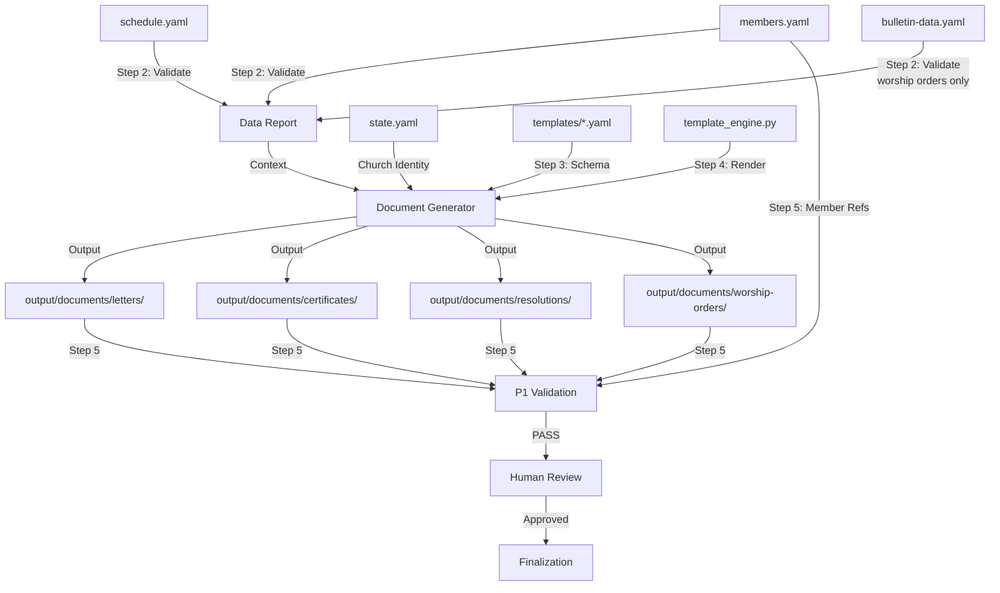

# 공문서 생성 워크플로우

교회 데이터 계층에서 구조화된 데이터를 조합하고, 템플릿 슬롯을 해석하며, `template_engine.py` 렌더링 시스템을 통해 인쇄 가능한 마크다운 출력물을 생산하는 공문서(공문, 증서, 결의문, 예배 순서지) 자동 생성 파이프라인.

## 개요

- **입력**: `data/members.yaml`, `data/schedule.yaml`, `data/bulletin-data.yaml`, `data/finance.yaml`, `templates/*.yaml`
- **출력**: `output/documents/{type}/{date}-{document-name}.md`
- **빈도**: 이벤트 기반 (문서 요청 시 수시)
- **Autopilot**: 활성화 -- 모든 단계가 결정론적 데이터 조합으로 이루어지며, 검토 체크포인트에서 인간 개입 루프(Human-in-the-Loop) 게이트 적용
- **pACS**: 활성화 -- 생성된 문서 품질에 대한 자기 신뢰도 평가
- **워크플로우 ID**: `document-generator`
- **트리거**: `/generate-document` 슬래시 커맨드 또는 Orchestrator 호출
- **위험 수준**: 중간 (증서와 공문은 법적·교회법적 효력을 가짐)
- **주요 에이전트**: `@document-generator`
- **지원 에이전트**: `@template-scanner`, `@member-manager` (읽기 전용)

---

## 유전된 DNA (부모 게놈)

> 이 워크플로우는 AgenticWorkflow의 전체 게놈을 상속한다.
> 도메인에 따라 목적은 달라지지만, 게놈은 동일하다. `soul.md` 섹션 0 참조.

**헌법적 원칙** (공문서 생성 도메인에 맞게 적용):

1. **품질 절대주의** (헌법적 원칙 1) -- 교회 명의로 발행되는 모든 문서는 정확하고, 완전하며, 올바른 서식을 갖춰야 한다. 공문과 증서는 법적·교회법적 권위를 수반한다. 날짜가 잘못된 세례증서, 재적 기간이 부정확한 이명증서, 의결 사항이 잘못 기재된 당회 결의문은 기관 신뢰를 훼손하며 법적 결과를 초래할 수 있다. 품질이란 곧: 모든 가변 영역이 검증된 데이터로 채워지고, 교인 참조 오류가 없으며, 한국어 서식이 올바르고, 직인 영역이 적절히 확보되며, 날짜가 일관성을 유지하는 것을 의미한다.
2. **단일 파일 SOT** (헌법적 원칙 2) -- `state.yaml`이 중앙 상태 권위이다. `@document-generator` 에이전트는 `data/members.yaml`, `data/schedule.yaml`, `data/bulletin-data.yaml`, `data/finance.yaml`에서 읽기만 하며, 쓰기는 오직 `output/documents/`에만 수행한다. 어떤 에이전트도 자신의 쓰기 권한 밖의 파일에 쓸 수 없다. 이 워크플로우에서 데이터 파일은 읽기 전용이다.
3. **코드 변경 프로토콜** (헌법적 원칙 3) -- 검증 스크립트, 템플릿 정의, 또는 템플릿 엔진(`template_engine.py`)을 수정할 때 3단계 프로토콜(의도 파악, 영향 범위 분석, 변경 설계)이 적용된다. 코딩 기준점(CAP)이 모든 구현을 안내한다:
   - **CAP-1 (코딩 전 사고)** -- 생성 전에 템플릿 YAML과 데이터 소스를 먼저 읽는다. 슬롯 타입, 필수 vs. 선택 필드, 서식 관례를 이해한 뒤 출력을 생산한다.
   - **CAP-2 (단순성 우선)** -- 문서 생성은 템플릿 채우기이다. 추측성 추상화, 불필요한 헬퍼 레이어를 만들지 않는다. 엔진은 YAML을 읽고, 슬롯을 해석하고, 마크다운을 출력할 뿐이다.
   - **CAP-4 (외과적 변경)** -- 문서 필드를 수정하거나 서식을 조정할 때, 해당 슬롯만 변경한다. 관련 없는 섹션이나 템플릿을 리팩토링하지 않는다.

**상속 패턴**:

| DNA 구성 요소 | 상속 형태 | 이 워크플로우에서의 적용 |
|--------------|----------|----------------------|
| 3단계 구조 | Research, Processing, Output | 데이터 검증, 문서 조합, 사람 검토 + 최종 처리 |
| SOT 패턴 | `state.yaml` -- 단일 기록자 (Orchestrator) | 교회 정보(이름, 교단)는 SOT에서 읽기; 문서 출력은 `output/documents/`에만 쓰기 |
| 4계층 QA | L0 Anti-Skip, L1 Verification, L1.5 pACS, L2 사람 검토 | L0: 파일 존재 + 최소 크기. L1: 슬롯 채움 + 참조 무결성 검사. L1.5: pACS 자기 평가. L2: 단일 검토 인간 개입 루프 게이트 |
| P1 할루시네이션 방지 | 결정론적 검증 스크립트 | 교인 참조 무결성 (`validate_members.py`의 M1-M7), 템플릿 스키마 검증 (`template_scanner.py --validate`) |
| P2 전문성 기반 위임 | 각 작업별 전문 서브에이전트 | `@document-generator`는 조합 담당, `@template-scanner`는 템플릿 스키마 담당(읽기 전용), `@member-manager`는 교인 데이터 담당(읽기 전용) |
| Safety Hook | `block_destructive_commands.py` -- 위험 명령 차단 | 문서 아카이브나 데이터 파일의 실수에 의한 삭제 방지 |
| 컨텍스트 보존 시스템 | 스냅샷 + Knowledge Archive + RLM 복원 | 문서 생성 상태가 세션 경계를 넘어 유지됨 |
| 코딩 기준점 (CAP) | CAP-1부터 CAP-4까지 내면화 | CAP-1: 생성 전 데이터 완전성 확인. CAP-2: 템플릿 채우기를 위한 최소 코드. CAP-4: 개별 슬롯에 대한 외과적 수정만 |
| Decision Log | `autopilot-logs/` -- 투명한 의사결정 추적 | 사람 검토 자동 승인을 근거와 함께 기록 |

**도메인 특화 유전자 발현**:

공문서 생성 워크플로우에서 강하게 발현되는 DNA 구성 요소:

- **P1 (데이터 정확성)** -- 교인 ID 교차 참조를 통해 증서나 공문에 실존하지 않는 이름이 포함되지 않도록 보장한다. 세례 날짜 검증은 성례 기록의 무결성을 보장한다. 이명 기간 계산(registration_date에서 transfer_date까지)은 산술적으로 정확해야 한다.
- **P2 (전문성 기반 위임)** -- 템플릿 스키마 지식은 `@template-scanner`에 귀속된다. 교인 데이터 권한은 `@member-manager`에 귀속된다. `@document-generator` 에이전트는 이 도메인들에서 읽기만 하며 절대 쓰지 않는다. 이 경계는 타협의 여지가 없다.
- **SOT 유전자** -- 문서 생성은 데이터에서 읽고 출력에 쓰는 순수한 파이프라인이다. 이 워크플로우에서 어떤 데이터 파일도 수정되지 않는다. `output/documents/` 디렉터리가 유일한 쓰기 대상이다.
- **안전 유전자** -- 증서와 공문에는 개인식별정보(교인 이름, 주소, 세례 날짜)가 포함된다. 직인 영역(직인 위치)은 NO_VARIABLE_CONTENT로 확보되어야 한다. 주민등록번호에는 개인정보 마스킹이 적용된다.

---

## 문서 유형 레지스트리

이 워크플로우는 5가지 문서 유형을 지원한다. 각 유형에는 전용 템플릿, 특정 데이터 소스, 정의된 가변 영역이 있다.

### DT-1: 공문 (Official Letter)

| 항목 | 값 |
|------|---|
| 템플릿 | `templates/official-letter-template.yaml` |
| 데이터 소스 | `data/members.yaml`, `data/schedule.yaml` |
| 출력 경로 | `output/documents/letters/{date}-{subject-slug}.md` |
| HitL 게이트 | 단일 검토 (중간 위험) |
| 사용 사례 | 교단 대외 서신, 교회 간 공문, 공식 통지 |

**가변 영역**:

| VR ID | 이름 | 소스 | 필수 |
|-------|------|------|------|
| VR-LTR-01 | 교단 헤더 | `state.yaml` `church.denomination` | 예 |
| VR-LTR-02 | 교회 이름 | `state.yaml` `church.name` | 예 |
| VR-LTR-03 | 문서 번호 | 파생: `{year}-{type}-{seq:03d}` | 예 |
| VR-LTR-04 | 날짜 | 생성 날짜 | 예 |
| VR-LTR-05 | 수신자 | Orchestrator 입력 또는 교인 조회 | 예 |
| VR-LTR-06 | 제목 | Orchestrator 입력 | 예 |
| VR-LTR-07 | 본문 내용 | Orchestrator 입력 | 예 |
| VR-LTR-08 | 발신자/서명 | `state.yaml` 교회 대표자 | 예 |
| VR-LTR-09 | 직인 영역 | 예약됨 (NO_VARIABLE_CONTENT) | 예 |

### DT-2: 세례증서 (Baptism Certificate)

| 항목 | 값 |
|------|---|
| 템플릿 | `templates/certificate-template.yaml` (type: baptism) |
| 데이터 소스 | `data/members.yaml` (`church.baptism_date`, `church.baptism_type`, `church.sacraments`) |
| 출력 경로 | `output/documents/certificates/{member_id}-baptism-cert.md` |
| HitL 게이트 | 단일 검토 (중간 위험) |
| 사용 사례 | 교인 요청, 이명 시 첨부 서류, 교단 기록 |

**가변 영역**:

| VR ID | 이름 | 소스 | 필수 |
|-------|------|------|------|
| VR-BAP-01 | 교회 이름 | `state.yaml` `church.name` | 예 |
| VR-BAP-02 | 교단 | `state.yaml` `church.denomination` | 예 |
| VR-BAP-03 | 증서 번호 | 파생: `{year}-BAP-{seq:03d}` | 예 |
| VR-BAP-04 | 수령인 이름 | `members.yaml` `members[id].name` | 예 |
| VR-BAP-05 | 생년월일 | `members.yaml` `members[id].birth_date` | 예 |
| VR-BAP-06 | 세례 날짜 | `members.yaml` `members[id].church.baptism_date` | 예 |
| VR-BAP-07 | 세례 형태 | `members.yaml` `members[id].church.baptism_type` | 예 |
| VR-BAP-08 | 집례자 | `members.yaml` `members[id].church.sacraments.officiant` 또는 SOT 목사 | 아니오 |
| VR-BAP-09 | 서명란 | `state.yaml` 교회 대표자 | 예 |
| VR-BAP-10 | 직인 영역 | 예약됨 (NO_VARIABLE_CONTENT) | 예 |

### DT-3: 이명증서 (Transfer Certificate)

| 항목 | 값 |
|------|---|
| 템플릿 | `templates/certificate-template.yaml` (type: transfer) |
| 데이터 소스 | `data/members.yaml` |
| 출력 경로 | `output/documents/certificates/{member_id}-transfer-cert.md` |
| HitL 게이트 | 단일 검토 (중간 위험) |
| 사용 사례 | 타 교회로의 이명 |

**가변 영역**:

| VR ID | 이름 | 소스 | 필수 |
|-------|------|------|------|
| VR-TRF-01 | 교회 이름 | `state.yaml` `church.name` | 예 |
| VR-TRF-02 | 교단 | `state.yaml` `church.denomination` | 예 |
| VR-TRF-03 | 증서 번호 | 파생: `{year}-TRF-{seq:03d}` | 예 |
| VR-TRF-04 | 교인 이름 | `members.yaml` `members[id].name` | 예 |
| VR-TRF-05 | 생년월일 | `members.yaml` `members[id].birth_date` | 예 |
| VR-TRF-06 | 등록일 | `members.yaml` `members[id].church.registration_date` | 예 |
| VR-TRF-07 | 이명일 | Orchestrator 입력 또는 현재 날짜 | 예 |
| VR-TRF-08 | 재적 기간 | 파생: `registration_date`에서 `transfer_date`까지 | 예 |
| VR-TRF-09 | 세례 상태 | `members.yaml` `members[id].church.baptism_date` (유/무) | 예 |
| VR-TRF-10 | 전입 교회 | Orchestrator 입력 | 예 |
| VR-TRF-11 | 서명란 | `state.yaml` 교회 대표자 | 예 |
| VR-TRF-12 | 직인 영역 | 예약됨 (NO_VARIABLE_CONTENT) | 예 |

### DT-4: 당회 결의문 (Session Resolution)

| 항목 | 값 |
|------|---|
| 템플릿 | `templates/meeting-minutes-template.yaml` (type: session_resolution) |
| 데이터 소스 | `data/schedule.yaml`, `data/members.yaml` |
| 출력 경로 | `output/documents/resolutions/{date}-session-resolution.md` |
| HitL 게이트 | 단일 검토 (중간 위험) |
| 사용 사례 | 당회 공식 의결 -- 임직, 권징, 재산, 예산 승인 |

**가변 영역**:

| VR ID | 이름 | 소스 | 필수 |
|-------|------|------|------|
| VR-RES-01 | 교회 이름 | `state.yaml` `church.name` | 예 |
| VR-RES-02 | 회의 날짜 | `schedule.yaml` 당회 일정 또는 Orchestrator 입력 | 예 |
| VR-RES-03 | 회의 번호 | 파생: `{year}-{seq:03d}` | 예 |
| VR-RES-04 | 참석자 | `members.yaml`에서 `role: "장로"` + 목사로 필터 | 예 |
| VR-RES-05 | 안건 | Orchestrator 입력 | 예 |
| VR-RES-06 | 의결 사항 | Orchestrator 입력 -- 각 항목에 표결 수 (찬성/반대/기권) 포함 | 예 |
| VR-RES-07 | 폐회 | 시간, 축도, 차기 회의 날짜 | 예 |
| VR-RES-08 | 의장 서명 | SOT의 목사 이름 | 예 |
| VR-RES-09 | 서기 서명 | 지정된 서기 (장로 또는 서기) | 예 |
| VR-RES-10 | 직인 영역 | 예약됨 (NO_VARIABLE_CONTENT) | 예 |

### DT-5: 예배 순서지 (Worship Order)

| 항목 | 값 |
|------|---|
| 템플릿 | `templates/worship-template.yaml` |
| 데이터 소스 | `data/schedule.yaml`, `data/bulletin-data.yaml` |
| 출력 경로 | `output/documents/worship-orders/{date}-worship-order.md` |
| HitL 게이트 | 단일 검토 (중간 위험) |
| 사용 사례 | 특별예배 순서지 (부흥회, 성탄절, 부활절, 감사절) |

**가변 영역**:

| VR ID | 이름 | 소스 | 필수 |
|-------|------|------|------|
| VR-WOR-01 | 교회 이름 | `state.yaml` `church.name` | 예 |
| VR-WOR-02 | 예배 명칭 | `schedule.yaml` 행사 이름 또는 Orchestrator 입력 | 예 |
| VR-WOR-03 | 날짜 | 행사 날짜 | 예 |
| VR-WOR-04 | 설교 제목 | `bulletin-data.yaml` `bulletin.sermon.title` 또는 Orchestrator 입력 | 예 |
| VR-WOR-05 | 성경 구절 | `bulletin-data.yaml` `bulletin.sermon.scripture` 또는 Orchestrator 입력 | 예 |
| VR-WOR-06 | 설교자 | `bulletin-data.yaml` `bulletin.sermon.preacher` 또는 Orchestrator 입력 | 예 |
| VR-WOR-07 | 예배 순서 표 | Orchestrator 입력 또는 `bulletin-data.yaml` `bulletin.worship_order` | 예 |
| VR-WOR-08 | 봉헌 담당 | Orchestrator 입력 | 아니오 |
| VR-WOR-09 | 광고 사항 | Orchestrator 입력 (제목만) | 아니오 |

---

## 슬래시 커맨드

### `/generate-document`

```markdown
# .claude/commands/generate-document.md
---
description: "Generate an official church document (letter, certificate, resolution, or worship order)"
---

Generate an official document using the document-generator workflow.

Required arguments:
  --type: Document type (letter | baptism-cert | transfer-cert | resolution | worship-order)
  --member-id: (for certificates) Target member ID (e.g., M001)
  --date: (optional) Document date (defaults to today)

Steps:
1. Determine document type from arguments
2. Load relevant data sources (members.yaml, schedule.yaml, etc.)
3. Validate data completeness for the target document type
4. Load the appropriate template from templates/
5. Populate all variable regions via template_engine.py
6. Generate output to output/documents/{type}/
7. Present for human review (single-review gate)
8. Finalize and log

Type: $ARGUMENTS
```

---

## Research 단계

### 1. 문서 요청 분석

- **에이전트**: Orchestrator
- **검증 기준**:
  - [ ] 문서 유형이 다음 중 하나임: `letter`, `baptism-cert`, `transfer-cert`, `resolution`, `worship-order`
  - [ ] 증서 유형의 경우: `member_id`가 제공되고 `M\d{3,}` 형식에 부합
  - [ ] 결의문 유형의 경우: 회의 날짜와 안건이 제공됨
  - [ ] 공문 유형의 경우: 수신자, 제목, 본문 내용이 제공됨
  - [ ] 예배 순서지 유형의 경우: 예배 명칭과 날짜가 제공됨
- **작업**: 문서 생성 요청을 파싱하여 문서 유형을 결정하고, 필요한 데이터 소스와 템플릿을 식별한다. 3단계의 적절한 생성 프로토콜로 라우팅한다.
- **산출물**: 문서 생성 명세 (내부용 -- 문서 유형, 대상 교인/행사, 데이터 소스 경로)
- **번역**: 없음
- **리뷰**: 없음

### 2. 데이터 소스 검증

- **에이전트**: `@document-generator`
- **검증 기준**:
  - [ ] 모든 필수 데이터 파일이 읽기 가능하고 유효한 YAML임
  - [ ] 증서 유형의 경우: 대상 `member_id`가 `data/members.yaml`에 `status: "active"` 또는 `status: "transferred"`(이명증서의 경우)로 존재함
  - [ ] 세례증서의 경우: `members[id].church.baptism_date`가 null이 아니고 유효한 YYYY-MM-DD 형식임
  - [ ] 이명증서의 경우: `members[id].church.registration_date`가 null이 아님
  - [ ] 결의문의 경우: 회의 날짜 교차 참조를 위해 `data/schedule.yaml`에 접근 가능
  - [ ] 결의문의 경우: `data/members.yaml`에 `role: "장로"`인 교인이 최소 1명 존재
  - [ ] 예배 순서지의 경우: `data/schedule.yaml` 또는 `data/bulletin-data.yaml`에 접근 가능
  - [ ] 교회 식별 정보(이름, 교단) 확인을 위해 `state.yaml`이 읽기 가능 [trace:step-1:domain-analysis]
  - [ ] 대상 문서 유형의 템플릿 파일이 `templates/` 디렉터리에 존재
  - [ ] 템플릿 파일이 스키마 검증 통과: `python3 scripts/template_scanner.py --validate templates/{type}-template.yaml`
- **작업**: 대상 문서 유형에 필요한 모든 데이터 소스를 읽고 검증한다. 교인 참조가 해석되는지, 날짜가 유효한지, 템플릿 스키마가 온전한지 확인한다. 생성 단계로 넘어가기 전에 누락되거나 유효하지 않은 데이터를 보고한다.
- **산출물**: 데이터 검증 보고서 (내부용 -- 3단계에 컨텍스트로 전달) [trace:step-2:data-validation]
- **번역**: 없음
- **리뷰**: 없음

---

## Processing 단계

### 3. 템플릿 로딩 및 슬롯 매핑

- **에이전트**: `@document-generator`
- **검증 기준**:
  - [ ] `templates/{type}-template.yaml`에서 템플릿 YAML이 성공적으로 로딩됨
  - [ ] 템플릿에 정의된 모든 섹션이 존재함 [trace:step-2:data-validation]
  - [ ] 슬롯-소스 매핑이 완전함 -- 모든 필수 슬롯에 해석 가능한 데이터 소스가 있음
  - [ ] 파생 슬롯의 파생 규칙이 정의됨 (증서 번호, 재적 기간)
  - [ ] 직인 영역이 NO_VARIABLE_CONTENT로 표시됨
  - [ ] 문서 유형이 템플릿의 `document_type` 필드와 일치함
- **작업**: 대상 문서 유형의 템플릿 YAML을 로딩한다. 각 슬롯을 데이터 소스 경로에 매핑한다. 파생 값(증서 번호, 날짜 계산, 재적 기간 산출)을 해석한다. 문서 조합을 위한 완전한 슬롯-값 맵을 준비한다.
- **산출물**: 슬롯-값 매핑 (내부용 -- 4단계에 컨텍스트로 전달) [trace:step-3:slot-mapping]
- **번역**: 없음
- **리뷰**: 없음

### 4. 문서 조합

- **에이전트**: `@document-generator`
- **전처리**: `template_engine.py`의 `load_data_files()`로 데이터 파일을 로딩한다. 각 템플릿 섹션에 대해 `resolve_slot()`으로 모든 슬롯 값을 해석한다.
- **검증 기준**:
  - [ ] 모든 필수 가변 영역이 비어 있지 않은 값으로 채워짐 [trace:step-3:slot-mapping]
  - [ ] 선택적 가변 영역이 값으로 채워지거나 명시적으로 생략됨 (플레이스홀더 텍스트 금지)
  - [ ] 날짜 필드가 한국어 관례 형식(`{year}년 {month}월 {day}일`)으로 서식 적용됨
  - [ ] 금액 필드(해당 시)가 쉼표 구분 원화 형식(`₩{value:,}`)으로 서식 적용됨
  - [ ] 교인 이름이 `data/members.yaml`에서 올바르게 해석됨
  - [ ] 직인 영역이 예약 구역(NO_VARIABLE_CONTENT)으로 렌더링됨 [trace:step-4:validation-rules]
  - [ ] 문서 번호가 해당 유형의 순차 형식을 따름
  - [ ] 세례증서의 경우: 세례 형태가 {`adult`, `infant`, `confirmation`} 중 하나임
  - [ ] 이명증서의 경우: 재적 기간 계산이 산술적으로 정확함 (registration_date에서 transfer_date까지)
  - [ ] 결의문의 경우: 참석자 목록에 장로/목사 직분의 교인만 포함
  - [ ] 결의문의 경우: 각 의결 항목에 표결 수(찬성/반대/기권)가 있음
  - [ ] 생성된 마크다운의 구조가 유효함 (제목, 표, 목록이 올바르게 파싱됨)
  - [ ] 한국어 용어가 `data/church-glossary.yaml` 항목과 일치함
  - [ ] 출력에 `[TBD]`, `[TODO]`, `{placeholder}` 문자열이 없음
- **작업**: 템플릿 섹션을 순회하며 각 슬롯을 데이터에 대해 해석하여 문서를 조합한다. 슬롯 해석과 서식 적용에 `template_engine.py`를 사용한다. 완성된 문서를 적절한 출력 경로에 기록한다.

  **문서 유형별 생성 명령**:

  ```bash
  # Official Letter
  python3 scripts/template_engine.py \
      --template templates/official-letter-template.yaml \
      --data data/members.yaml --data data/schedule.yaml \
      --output output/documents/letters/{date}-{subject-slug}.md

  # Baptism Certificate
  python3 scripts/template_engine.py \
      --template templates/certificate-template.yaml \
      --data data/members.yaml \
      --member-id {member_id} \
      --output output/documents/certificates/{member_id}-baptism-cert.md

  # Transfer Certificate
  python3 scripts/template_engine.py \
      --template templates/certificate-template.yaml \
      --data data/members.yaml \
      --member-id {member_id} \
      --output output/documents/certificates/{member_id}-transfer-cert.md

  # Session Resolution
  python3 scripts/template_engine.py \
      --template templates/meeting-minutes-template.yaml \
      --data data/schedule.yaml --data data/members.yaml \
      --output output/documents/resolutions/{date}-session-resolution.md

  # Worship Order
  python3 scripts/template_engine.py \
      --template templates/worship-template.yaml \
      --data data/bulletin-data.yaml --data data/schedule.yaml \
      --output output/documents/worship-orders/{date}-worship-order.md
  ```

- **산출물**: `output/documents/{type}/{filename}.md`에 생성된 문서 파일
- **번역**: 없음
- **리뷰**: 없음

### 5. (hook) P1 검증

- **전처리**: 없음 -- 검증은 생성된 출력물과 데이터 파일을 직접 읽음
- **Hook**: `validate_members.py` (교인 참조 무결성) + `template_scanner.py --validate` (템플릿 적합성)
- **명령**:
  ```bash
  # Member reference integrity (for certificate and resolution types)
  python3 .claude/hooks/scripts/validate_members.py --data-dir data/

  # Template schema compliance
  python3 scripts/template_scanner.py --validate templates/{type}-template.yaml
  ```
- **검증 기준**:
  - [ ] 증서 유형의 경우: 대상 교인이 `members.yaml`에 존재 (M1 검사) [trace:step-4:validation-rules]
  - [ ] 증서 유형의 경우: 교인 상태가 적절함 (세례증서는 `active`, 이명증서는 `active` 또는 `transferred`) [trace:step-4:validation-rules]
  - [ ] 증서 유형의 경우: 관련 날짜 필드가 유효한 YYYY-MM-DD (M6 검사) [trace:step-4:validation-rules]
  - [ ] 결의문의 경우: 모든 참석자 교인 ID가 존재하고 적절한 직분을 가짐
  - [ ] 템플릿 스키마 검증 통과 (모든 필수 섹션과 슬롯 존재)
  - [ ] 생성된 출력 파일이 존재하고 비어 있지 않음 (L0 검사: >= 100 bytes)
  - [ ] 생성된 출력에 플레이스홀더 마커(`[TBD]`, `[TODO]`, `{placeholder}`)가 없음
- **작업**: 문서 데이터 무결성을 확인하기 위해 P1 결정론적 검증을 실행한다. 증서 유형의 경우 `members.yaml`에 대한 교인 참조를 검증한다. 모든 유형에 대해 템플릿 스키마 적합성과 출력 완전성을 검증한다.
- **산출물**: 검증 결과 (PASS/FAIL, 항목별 세부 정보 포함)
- **오류 처리**: 어떤 검사라도 실패하면 파이프라인이 중단된다. `@document-generator` 에이전트가 데이터 문제를 수정하고 검증을 재실행해야 한다(최대 3회 재시도). 3회 실패 후에는 사람에게 에스컬레이션한다.
- **번역**: 없음
- **리뷰**: 없음

---

## Output 단계

### 6. (human) 문서 검토

- **조치**: 생성된 문서의 정확성, 어조, 서식, 완전성을 검토한다. 다음 사항을 확인한다:
  - 교인 정보가 정확함 (이름, 날짜, 직분)
  - 문서 언어가 격식 수준에 적절함
  - 한국어 서식이 자연스럽고 관례적임
  - 직인 영역이 적절히 확보됨
  - 증서의 경우: 성례 및 재적 날짜가 역사적으로 정확함
  - 결의문의 경우: 의결 사항이 당회의 심의 내용을 정확히 반영함
  - 공문의 경우: 어조가 소통 목적에 부합함 (격식/목회적/행정적)
- **HitL 패턴**: 단일 검토 (중간 위험) -- 문서당 1회 확인
- **검증 기준**:
  - [ ] 사람이 생성된 문서를 검토 완료함
  - [ ] 사람이 정확성을 확인했거나 수정 사항을 제공함
  - [ ] 수정 사항이 제공된 경우, 4-5단계를 통해 적용 및 재검증 완료
  - [ ] 문서가 최종 처리 승인됨
- **Autopilot 동작**: Autopilot 모드에서 이 단계는 다음 근거로 자동 승인된다: "모든 가변 영역이 검증된 데이터 소스에서 채워짐. P1 교인 참조 검증 통과. 템플릿 스키마 적합성 확인. pACS GREEN. 결정론적 데이터 검증을 통해 품질 극대화 달성." 결정 내용은 `autopilot-logs/step-6-decision.md`에 기록된다.
- **번역**: 없음
- **리뷰**: 없음

### 7. 최종 처리

- **에이전트**: `@document-generator`
- **검증 기준**:
  - [ ] 생성된 문서가 예상 출력 경로에 존재 [trace:step-9:template-engine]
  - [ ] 문서 파일이 비어 있지 않음 (L0 검사)
  - [ ] 출력 경로가 명명 규칙을 따름: `output/documents/{type}/{filename}.md`
  - [ ] 이 워크플로우 중 데이터 파일이 수정되지 않음 (읽기 전용 제약) [trace:step-4:validation-rules]
  - [ ] 생성 메타데이터가 기록됨 (타임스탬프, 문서 유형, 해당 시 member_id, 사용된 템플릿)
- **작업**: 최종 문서가 출력 디렉터리에 올바르게 기록되었는지 확인한다. 감사 추적을 위해 생성 메타데이터를 기록한다. Orchestrator에 완료를 보고한다.
- **산출물**: `output/documents/{type}/{filename}.md`의 최종 문서 + 생성 로그 항목
- **번역**: 없음
- **리뷰**: 없음

---

## Claude Code 구성

### 서브에이전트

```yaml
# .claude/agents/document-generator.md
---
model: sonnet
tools: [Read, Write, Edit, Bash, Glob, Grep]
write_permissions:
  - output/documents/
---
# Pattern execution task — template population + data assembly
# Sonnet is sufficient for deterministic template slot resolution
```

```yaml
# .claude/agents/template-scanner.md (referenced, not defined in this workflow)
---
model: opus
tools: [Read, Write, Edit, Bash, Glob, Grep]
write_permissions:
  - templates/
---
# Vision + reasoning required for document layout analysis
# Only invoked when new template creation is needed
```

### SOT (상태 관리)

- **SOT 파일**: `state.yaml` (church-admin 시스템 수준 SOT)
- **쓰기 권한**: Orchestrator 전용 -- 어떤 서브에이전트도 `state.yaml`에 직접 쓰지 않음
- **에이전트 접근**: `@document-generator`는 읽기 전용. 교회 식별 필드(`church.name`, `church.denomination`)는 SOT에서 제공됨.
- **데이터 파일**: 모든 `data/*.yaml` 파일은 이 워크플로우에서 읽기 전용이다. 문서 생성 중 데이터 수정은 발생하지 않는다.

**사용되는 SOT 필드**:

```yaml
church:
  name: "..."                              # All document headers
  denomination: "..."                      # Denomination prefix
  representative:                          # Signature blocks
    name: "..."                            # Senior pastor / moderator
    title: "..."                           # 담임목사
```

### Hooks

```json
{
  "hooks": {
    "PreToolUse": [
      {
        "matcher": "Write",
        "hooks": [
          {
            "type": "command",
            "command": "if test -f \"$CLAUDE_PROJECT_DIR/.claude/hooks/scripts/block_destructive_commands.py\"; then python3 \"$CLAUDE_PROJECT_DIR/.claude/hooks/scripts/block_destructive_commands.py\"; fi",
            "timeout": 10
          }
        ]
      }
    ]
  }
}
```

> **참고**: 공문서 생성 워크플로우는 상위 프로젝트의 Hook 인프라(block_destructive_commands.py, 컨텍스트 보존 Hook)에 의존한다. 5단계에서 명시적으로 호출되는 검증 스크립트 외에 워크플로우 전용 Hook은 필요하지 않다.

### 슬래시 커맨드

```yaml
commands:
  /generate-document:
    description: "Generate an official church document"
    file: ".claude/commands/generate-document.md"
```

### 런타임 디렉터리

```yaml
runtime_directories:
  output/documents/letters/:       # Official letters (공문)
  output/documents/certificates/:  # Baptism + transfer certificates
  output/documents/resolutions/:   # Session resolutions (당회 결의문)
  output/documents/worship-orders/: # Special worship orders
  verification-logs/:              # step-N-verify.md (L1 verification results)
  pacs-logs/:                      # step-N-pacs.md (pACS self-confidence ratings)
  autopilot-logs/:                 # step-N-decision.md (auto-approval decision logs)
```

### 오류 처리

```yaml
error_handling:
  on_agent_failure:
    action: retry_with_feedback
    max_attempts: 3
    escalation: human

  on_validation_failure:
    action: retry_with_feedback
    retry_with_feedback: true
    rollback_after: 3
    detail: "Member reference or template validation failure triggers data re-read and re-generation"

  on_hook_failure:
    action: log_and_continue

  on_context_overflow:
    action: save_and_recover
```

### Autopilot 로그

```yaml
autopilot_logging:
  log_directory: "autopilot-logs/"
  log_format: "step-{N}-decision.md"
  required_fields:
    - step_number
    - checkpoint_type
    - decision
    - rationale
    - timestamp
  template: "references/autopilot-decision-template.md"
```

### pACS 로그

```yaml
pacs_logging:
  log_directory: "pacs-logs/"
  log_format: "step-{N}-pacs.md"
  dimensions: [F, C, L]
  scoring: "min-score"
  triggers:
    GREEN: ">= 70 -> auto-proceed"
    YELLOW: "50-69 -> proceed with flag"
    RED: "< 50 -> rework or escalate"
  protocol: "AGENTS.md section 5.4"
```

---

## 스캔-앤-복제 통합

이 워크플로우는 스캔-앤-복제 파이프라인(PRD F-06)을 위해 `@template-scanner` 에이전트와 통합된다. 흐름은 다음과 같다:

1. **스캔 단계** (문서 유형별 1회 설정): 물리적 문서 샘플(사진, PDF 스캔)을 `@template-scanner`가 Claude 멀티모달 비전을 사용하여 분석한다. 에이전트는 고정 영역(헤더, 직인, 테두리)과 가변 영역(이름 필드, 날짜 필드, 금액)을 식별한다. 출력은 `templates/`에 저장되는 구조화된 템플릿 YAML 파일이다.

2. **복제 단계** (문서별 생성): `@document-generator` 에이전트가 템플릿 YAML을 읽고 `template_engine.py`를 통해 교회 데이터 계층에서 가변 슬롯을 채운다. 엔진은 dot-path 참조(`members[id].name`)를 해석하고, 서식 규칙(한국어 날짜, 통화)을 적용하며, 마크다운 출력을 생산한다.

3. **템플릿 생명주기**:
   - 신규 템플릿: `@template-scanner`가 샘플 분석 -> 후보 YAML 생성 -> 최초 실행 HitL 확인 -> `templates/`에 저장
   - 기존 템플릿: `@document-generator`가 `templates/`에서 직접 로딩 -> 스캐너 개입 없음
   - 템플릿 갱신: `@template-scanner`가 갱신된 샘플 재분석 -> 새 버전 생성 -> HitL 확인 -> `templates/`에 덮어쓰기

**템플릿-엔진 데이터 흐름**:

```mermaid
graph LR
    A[Document Sample<br/>Photo/PDF] -->|@template-scanner| B[Template YAML<br/>templates/*.yaml]
    B -->|@document-generator| C[template_engine.py]
    D[Data Sources<br/>members.yaml<br/>schedule.yaml<br/>bulletin-data.yaml] -->|Read| C
    E[state.yaml<br/>Church Identity] -->|Read| C
    C -->|Generate| F[Output Document<br/>output/documents/*.md]
```

---

## 교차 단계 추적성 인덱스

이 섹션은 워크플로우에서 사용되는 모든 추적 마커와 그 해석 대상을 문서화한다.

| 마커 | 단계 | 해석 대상 |
|------|------|----------|
| `[trace:step-1:domain-analysis]` | 1단계 | 문서 요청 분석 -- 유형 분류, 필요 데이터 소스 식별 |
| `[trace:step-2:data-validation]` | 2단계 | 데이터 소스 검증 보고서 -- 교인 존재 여부, 날짜 유효성, 템플릿 무결성 |
| `[trace:step-3:slot-mapping]` | 3단계 | 템플릿 슬롯-소스 매핑 -- 모든 VR이 파생 값 규칙과 함께 데이터 경로에 매핑됨 |
| `[trace:step-4:validation-rules]` | 4단계 | 문서 조합 검증 -- VR 채움, 서식 적합성, 참조 무결성, 직인 영역 확보 |
| `[trace:step-9:template-engine]` | 9단계 (스캔-앤-복제) | 템플릿 엔진 통합 -- `template_engine.py` 슬롯 해석, 서식 적용, 출력 렌더링 |

---

## 데이터 흐름 다이어그램



---

## 실행 체크리스트 (회차별)

이 체크리스트는 공문서 생성 워크플로우가 실행될 때마다 Orchestrator가 수행한다.

### 사전 실행
- [ ] 문서 유형이 유효한지 확인 (letter | baptism-cert | transfer-cert | resolution | worship-order)
- [ ] 대상 문서 유형에 필요한 인자가 존재하는지 확인
- [ ] 교회 식별 필드를 위해 `state.yaml`이 읽기 가능한지 확인

### 1단계 완료
- [ ] 문서 유형 식별 완료
- [ ] 데이터 소스 요건 결정 완료
- [ ] SOT `current_step`을 1로 설정

### 2단계 완료
- [ ] 모든 필수 데이터 파일이 유효한 YAML
- [ ] 교인 참조 해석 완료 (증서/결의문 유형의 경우)
- [ ] 템플릿 파일 존재 및 스키마 검증 통과
- [ ] 데이터 검증 보고서 생성 완료

### 3단계 완료
- [ ] 템플릿 로딩 성공
- [ ] 모든 슬롯-소스 매핑 해석 완료
- [ ] 파생 값 산출 완료 (증서 번호, 기간, 날짜)

### 4단계 완료
- [ ] 문서 파일이 예상 출력 경로에 존재
- [ ] 문서 파일이 비어 있지 않음 (L0 검사: >= 100 bytes)
- [ ] 모든 필수 VR이 비어 있지 않은 값으로 채워짐
- [ ] 출력에 플레이스홀더 텍스트 없음
- [ ] 한국어 서식 정확

### 5단계 완료
- [ ] 교인 참조 검증 통과 (해당 유형의 경우)
- [ ] 템플릿 스키마 검증 통과
- [ ] 출력 완전성 확인 완료

### 6단계 완료
- [ ] 사람 검토 완료 (또는 Autopilot 자동 승인)
- [ ] 수정 사항 적용 완료 (해당 시)
- [ ] Decision Log 생성 완료 (Autopilot 모드)

### 7단계 완료
- [ ] 최종 문서가 출력 경로에 기록됨
- [ ] 생성 메타데이터 기록 완료
- [ ] 데이터 파일이 수정되지 않음 (읽기 전용 제약 확인)
- [ ] 워크플로우 상태가 완료로 설정됨

---

## 후처리

각 워크플로우 실행 후, 다음 검증 스크립트를 실행한다:

```bash
# Member reference integrity (for certificate and resolution types)
python3 .claude/hooks/scripts/validate_members.py --data-dir data/

# Cross-step traceability validation (CT1-CT5)
python3 .claude/hooks/scripts/validate_traceability.py --step 7 --project-dir .
```

---

## 품질 기준

### 문서 내용 품질

1. **교인 참조 무결성** -- 증서와 결의문에서 참조되는 모든 member_id는 `members.yaml`의 기존 레코드로 해석되어야 한다. M1 검증으로 확인한다.
2. **날짜 정확성** -- 모든 날짜는 유효한 YYYY-MM-DD 형식이고 역사적으로 일관성이 있어야 한다 (전입의 경우 baptism_date가 registration_date 이후일 수 없으며, 재적 기간은 양수여야 한다).
3. **직인 영역 무결성** -- 직인 영역(직인 위치)은 NO_VARIABLE_CONTENT 예약 구역으로 렌더링되어야 한다. 직인 영역에 데이터 값을 배치할 수 없다.
4. **한국어 서식** -- 날짜는 `년/월/일` 형식을 사용한다. 금액은 쉼표 구분 원화(`₩N,NNN`) 형식을 사용한다. 직분 명칭은 `church-glossary.yaml` 항목(집사, 권사, 장로, 목사)에 맞춘다.
5. **템플릿 적합성** -- 출력 구조가 템플릿 YAML의 섹션 순서 및 슬롯 정의와 일치해야 한다.
6. **플레이스홀더 텍스트 금지** -- 모든 필드에 YAML 소스의 실제 데이터가 포함되어야 한다. 출력에 `[TBD]`, `[TODO]`, `{placeholder}` 문자열이 없어야 한다.
7. **문서 번호 매기기** -- 각 유형 및 회계연도 내에서 순차적 문서 번호 부여. 중복이나 누락 없음.
8. **개인정보 보호** -- 주민등록번호는 개인정보 마스킹(`XXXXXX-X******`) 처리된다. 자택 주소는 법적으로 필요한 경우(예: 기부금 영수증)에만 포함한다.

### 비기능적 품질

1. **멱등성** -- 동일한 입력 데이터와 매개변수로 문서 생성을 두 번 실행하면 동일한 출력이 생산된다.
2. **추적성** -- 생성된 모든 필드는 YAML 데이터 파일 또는 Orchestrator 입력의 특정 소스 경로로 추적 가능하다.
3. **감사 가능성** -- 생성 메타데이터(타임스탬프, 문서 유형, 템플릿 버전, 사용된 데이터 소스)가 생산된 각 문서에 대해 기록된다.
4. **읽기 전용 안전성** -- 이 워크플로우는 어떤 데이터 파일도 수정하지 않는다. 유일한 쓰기 대상은 `output/documents/`이다.
