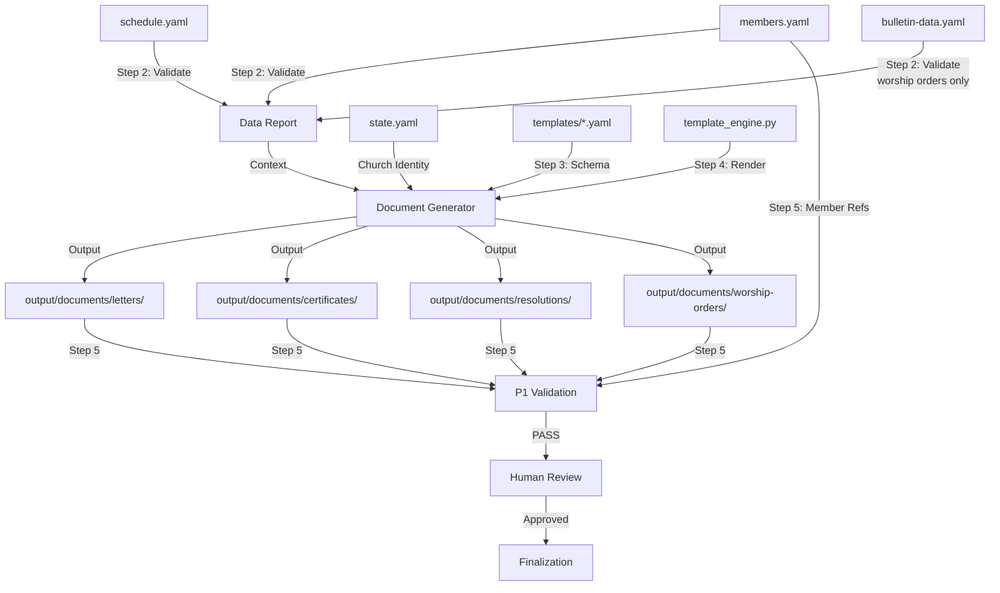

# Official Document Generation Workflow

Automated pipeline for generating official church documents -- letters, certificates, resolutions, and worship orders -- by assembling structured data from the church data layer, resolving template slots, and producing print-ready Markdown output through the `template_engine.py` rendering system.

## Overview

- **Input**: `data/members.yaml`, `data/schedule.yaml`, `data/bulletin-data.yaml`, `data/finance.yaml`, `templates/*.yaml`
- **Output**: `output/documents/{type}/{date}-{document-name}.md`
- **Frequency**: Event-driven (on-demand per document request)
- **Autopilot**: enabled -- all steps have deterministic data assembly with HitL gates at review checkpoints
- **pACS**: enabled -- self-confidence assessment on generated document quality
- **Workflow ID**: `document-generator`
- **Trigger**: `/generate-document` slash command or Orchestrator invocation
- **Risk Level**: medium (certificates and letters carry legal and ecclesiastical weight)
- **Primary Agent**: `@document-generator`
- **Supporting Agents**: `@template-scanner`, `@member-manager` (read-only)

---

## Inherited DNA (Parent Genome)

> This workflow inherits the complete genome of AgenticWorkflow.
> Purpose varies by domain; the genome is identical. See `soul.md` section 0.

**Constitutional Principles** (adapted to the official document generation domain):

1. **Quality Absolutism** (Constitutional Principle 1) -- Every document issued under the church name must be accurate, complete, and correctly formatted. Official letters and certificates carry legal and ecclesiastical authority. A baptism certificate with a wrong date, a transfer certificate with an incorrect membership period, or a session resolution with misattributed decisions damages institutional trust and may have legal consequences. Quality means: all variable regions populated with verified data, zero broken member references, correct Korean formatting, proper seal zone reservation, and date consistency.
2. **Single-File SOT** (Constitutional Principle 2) -- `state.yaml` is the central state authority. The `@document-generator` agent reads from `data/members.yaml`, `data/schedule.yaml`, `data/bulletin-data.yaml`, and `data/finance.yaml` but writes ONLY to `output/documents/`. No agent may write to files outside its write permissions. Data files are read-only for this workflow.
3. **Code Change Protocol** (Constitutional Principle 3) -- When modifying validation scripts, template definitions, or the template engine (`template_engine.py`), the 3-step protocol (Intent, Ripple Effect Analysis, Change Plan) applies. Coding Anchor Points (CAP) guide all implementation:
   - **CAP-1 (Think Before Coding)** -- Read the template YAML and data source before generating. Understand the slot types, required vs. optional fields, and formatting conventions before producing output.
   - **CAP-2 (Simplicity First)** -- Document generation is template population. No speculative abstractions, no unnecessary helper layers. The engine reads YAML, resolves slots, outputs Markdown.
   - **CAP-4 (Surgical Changes)** -- When fixing a document field or adjusting formatting, change only the affected slot. Do not refactor unrelated sections or templates.

**Inherited Patterns**:

| DNA Component | Inherited Form | Application in This Workflow |
|--------------|---------------|------------------------------|
| 3-Phase Structure | Research, Processing, Output | Data validation, document assembly, human review + finalization |
| SOT Pattern | `state.yaml` -- single writer (Orchestrator) | Church identity (name, denomination) read from SOT; document output is write-only to `output/documents/` |
| 4-Layer QA | L0 Anti-Skip, L1 Verification, L1.5 pACS, L2 Human Review | L0: file exists + min size. L1: slot population + reference integrity checks. L1.5: pACS self-rating. L2: single-review HitL gate |
| P1 Hallucination Prevention | Deterministic validation scripts | Member reference integrity (M1-M7 from `validate_members.py`), template schema validation (`template_scanner.py --validate`) |
| P2 Expert Delegation | Specialized sub-agents for each task | `@document-generator` for assembly, `@template-scanner` for template schema (read-only), `@member-manager` for member data (read-only) |
| Safety Hooks | `block_destructive_commands.py` -- dangerous command blocking | Prevents accidental deletion of document archives or data files |
| Context Preservation | Snapshot + Knowledge Archive + RLM restoration | Document generation state survives session boundaries |
| Coding Anchor Points (CAP) | CAP-1 through CAP-4 internalized | CAP-1: verify data completeness before generation. CAP-2: minimal code for template population. CAP-4: surgical edits to individual slots only |
| Decision Log | `autopilot-logs/` -- transparent decision tracking | Human review auto-approval logged with rationale |

**Domain-Specific Gene Expression**:

The document generation workflow strongly expresses these DNA components:

- **P1 (Data Accuracy)** -- Member ID cross-referencing ensures no phantom names on certificates or letters. Baptism date validation guarantees sacramental record integrity. Transfer period calculation (registration_date to transfer_date) must be arithmetically correct.
- **P2 (Expert Delegation)** -- Template schema knowledge resides in `@template-scanner`. Member data authority resides in `@member-manager`. The `@document-generator` agent reads from these domains but never writes to them. These boundaries are non-negotiable.
- **SOT Gene** -- Document generation is a pure read-from-data, write-to-output pipeline. No data file is ever modified by this workflow. The `output/documents/` directory is the only write target.
- **Safety Gene** -- Certificates and letters contain PII (member names, addresses, baptism dates). Seal zones (직인 위치) must be reserved as NO_VARIABLE_CONTENT. Privacy masking applies to resident registration numbers.

---

## Document Type Registry

This workflow supports 5 document types. Each type has a dedicated template, specific data sources, and defined variable regions.

### DT-1: Official Letter (공문)

| Field | Value |
|-------|-------|
| Template | `templates/official-letter-template.yaml` |
| Data Sources | `data/members.yaml`, `data/schedule.yaml` |
| Output Path | `output/documents/letters/{date}-{subject-slug}.md` |
| HitL Gate | single-review (medium risk) |
| Use Cases | Denominational correspondence, inter-church communication, official notifications |

**Variable Regions**:

| VR ID | Name | Source | Required |
|-------|------|--------|----------|
| VR-LTR-01 | Denomination Header | `state.yaml` `church.denomination` | Yes |
| VR-LTR-02 | Church Name | `state.yaml` `church.name` | Yes |
| VR-LTR-03 | Document Number | Derived: `{year}-{type}-{seq:03d}` | Yes |
| VR-LTR-04 | Date | Generation date | Yes |
| VR-LTR-05 | Recipient | Orchestrator input or member lookup | Yes |
| VR-LTR-06 | Subject | Orchestrator input | Yes |
| VR-LTR-07 | Body Content | Orchestrator input | Yes |
| VR-LTR-08 | Sender/Signature | `state.yaml` church representative | Yes |
| VR-LTR-09 | Seal Zone | Reserved (NO_VARIABLE_CONTENT) | Yes |

### DT-2: Baptism Certificate (세례증서)

| Field | Value |
|-------|-------|
| Template | `templates/certificate-template.yaml` (type: baptism) |
| Data Sources | `data/members.yaml` (`church.baptism_date`, `church.baptism_type`, `church.sacraments`) |
| Output Path | `output/documents/certificates/{member_id}-baptism-cert.md` |
| HitL Gate | single-review (medium risk) |
| Use Cases | Member request, transfer documentation, denominational records |

**Variable Regions**:

| VR ID | Name | Source | Required |
|-------|------|--------|----------|
| VR-BAP-01 | Church Name | `state.yaml` `church.name` | Yes |
| VR-BAP-02 | Denomination | `state.yaml` `church.denomination` | Yes |
| VR-BAP-03 | Certificate Number | Derived: `{year}-BAP-{seq:03d}` | Yes |
| VR-BAP-04 | Recipient Name | `members.yaml` `members[id].name` | Yes |
| VR-BAP-05 | Birth Date | `members.yaml` `members[id].birth_date` | Yes |
| VR-BAP-06 | Baptism Date | `members.yaml` `members[id].church.baptism_date` | Yes |
| VR-BAP-07 | Baptism Type | `members.yaml` `members[id].church.baptism_type` | Yes |
| VR-BAP-08 | Officiant | `members.yaml` `members[id].church.sacraments.officiant` or SOT pastor | No |
| VR-BAP-09 | Signature Block | `state.yaml` church representative | Yes |
| VR-BAP-10 | Seal Zone | Reserved (NO_VARIABLE_CONTENT) | Yes |

### DT-3: Transfer Certificate (이명증서)

| Field | Value |
|-------|-------|
| Template | `templates/certificate-template.yaml` (type: transfer) |
| Data Sources | `data/members.yaml` |
| Output Path | `output/documents/certificates/{member_id}-transfer-cert.md` |
| HitL Gate | single-review (medium risk) |
| Use Cases | Outbound transfer to another church |

**Variable Regions**:

| VR ID | Name | Source | Required |
|-------|------|--------|----------|
| VR-TRF-01 | Church Name | `state.yaml` `church.name` | Yes |
| VR-TRF-02 | Denomination | `state.yaml` `church.denomination` | Yes |
| VR-TRF-03 | Certificate Number | Derived: `{year}-TRF-{seq:03d}` | Yes |
| VR-TRF-04 | Member Name | `members.yaml` `members[id].name` | Yes |
| VR-TRF-05 | Birth Date | `members.yaml` `members[id].birth_date` | Yes |
| VR-TRF-06 | Registration Date | `members.yaml` `members[id].church.registration_date` | Yes |
| VR-TRF-07 | Transfer Date | Orchestrator input or current date | Yes |
| VR-TRF-08 | Membership Period | Derived: `registration_date` to `transfer_date` | Yes |
| VR-TRF-09 | Baptism Status | `members.yaml` `members[id].church.baptism_date` (present/absent) | Yes |
| VR-TRF-10 | Destination Church | Orchestrator input | Yes |
| VR-TRF-11 | Signature Block | `state.yaml` church representative | Yes |
| VR-TRF-12 | Seal Zone | Reserved (NO_VARIABLE_CONTENT) | Yes |

### DT-4: Session Resolution (당회 결의문)

| Field | Value |
|-------|-------|
| Template | `templates/meeting-minutes-template.yaml` (type: session_resolution) |
| Data Sources | `data/schedule.yaml`, `data/members.yaml` |
| Output Path | `output/documents/resolutions/{date}-session-resolution.md` |
| HitL Gate | single-review (medium risk) |
| Use Cases | Elder session (당회) formal decisions -- ordinations, discipline, property, budget approval |

**Variable Regions**:

| VR ID | Name | Source | Required |
|-------|------|--------|----------|
| VR-RES-01 | Church Name | `state.yaml` `church.name` | Yes |
| VR-RES-02 | Meeting Date | `schedule.yaml` session event or Orchestrator input | Yes |
| VR-RES-03 | Meeting Number | Derived: `{year}-{seq:03d}` | Yes |
| VR-RES-04 | Attendees | `members.yaml` filtered by `role: "장로"` + pastor | Yes |
| VR-RES-05 | Agenda Items | Orchestrator input | Yes |
| VR-RES-06 | Decisions | Orchestrator input -- each with vote count (찬성/반대/기권) | Yes |
| VR-RES-07 | Closing | Time, benediction, next meeting date | Yes |
| VR-RES-08 | Moderator Signature | Pastor name from SOT | Yes |
| VR-RES-09 | Clerk Signature | Designated clerk (장로 or 서기) | Yes |
| VR-RES-10 | Seal Zone | Reserved (NO_VARIABLE_CONTENT) | Yes |

### DT-5: Worship Order (예배 순서지)

| Field | Value |
|-------|-------|
| Template | `templates/worship-template.yaml` |
| Data Sources | `data/schedule.yaml`, `data/bulletin-data.yaml` |
| Output Path | `output/documents/worship-orders/{date}-worship-order.md` |
| HitL Gate | single-review (medium risk) |
| Use Cases | Special service worship orders (revival, Christmas, Easter, thanksgiving) |

**Variable Regions**:

| VR ID | Name | Source | Required |
|-------|------|--------|----------|
| VR-WOR-01 | Church Name | `state.yaml` `church.name` | Yes |
| VR-WOR-02 | Service Name | `schedule.yaml` event name or Orchestrator input | Yes |
| VR-WOR-03 | Date | Event date | Yes |
| VR-WOR-04 | Sermon Title | `bulletin-data.yaml` `bulletin.sermon.title` or Orchestrator input | Yes |
| VR-WOR-05 | Scripture | `bulletin-data.yaml` `bulletin.sermon.scripture` or Orchestrator input | Yes |
| VR-WOR-06 | Preacher | `bulletin-data.yaml` `bulletin.sermon.preacher` or Orchestrator input | Yes |
| VR-WOR-07 | Worship Order Table | Orchestrator input or `bulletin-data.yaml` `bulletin.worship_order` | Yes |
| VR-WOR-08 | Offering Team | Orchestrator input | No |
| VR-WOR-09 | Announcements | Orchestrator input (titles only) | No |

---

## Slash Command

### `/generate-document`

```markdown
# .claude/commands/generate-document.md
---
description: "Generate an official church document (letter, certificate, resolution, or worship order)"
---

Generate an official document using the document-generator workflow.

Required arguments:
  --type: Document type (letter | baptism-cert | transfer-cert | resolution | worship-order)
  --member-id: (for certificates) Target member ID (e.g., M001)
  --date: (optional) Document date (defaults to today)

Steps:
1. Determine document type from arguments
2. Load relevant data sources (members.yaml, schedule.yaml, etc.)
3. Validate data completeness for the target document type
4. Load the appropriate template from templates/
5. Populate all variable regions via template_engine.py
6. Generate output to output/documents/{type}/
7. Present for human review (single-review gate)
8. Finalize and log

Type: $ARGUMENTS
```

---

## Research Phase

### 1. Document Request Analysis

- **Agent**: Orchestrator
- **Verification**:
  - [ ] Document type is one of: `letter`, `baptism-cert`, `transfer-cert`, `resolution`, `worship-order`
  - [ ] For certificate types: `member_id` is provided and matches `M\d{3,}` format
  - [ ] For resolution type: meeting date and agenda items are provided
  - [ ] For letter type: recipient, subject, and body content are provided
  - [ ] For worship-order type: service name and date are provided
- **Task**: Parse the document generation request, determine the document type, and identify which data sources and template are required. Route to the appropriate generation protocol in Step 3.
- **Output**: Document generation specification (internal -- document type, target member/event, data source paths)
- **Translation**: none
- **Review**: none

### 2. Data Source Validation

- **Agent**: `@document-generator`
- **Verification**:
  - [ ] All required data files are readable and valid YAML
  - [ ] For certificate types: target `member_id` exists in `data/members.yaml` with `status: "active"` or `status: "transferred"` (for transfer certs)
  - [ ] For baptism certificates: `members[id].church.baptism_date` is non-null and valid YYYY-MM-DD
  - [ ] For transfer certificates: `members[id].church.registration_date` is non-null
  - [ ] For resolutions: `data/schedule.yaml` is accessible for meeting date cross-reference
  - [ ] For resolutions: at least one member with `role: "장로"` exists in `data/members.yaml`
  - [ ] For worship orders: `data/schedule.yaml` or `data/bulletin-data.yaml` is accessible
  - [ ] `state.yaml` is readable for church identity fields (name, denomination) [trace:step-1:domain-analysis]
  - [ ] Template file for the target document type exists in `templates/` directory
  - [ ] Template file passes schema validation: `python3 scripts/template_scanner.py --validate templates/{type}-template.yaml`
- **Task**: Read and validate all data sources required for the target document type. Verify member references resolve, dates are valid, and the template schema is intact. Report any missing or invalid data before proceeding to generation.
- **Output**: Data validation report (internal -- passed to Step 3 as context) [trace:step-2:data-validation]
- **Translation**: none
- **Review**: none

---

## Processing Phase

### 3. Template Loading and Slot Mapping

- **Agent**: `@document-generator`
- **Verification**:
  - [ ] Template YAML loaded successfully from `templates/{type}-template.yaml`
  - [ ] All sections defined in the template are present [trace:step-2:data-validation]
  - [ ] Slot-to-source mapping is complete -- every required slot has a resolvable data source
  - [ ] Derived slots have their derivation rules defined (certificate numbers, membership periods)
  - [ ] Seal zones are marked as NO_VARIABLE_CONTENT
  - [ ] Document type matches the template's `document_type` field
- **Task**: Load the template YAML for the target document type. Map each slot to its data source path. Resolve derived values (certificate numbers, date calculations, membership period computation). Prepare the complete slot-value map for document assembly.
- **Output**: Slot-value mapping (internal -- passed to Step 4 as context) [trace:step-3:slot-mapping]
- **Translation**: none
- **Review**: none

### 4. Document Assembly

- **Agent**: `@document-generator`
- **Pre-processing**: Load data files via `template_engine.py` `load_data_files()`. Resolve all slot values using `resolve_slot()` for each template section.
- **Verification**:
  - [ ] All required variable regions are populated with non-empty values [trace:step-3:slot-mapping]
  - [ ] Optional variable regions are either populated or explicitly omitted (no placeholder text)
  - [ ] Date fields are formatted in Korean convention (`{year}년 {month}월 {day}일`)
  - [ ] Currency fields (if any) use comma-separated KRW format (`₩{value:,}`)
  - [ ] Member names resolve correctly from `data/members.yaml`
  - [ ] Seal zone is rendered as reserved area (NO_VARIABLE_CONTENT) [trace:step-4:validation-rules]
  - [ ] Document number follows the sequential format for its type
  - [ ] For baptism certs: baptism type is one of {`adult`, `infant`, `confirmation`}
  - [ ] For transfer certs: membership period calculation is arithmetically correct (registration_date to transfer_date)
  - [ ] For resolutions: attendee list includes only members with elder/pastor roles
  - [ ] For resolutions: each decision item has vote counts (찬성/반대/기권)
  - [ ] Generated Markdown renders valid structure (headings, tables, lists parse correctly)
  - [ ] Korean terms match `data/church-glossary.yaml` entries
  - [ ] No `[TBD]`, `[TODO]`, or `{placeholder}` strings in output
- **Task**: Assemble the document by iterating over the template sections and resolving each slot against the data. Use `template_engine.py` for slot resolution and formatting. Write the completed document to the appropriate output path.

  **Generation commands by document type**:

  ```bash
  # Official Letter
  python3 scripts/template_engine.py \
      --template templates/official-letter-template.yaml \
      --data data/members.yaml --data data/schedule.yaml \
      --output output/documents/letters/{date}-{subject-slug}.md

  # Baptism Certificate
  python3 scripts/template_engine.py \
      --template templates/certificate-template.yaml \
      --data data/members.yaml \
      --member-id {member_id} \
      --output output/documents/certificates/{member_id}-baptism-cert.md

  # Transfer Certificate
  python3 scripts/template_engine.py \
      --template templates/certificate-template.yaml \
      --data data/members.yaml \
      --member-id {member_id} \
      --output output/documents/certificates/{member_id}-transfer-cert.md

  # Session Resolution
  python3 scripts/template_engine.py \
      --template templates/meeting-minutes-template.yaml \
      --data data/schedule.yaml --data data/members.yaml \
      --output output/documents/resolutions/{date}-session-resolution.md

  # Worship Order
  python3 scripts/template_engine.py \
      --template templates/worship-template.yaml \
      --data data/bulletin-data.yaml --data data/schedule.yaml \
      --output output/documents/worship-orders/{date}-worship-order.md
  ```

- **Output**: Generated document file at `output/documents/{type}/{filename}.md`
- **Translation**: none
- **Review**: none

### 5. (hook) P1 Validation

- **Pre-processing**: None -- validation reads generated output and data files directly
- **Hook**: `validate_members.py` (for member reference integrity) + `template_scanner.py --validate` (for template compliance)
- **Command**:
  ```bash
  # Member reference integrity (for certificate and resolution types)
  python3 .claude/hooks/scripts/validate_members.py --data-dir data/

  # Template schema compliance
  python3 scripts/template_scanner.py --validate templates/{type}-template.yaml
  ```
- **Verification**:
  - [ ] For certificate types: target member exists in `members.yaml` (M1 check) [trace:step-4:validation-rules]
  - [ ] For certificate types: member status is appropriate (`active` for baptism, `active` or `transferred` for transfer) [trace:step-4:validation-rules]
  - [ ] For certificate types: relevant date fields are valid YYYY-MM-DD (M6 check) [trace:step-4:validation-rules]
  - [ ] For resolutions: all attendee member IDs exist and have appropriate roles
  - [ ] Template schema validation passes (all required sections and slots present)
  - [ ] Generated output file exists and is non-empty (L0 check: >= 100 bytes)
  - [ ] Generated output contains no placeholder markers (`[TBD]`, `[TODO]`, `{placeholder}`)
- **Task**: Execute P1 deterministic validation to verify document data integrity. For certificate types, validate member references against `members.yaml`. For all types, validate template schema compliance and output completeness.
- **Output**: Validation result (PASS/FAIL with per-check details)
- **Error Handling**: If any check fails, the pipeline halts. The `@document-generator` agent must fix the data issue and re-run validation (max 3 retries). After 3 failures, escalate to human.
- **Translation**: none
- **Review**: none

---

## Output Phase

### 6. (human) Document Review

- **Action**: Review the generated document for accuracy, tone, formatting, and completeness. Verify that:
  - Member information is correct (name, dates, roles)
  - Document language is appropriate for its formality level
  - Korean formatting is natural and conventional
  - Seal zone is properly reserved
  - For certificates: sacramental and membership dates are historically accurate
  - For resolutions: decisions accurately reflect the session's deliberations
  - For letters: tone matches the communication purpose (formal/pastoral/administrative)
- **HitL Pattern**: Single Review (medium risk) -- one confirmation per document
- **Verification**:
  - [ ] Human has reviewed the generated document
  - [ ] Human has confirmed accuracy or provided corrections
  - [ ] If corrections were provided, they have been applied and re-validated through Steps 4-5
  - [ ] Document is approved for finalization
- **Autopilot Behavior**: In autopilot mode, this step is auto-approved with the rationale: "All variable regions populated from verified data sources. P1 member reference validation passed. Template schema compliance confirmed. pACS GREEN. Quality maximization achieved through deterministic data validation." Decision logged to `autopilot-logs/step-6-decision.md`.
- **Translation**: none
- **Review**: none

### 7. Finalization

- **Agent**: `@document-generator`
- **Verification**:
  - [ ] Generated document exists at the expected output path [trace:step-9:template-engine]
  - [ ] Document file is non-empty (L0 check)
  - [ ] Output path follows the naming convention: `output/documents/{type}/{filename}.md`
  - [ ] No data files were modified during this workflow (read-only constraint) [trace:step-4:validation-rules]
  - [ ] Generation metadata is recorded (timestamp, document type, member_id if applicable, template used)
- **Task**: Verify the final document is correctly written to the output directory. Log generation metadata for audit trail. Report completion to the Orchestrator.
- **Output**: Final document at `output/documents/{type}/{filename}.md` + generation log entry
- **Translation**: none
- **Review**: none

---

## Claude Code Configuration

### Sub-agents

```yaml
# .claude/agents/document-generator.md
---
model: sonnet
tools: [Read, Write, Edit, Bash, Glob, Grep]
write_permissions:
  - output/documents/
---
# Pattern execution task — template population + data assembly
# Sonnet is sufficient for deterministic template slot resolution
```

```yaml
# .claude/agents/template-scanner.md (referenced, not defined in this workflow)
---
model: opus
tools: [Read, Write, Edit, Bash, Glob, Grep]
write_permissions:
  - templates/
---
# Vision + reasoning required for document layout analysis
# Only invoked when new template creation is needed
```

### SOT (State Management)

- **SOT File**: `state.yaml` (church-admin system-level SOT)
- **Write Permission**: Orchestrator only -- no sub-agent writes to `state.yaml` directly
- **Agent Access**: Read-only for `@document-generator`. Church identity fields (`church.name`, `church.denomination`) are sourced from SOT.
- **Data Files**: All `data/*.yaml` files are read-only for this workflow. No data modification occurs during document generation.

**SOT Fields Used**:

```yaml
church:
  name: "..."                              # All document headers
  denomination: "..."                      # Denomination prefix
  representative:                          # Signature blocks
    name: "..."                            # Senior pastor / moderator
    title: "..."                           # 담임목사
```

### Hooks

```json
{
  "hooks": {
    "PreToolUse": [
      {
        "matcher": "Write",
        "hooks": [
          {
            "type": "command",
            "command": "if test -f \"$CLAUDE_PROJECT_DIR/.claude/hooks/scripts/block_destructive_commands.py\"; then python3 \"$CLAUDE_PROJECT_DIR/.claude/hooks/scripts/block_destructive_commands.py\"; fi",
            "timeout": 10
          }
        ]
      }
    ]
  }
}
```

> **Note**: The document-generator workflow relies on the parent project's hook infrastructure (block_destructive_commands.py, context preservation hooks). No workflow-specific hooks are needed beyond the validation scripts invoked explicitly in Step 5.

### Slash Commands

```yaml
commands:
  /generate-document:
    description: "Generate an official church document"
    file: ".claude/commands/generate-document.md"
```

### Runtime Directories

```yaml
runtime_directories:
  output/documents/letters/:       # Official letters (공문)
  output/documents/certificates/:  # Baptism + transfer certificates
  output/documents/resolutions/:   # Session resolutions (당회 결의문)
  output/documents/worship-orders/: # Special worship orders
  verification-logs/:              # step-N-verify.md (L1 verification results)
  pacs-logs/:                      # step-N-pacs.md (pACS self-confidence ratings)
  autopilot-logs/:                 # step-N-decision.md (auto-approval decision logs)
```

### Error Handling

```yaml
error_handling:
  on_agent_failure:
    action: retry_with_feedback
    max_attempts: 3
    escalation: human

  on_validation_failure:
    action: retry_with_feedback
    retry_with_feedback: true
    rollback_after: 3
    detail: "Member reference or template validation failure triggers data re-read and re-generation"

  on_hook_failure:
    action: log_and_continue

  on_context_overflow:
    action: save_and_recover
```

### Autopilot Logs

```yaml
autopilot_logging:
  log_directory: "autopilot-logs/"
  log_format: "step-{N}-decision.md"
  required_fields:
    - step_number
    - checkpoint_type
    - decision
    - rationale
    - timestamp
  template: "references/autopilot-decision-template.md"
```

### pACS Logs

```yaml
pacs_logging:
  log_directory: "pacs-logs/"
  log_format: "step-{N}-pacs.md"
  dimensions: [F, C, L]
  scoring: "min-score"
  triggers:
    GREEN: ">= 70 -> auto-proceed"
    YELLOW: "50-69 -> proceed with flag"
    RED: "< 50 -> rework or escalate"
  protocol: "AGENTS.md section 5.4"
```

---

## Scan-and-Replicate Integration

This workflow integrates with the `@template-scanner` agent for the scan-and-replicate pipeline (PRD F-06). The flow is:

1. **Scan Phase** (one-time setup per document type): A physical document sample (photo, PDF scan) is analyzed by `@template-scanner` using Claude multimodal vision. The agent identifies fixed regions (headers, seals, borders) and variable regions (name fields, date fields, amounts). The output is a structured template YAML file saved to `templates/`.

2. **Replicate Phase** (per-document generation): The `@document-generator` agent reads the template YAML and populates variable slots from the church data layer via `template_engine.py`. The engine resolves dot-path references (`members[id].name`), applies formatting rules (Korean dates, currency), and produces Markdown output.

3. **Template Lifecycle**:
   - New template: `@template-scanner` analyzes sample -> generates candidate YAML -> first-run HitL confirmation -> saved to `templates/`
   - Existing template: `@document-generator` loads directly from `templates/` -> no scanner involvement
   - Template update: `@template-scanner` re-analyzes updated sample -> generates new version -> HitL confirmation -> overwrites in `templates/`

**Template-to-Engine Data Flow**:

```mermaid
graph LR
    A[Document Sample<br/>Photo/PDF] -->|@template-scanner| B[Template YAML<br/>templates/*.yaml]
    B -->|@document-generator| C[template_engine.py]
    D[Data Sources<br/>members.yaml<br/>schedule.yaml<br/>bulletin-data.yaml] -->|Read| C
    E[state.yaml<br/>Church Identity] -->|Read| C
    C -->|Generate| F[Output Document<br/>output/documents/*.md]
```

---

## Cross-Step Traceability Index

This section documents all traceability markers used in the workflow and their resolution targets.

| Marker | Step | Resolves To |
|--------|------|-------------|
| `[trace:step-1:domain-analysis]` | Step 1 | Document request analysis -- type classification, required data sources identification |
| `[trace:step-2:data-validation]` | Step 2 | Data source validation report -- member existence, date validity, template integrity |
| `[trace:step-3:slot-mapping]` | Step 3 | Template slot-to-source mapping -- all VRs mapped to data paths with derived value rules |
| `[trace:step-4:validation-rules]` | Step 4 | Document assembly validation -- VR population, format compliance, reference integrity, seal zone reservation |
| `[trace:step-9:template-engine]` | Step 9 (scan-and-replicate) | Template engine integration -- `template_engine.py` slot resolution, formatting, and output rendering |

---

## Data Flow Diagram



---

## Execution Checklist (Per-Run)

This checklist is executed by the Orchestrator each time the document-generator workflow runs.

### Pre-Run
- [ ] Verify document type is valid (letter | baptism-cert | transfer-cert | resolution | worship-order)
- [ ] Verify required arguments are present for the target document type
- [ ] Verify `state.yaml` is readable for church identity fields

### Step 1 Completion
- [ ] Document type identified
- [ ] Data source requirements determined
- [ ] SOT `current_step` set to 1

### Step 2 Completion
- [ ] All required data files are valid YAML
- [ ] Member references resolve (for certificate/resolution types)
- [ ] Template file exists and passes schema validation
- [ ] Data validation report generated

### Step 3 Completion
- [ ] Template loaded successfully
- [ ] All slot-to-source mappings resolved
- [ ] Derived values computed (cert numbers, periods, dates)

### Step 4 Completion
- [ ] Document file exists at expected output path
- [ ] Document file is non-empty (L0 check: >= 100 bytes)
- [ ] All required VRs populated with non-empty values
- [ ] No placeholder text in output
- [ ] Korean formatting correct

### Step 5 Completion
- [ ] Member reference validation passed (for applicable types)
- [ ] Template schema validation passed
- [ ] Output completeness verified

### Step 6 Completion
- [ ] Human review completed (or autopilot auto-approved)
- [ ] Corrections applied if any
- [ ] Decision log generated (autopilot mode)

### Step 7 Completion
- [ ] Final document written to output path
- [ ] Generation metadata logged
- [ ] No data files modified (read-only constraint verified)
- [ ] Workflow status set to completed

---

## Post-processing

After each workflow run, execute the following validation scripts:

```bash
# Member reference integrity (for certificate and resolution types)
python3 .claude/hooks/scripts/validate_members.py --data-dir data/

# Cross-step traceability validation (CT1-CT5)
python3 .claude/hooks/scripts/validate_traceability.py --step 7 --project-dir .
```

---

## Quality Standards

### Document Content Quality

1. **Member Reference Integrity** -- Every member_id referenced in certificates and resolutions must resolve to an existing record in `members.yaml`. Verified by M1 validation.
2. **Date Accuracy** -- All dates must be valid YYYY-MM-DD format and historically consistent (baptism_date cannot be after registration_date for inbound transfers; membership period must be positive).
3. **Seal Zone Integrity** -- Seal zones (직인 위치) must be rendered as NO_VARIABLE_CONTENT reserved areas. No data values may be placed in seal zones.
4. **Korean Formatting** -- Dates use `년/월/일` format. Currency uses comma-separated KRW (`₩N,NNN`). Role titles match `church-glossary.yaml` entries (집사, 권사, 장로, 목사).
5. **Template Conformance** -- Output structure must match the template YAML section order and slot definitions.
6. **No Placeholder Text** -- Every field contains real data from YAML sources. No `[TBD]`, `[TODO]`, or `{placeholder}` strings in output.
7. **Document Numbering** -- Sequential document numbers within each type and fiscal year. No duplicates, no gaps.
8. **Privacy Protection** -- Resident registration numbers are privacy-masked (`XXXXXX-X******`). Home addresses are included only when legally required (e.g., donation receipts).

### Non-Functional Quality

1. **Idempotency** -- Running document generation twice with the same input data and parameters produces identical output.
2. **Traceability** -- Every generated field traces back to a specific source path in a YAML data file or Orchestrator input.
3. **Auditability** -- Generation metadata (timestamp, document type, template version, data sources used) is logged for each document produced.
4. **Read-Only Safety** -- This workflow never modifies any data file. The only write target is `output/documents/`.
