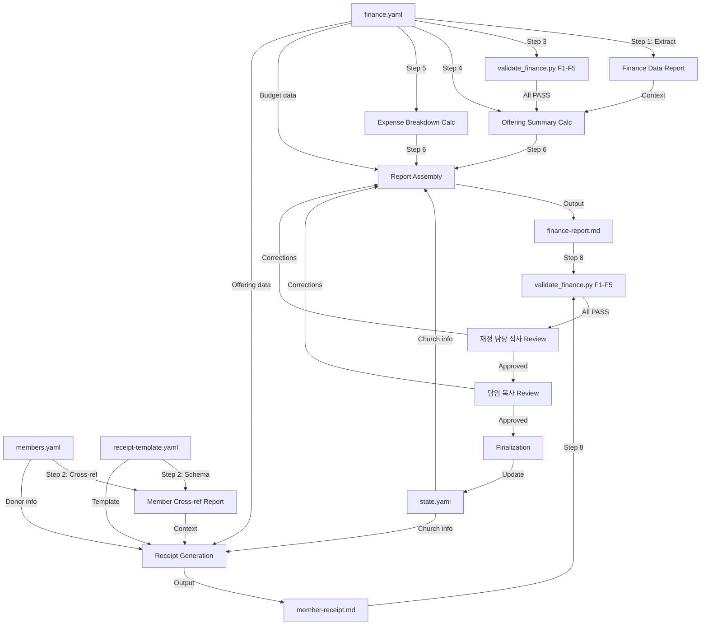

# 월별 재정 보고서 워크플로우

교회의 월별 재정 보고서를 생성한다: 구분별 헌금 요약, 지출 내역, 예산 대비 실적 비교, 그리고 개별 교인에 대한 연간 기부금영수증(소득세법 시행령 §80조①5호 근거).

## 개요

- **입력**: `data/finance.yaml`, `data/members.yaml`, `templates/receipt-template.yaml`, `state.yaml`
- **출력**: `output/finance-reports/{year}-{month}-finance-report.md`, `certificates/receipts/{year}/{member_id}-receipt-{year}.md`
- **주기**: 월 1회 (매월 첫 영업일 — 전월 분)
- **Autopilot**: 비활성 — 모든 재정 산출물은 이중 사람 검토를 필요로 함 (재정 담당 집사 + 담임 목사)
- **pACS**: 활성 — 재정 정확성에 대한 자기 신뢰도 평가
- **워크플로우 ID**: `monthly-finance-report`
- **트리거**: 예약 실행 (매월 첫 영업일) 또는 수동 (`/generate-finance-report`)
- **위험 수준**: 높음 (재정 데이터 — 법적·수탁 의무)
- **주 에이전트**: `@finance-recorder`
- **지원 에이전트**: `@member-manager` (교인 데이터에 대해 읽기 전용 접근)
- **통화**: KRW (원화), 정수 금액만 — 소수점 없음

---

## 유전된 DNA

> 이 워크플로우는 AgenticWorkflow의 전체 게놈을 상속한다.
> 목적은 도메인마다 다르지만, 게놈은 동일하다. `soul.md` 섹션 0 참조.

**헌법적 원칙** (재정 보고 도메인에 맞게 적용):

1. **품질 절대주의** (헌법적 원칙 1) — 교회 이름으로 공표되는 모든 재정 수치는 산술적으로 증명 가능하고 법적으로 준수해야 한다. 기부금영수증의 단 하나의 오류 금액이 교인의 세금 신고 오류와 교회의 법적 책임을 초래할 수 있다. 품질의 의미: F1-F5 검증 PASS, 산술적 불일치 제로, 정확한 한글 숫자 변환, 모든 산출물에 대한 이중 서명 사람 검토. 보고서 생성 속도는 무관하며, 정확성이 유일한 기준이다.
2. **단일 파일 SOT** (헌법적 원칙 2) — `data/finance.yaml`이 모든 재정 기록의 단일 소스 오브 트루스이다. `@finance-recorder` 에이전트가 유일한 기록자이다. 다른 에이전트는 이 파일에 쓸 수 없다. `state.yaml`은 워크플로우 수준 상태를 추적한다 (Orchestrator 전용). `data/members.yaml`은 영수증 생성에 필요한 교인 정보(기부자 이름, 주소, 주민등록번호)에 대해 읽기 전용이다.
3. **코드 변경 프로토콜** (헌법적 원칙 3) — 검증 스크립트(`validate_finance.py`), 영수증 템플릿, 또는 계산 로직을 수정할 때 3단계 프로토콜(의도 파악, 영향 범위 분석, 변경 설계)이 적용된다. 코딩 기준점(CAP)이 모든 구현을 안내한다:
   - **CAP-1 (코딩 전 사고)** — 수정 전에 `finance.yaml` 스키마와 `validate_finance.py` F1-F5 규칙을 먼저 읽는다. 산술 체인을 이해한다: 헌금 → monthly_summary → 예산 비교.
   - **CAP-2 (단순성 우선)** — 재정 보고는 집계와 포맷팅이다. 추측성 추상화 없음. 구분별 헌금 합산, 구분별 지출 합산, 예산 대비 비교, 마크다운으로 포맷팅.
   - **CAP-4 (외과적 변경)** — 계산을 수정하거나 형식을 조정할 때, 영향받는 연산만 변경한다. 전체 보고서를 재구성하거나 관련 없는 재정 기록을 수정하지 않는다.

**상속 패턴**:

| DNA 구성요소 | 상속 형태 | 이 워크플로우에서의 적용 |
|--------------|----------|------------------------|
| 3단계 구조 | 리서치, 처리, 출력 | 데이터 추출 + 검증, 계산 + 생성, 이중 검토 + 최종 처리 |
| SOT 패턴 | `finance.yaml` — 단일 기록자 (`@finance-recorder`) | 모든 재정 기록 중앙화; `state.yaml` Orchestrator 전용 |
| 4계층 QA | L0 Anti-Skip, L1 Verification, L1.5 pACS, L2 사람 검토 | L0: 파일 존재 + 최소 크기. L1: 산술 검증. L1.5: pACS 자기 평가. L2: 이중 사람 검토 (재정 담당 집사 + 담임 목사) |
| P1 할루시네이션 방지 | 결정론적 검증 (`validate_finance.py` F1-F5) | F1 ID 유일성, F2 금액 양수, F3 헌금 합계, F4 예산 산술, F5 월별 결산 정확성 |
| P2 전문성 기반 위임 | `@finance-recorder` — 모든 재정 작업 담당 | 재정 데이터 기록과 보고서 생성의 유일한 에이전트 |
| Safety Hook | `block_destructive_commands.py` — 위험 명령 차단 | 재정 기록의 우발적 삭제 방지 |
| 원자적 쓰기 | `church_data_utils.py` flock + tempfile + rename | 동시 접근 시 재정 데이터 무결성 보장 |
| 컨텍스트 보존 | 스냅샷 + Knowledge Archive + RLM 복원 | 재정 계산 상태가 세션 경계에서도 보존됨 |
| 코딩 기준점 (CAP) | CAP-1부터 CAP-4까지 내면화 | CAP-1: 계산 수정 전 F1-F5 먼저 읽기. CAP-2: 집계만, 과잉 설계 없음. CAP-4: 개별 연산에 대한 외과적 수정 |
| Decision Log | `autopilot-logs/` — 해당 없음 (Autopilot 비활성) | 모든 결정에 명시적 사람 승인 필요 |
| 무효화 전용 삭제 | `void: true` 플래그 — 재정 기록 삭제 금지 | 한국 교회 회계는 영구적 감사 추적을 요구함 |

**도메인 특화 유전자 발현**:

재정 보고 워크플로우에서 가장 강하게 발현되는 DNA 구성요소:

- **P1 유전자 (우성)** — `validate_finance.py` F1-F5가 `finance.yaml`에 기록할 때마다 실행된다. F3(헌금 합계 일관성)과 F5(월별 결산 정확성)는 산술 오류가 보고서에 전파될 수 없다는 연산적 증명을 제공한다. 이는 권고가 아니라 구조적 강제이다.
- **SOT 유전자 (우성)** — 재정 데이터는 가장 엄격한 단일 기록자 패턴을 따른다. `@finance-recorder`만 `finance.yaml`에 기록한다. 무효화 전용 삭제 정책은 불변 감사 추적을 보장한다. 이는 모든 기록을 무기한 보존해야 하는 한국 교회 회계 관행을 반영한다.
- **안전 유전자 (발현)** — 재정 데이터는 높은 민감도를 가진다. 이중 사람 검토(재정 담당 집사 + 담임 목사)가 모든 산출물에 필수이다. 이 워크플로우에서 Autopilot은 영구적으로 비활성이다. 재정 문서의 자동 승인 없음.
- **품질 유전자 (우성)** — 기부금영수증은 법적 문서이다(소득세법 시행령 §80조①5호). 한글 숫자 변환은 정확해야 한다. 주민등록번호의 개인정보 마스킹이 올바라야 한다. 어떤 오류든 교인에게 직접적인 법적·세무적 영향을 미친다.

---

## 슬래시 커맨드

### `/generate-finance-report`

```markdown
# .claude/commands/generate-finance-report.md
---
description: "Generate the monthly finance report and optionally donation receipts"
---

Execute the monthly-finance-report workflow for the specified month.

Steps:
1. Read `state.yaml` for church info and workflow state
2. Read and validate `data/finance.yaml` (run F1-F5 validation)
3. Filter offerings and expenses for the target month
4. Calculate offering summary by category (십일조, 감사헌금, 특별헌금, 기타)
5. Calculate expense breakdown by category (관리비, 인건비, 사역비, 선교비, 기타)
6. Generate budget vs actual comparison from budget section
7. Produce monthly report as Markdown
8. Run P1 validation: `python3 .claude/hooks/scripts/validate_finance.py --data-dir data/`
9. Present for double human review (재정 담당 집사 → 담임 목사)
10. On approval, update `state.yaml` workflow state

Optional (annual cycle):
11. Generate per-member donation receipts (기부금영수증) using receipt-template.yaml
12. Run receipt arithmetic validation
13. Present receipts for double human review

Target: $ARGUMENTS (defaults to previous month if not specified. Use "receipts" or "영수증" to include donation receipt generation.)
```

---

## 리서치 단계

### 1. 재정 데이터 추출

- **에이전트**: `@finance-recorder`
- **검증**:
  - [ ] `data/finance.yaml`이 읽기 가능하고 유효한 YAML임
  - [ ] `schema_version`이 존재하며 예상 버전과 일치
  - [ ] `currency` 필드가 "KRW"임
  - [ ] `year` 필드가 대상 보고 연도와 일치
  - [ ] `last_updated`가 합리적 범위 내 유효한 날짜임
  - [ ] 대상 월에 무효화되지 않은 헌금 기록이 최소 1건 존재
  - [ ] 대상 월에 무효화되지 않은 지출 기록이 최소 1건 존재 (또는 명시적 지출 제로 확인)
  - [ ] `budget` 섹션이 존재하며 `fiscal_year`가 대상 연도와 일치
  - [ ] `budget.categories`에 최소한 표준 카테고리 포함: 관리비, 인건비
  - [ ] 모든 헌금 기록에 `items[]`가 있으며 `category`와 `amount` 필드 포함
  - [ ] 모든 지출 기록에 `category`, `amount`, `approved_by` 필드 포함
- **작업**: `data/finance.yaml`을 읽고 대상 월의 모든 무효화되지 않은 헌금 및 지출 기록을 추출한다. 예산 카테고리와 배정 금액을 파악한다. 데이터 완전성을 검증하고 이상 항목(예: 무효화 기록, 누락된 승인 서명, 비정상적 고액)을 표시한다.
- **출력**: 재정 데이터 추출 보고서 (내부용 — 2단계에 컨텍스트로 전달)
- **번역**: 없음
- **리뷰**: 없음

### 2. 교인 데이터 교차 참조 (영수증 모드 전용)

- **에이전트**: `@finance-recorder` (`data/members.yaml`에 대한 읽기 전용 접근)
- **검증**:
  - [ ] `data/members.yaml`이 읽기 가능하고 유효한 YAML임
  - [ ] `finance.yaml`의 `pledged_annual`에 있는 모든 `member_id` 참조가 기존 교인으로 해결됨
  - [ ] 참조된 교인의 상태가 `status: "active"`임
  - [ ] 교인 기록에 영수증에 필요한 필드 포함: `name`, `contact.address` (null 허용)
  - [ ] `templates/receipt-template.yaml`이 읽기 가능하며 필수 섹션 모두 포함: header, church_info, donor_info, donation_details, legal_footer
  - [ ] 영수증 템플릿 `legal.basis`가 예상 법률 참조와 일치 (소득세법 제34조)
- **작업**: `finance.yaml`의 `pledged_annual` 교인 ID를 `data/members.yaml`과 교차 참조하여 영수증 생성을 위한 기부자 신원을 확인한다. `templates/receipt-template.yaml`을 읽어 템플릿 스키마가 온전한지 확인한다. 이 단계는 기부금영수증이 요청된 경우에만 실행된다(연간 주기 또는 명시적 `receipts` 인자).
- **출력**: 교인 교차 참조 보고서 (내부용 — 7단계에 컨텍스트로 전달)
- **번역**: 없음
- **리뷰**: 없음

### 3. (hook) P1 원천 데이터 검증

- **전처리**: 없음 — 검증이 데이터 파일을 직접 읽음
- **Hook**: `validate_finance.py`
- **명령**: `python3 .claude/hooks/scripts/validate_finance.py --data-dir data/`
- **검증**:
  - [ ] F1 PASS: 모든 헌금 ID가 `OFF-YYYY-NNN` 형식 일치; 모든 지출 ID가 `EXP-YYYY-NNN` 형식 일치; 중복 없음
  - [ ] F2 PASS: 무효화되지 않은 모든 기록의 금액이 양의 정수
  - [ ] F3 PASS: 무효화되지 않은 모든 헌금의 `total`이 `sum(items[].amount)`와 일치
  - [ ] F4 PASS: `budget.total_budget`이 `sum(budget.categories.values())`와 일치
  - [ ] F5 PASS: 모든 `monthly_summary` 항목이 무효화되지 않은 기록에서 계산된 합계와 일치
  - [ ] 검증 스크립트가 종료 코드 0과 JSON 출력에서 `valid: true`로 종료됨
- **작업**: 계산 시작 전 재정 데이터 무결성을 확인하기 위해 P1 결정론적 검증 스크립트를 실행한다. 5개 검사(F1-F5) 모두 PASS해야 한다. 어떤 검사라도 실패하면 중단하고 진행 전에 진단한다.
- **출력**: 검증 결과 (JSON — 검사별 세부 사항 포함 `valid: true/false`)
- **오류 처리**: F 검사 중 하나라도 실패하면 파이프라인이 중단된다. `@finance-recorder` 에이전트가 특정 실패 규칙을 진단하고, `finance.yaml`의 데이터 문제를 수정한 뒤 검증을 재실행해야 한다(최대 3회 재시도). 3회 실패 후 사람에게 에스컬레이션(재정 담당 집사).
- **번역**: 없음
- **리뷰**: 없음

---

## 처리 단계

### 4. 월별 헌금 요약 계산

- **에이전트**: `@finance-recorder`
- **전처리**: 검증된 `data/finance.yaml`을 로드한다. `date`가 대상 월 내에 있고 `void == false`인 헌금을 필터링한다.
- **검증**:
  - [ ] 대상 월의 무효화되지 않은 헌금만 집계에 포함됨
  - [ ] 헌금이 `items[].category`별로 올바른 카테고리명으로 그룹화됨: 십일조 (Tithe), 감사헌금 (Thanksgiving), 특별헌금 (Special), 선교헌금 (Mission), 건축헌금 (Building Fund), 주일헌금 (Sunday Offering), 기타 (Other)
  - [ ] 카테고리 소계의 합이 월별 총 수입과 일치 (산술 교차 검사)
  - [ ] 총합이 finance.yaml의 `monthly_summary[target_month].total_income`과 일치 (F5 일관성)
  - [ ] 모든 금액이 쉼표 구분자가 포함된 KRW 정수로 표시됨 (예: ₩3,850,000)
  - [ ] 총 수입 대비 각 카테고리의 비율이 정확하게 계산됨 (비율 합계 = 100%)
  - [ ] [trace:step-4:validation-rules] — F3 및 F5 규칙 대비 산술 무결성 확인됨
- **작업**: 대상 월의 모든 무효화되지 않은 헌금을 카테고리별로 집계한다. 각 카테고리에 대해 다음을 계산한다: 합계 금액, 건수, 총 수입 대비 비율. 요약 테이블 생성:

  | 헌금 구분 (Category) | 건수 (Count) | 금액 (Amount) | 비율 (%) |
  |---------------------|-------------|---------------|---------|
  | 십일조 (Tithe)       | N           | ₩X,XXX,XXX    | XX.X%   |
  | 감사헌금 (Thanksgiving)| N          | ₩X,XXX,XXX    | XX.X%   |
  | ...                 | ...         | ...           | ...     |
  | **합계 (Total)**     | **N**       | **₩X,XXX,XXX**| **100%**|

- **출력**: 헌금 요약 테이블 (내부용 — 6단계 보고서에 포함)
- **번역**: 없음
- **리뷰**: 없음

### 5. 월별 지출 내역 계산

- **에이전트**: `@finance-recorder`
- **전처리**: `date`가 대상 월 내에 있고 `void == false`인 지출을 필터링한다.
- **검증**:
  - [ ] 대상 월의 무효화되지 않은 지출만 포함됨
  - [ ] 지출이 `category`별로 표준 카테고리로 그룹화됨: 관리비, 인건비, 사역비, 선교비, 교육비, 기타
  - [ ] 카테고리 소계의 합이 월별 총 지출과 일치 (산술 교차 검사)
  - [ ] 총합이 finance.yaml의 `monthly_summary[target_month].total_expense`와 일치 (F5 일관성)
  - [ ] 각 지출에 `approved_by` 필드가 존재 (감사 추적)
  - [ ] 모든 금액이 쉼표 구분자가 포함된 KRW 정수로 표시됨
  - [ ] 총 지출 대비 각 카테고리의 비율이 정확하게 계산됨
  - [ ] [trace:step-4:validation-rules] — F5 규칙 대비 산술 무결성 확인됨
- **작업**: 대상 월의 모든 무효화되지 않은 지출을 카테고리별로 집계한다. 각 카테고리에 대해 다음을 계산한다: 합계 금액, 건수, 총 지출 대비 비율. 요약 테이블 생성:

  | 지출 구분 (Category) | 건수 (Count) | 금액 (Amount) | 비율 (%) |
  |---------------------|-------------|---------------|---------|
  | 관리비 (Maintenance)  | N           | ₩X,XXX,XXX    | XX.X%   |
  | 인건비 (Personnel)    | N           | ₩X,XXX,XXX    | XX.X%   |
  | 사역비 (Ministry)     | N           | ₩X,XXX,XXX    | XX.X%   |
  | 선교비 (Mission)      | N           | ₩X,XXX,XXX    | XX.X%   |
  | ...                 | ...         | ...           | ...     |
  | **합계 (Total)**     | **N**       | **₩X,XXX,XXX**| **100%**|

- **출력**: 지출 내역 테이블 (내부용 — 6단계 보고서에 포함)
- **번역**: 없음
- **리뷰**: 없음

### 6. 월별 보고서 조립

- **에이전트**: `@finance-recorder`
- **전처리**: 4단계의 헌금 요약, 5단계의 지출 내역, `finance.yaml`의 예산 데이터를 결합한다.
- **검증**:
  - [ ] 보고서 파일이 `output/finance-reports/{year}-{month}-finance-report.md`에 존재하며 비어있지 않음 (>= 500 바이트)
  - [ ] 보고서에 4개 섹션 모두 포함: 헌금 요약 (Offering Summary), 지출 내역 (Expense Breakdown), 예결산 대비 (Budget vs Actual), 월말 잔액 (Monthly Balance)
  - [ ] 예산 대비 실적 비교에 포함: 예산 카테고리, 예산 배정 금액 (연간 ÷ 12로 월별), 실제 금액, 차이 (실제 - 예산), 차이 비율
  - [ ] 월말 잔액 계산: total_income - total_expense = balance (monthly_summary 대비 검증)
  - [ ] 연초부터 누적 합계 포함: 누적 수입, 누적 지출, 누적 잔액
  - [ ] 보고서 헤더에 포함: 교회명 (state.yaml에서), 보고 기간, 생성 일자
  - [ ] 플레이스홀더 텍스트 없음 — 모든 필드에 finance.yaml에서 산출된 실제 데이터 포함
  - [ ] 보고서 내 모든 산술이 F3/F5 검증 대비 독립적으로 확인 가능
- **작업**: 다음 내용을 포함하는 월별 재정 보고서를 마크다운 문서로 생성한다:
  1. **헤더**: 교회명, 교단, 보고 기간 (YYYY년 MM월), 생성 일자
  2. **헌금 요약 (Offering Summary)**: 4단계의 카테고리별 내역 테이블
  3. **지출 내역 (Expense Breakdown)**: 5단계의 카테고리별 내역 테이블
  4. **예결산 대비 (Budget vs Actual)**: 각 예산 카테고리에 대해 연간 예산, 월별 예산(÷12), 실제 월별 지출, 차이, 차이 비율을 표시한다. 실제 지출이 예산을 초과하는 카테고리는 빨간색으로 표시한다.
  5. **월말 잔액 (Monthly Balance)**: 총 수입 - 총 지출 = 잔액. 가용한 경우 전월 이월금을 포함한다.
  6. **누적 현황 (Year-to-Date)**: 1월부터 대상 월까지의 누적 수입, 지출, 잔액.
  7. **비고 (Notes)**: 처리 중 확인된 무효화 기록, 비정상적 거래, 또는 불일치 사항.
- **출력**: `output/finance-reports/{year}-{month}-finance-report.md`
- **번역**: 없음
- **리뷰**: 없음

### 7. 기부금영수증 생성 (연간 주기 전용)

- **에이전트**: `@finance-recorder`
- **전처리**: 섹션-슬롯 스키마를 위해 `templates/receipt-template.yaml`을 로드한다. 기부자 정보를 위해 `data/members.yaml`을 로드한다. 이 단계는 연간 주기(일반적으로 1월에 전년도 회계연도 대상) 또는 명시적 요청 시에만 실행된다.
- **검증**:
  - [ ] 영수증 템플릿이 로드되고 5개 섹션 모두 존재: header, church_info, donor_info, donation_details, legal_footer
  - [ ] 헌금 기록이 있는 각 활동 교인에 대해: 무효화되지 않은 헌금으로부터 교인별 연간 합계 산출됨
  - [ ] `receipt_number`가 `No. {year}-{seq:03d}` 형식을 따르며 순번 카운터 적용
  - [ ] `donation_period`에 올바른 회계연도 범위 표시 (YYYY년 1월 1일 ~ YYYY년 12월 31일)
  - [ ] `donation_items` 테이블이 카테고리별 헌금을 올바른 합계로 집계
  - [ ] `total_amount_numeric`이 모든 카테고리 금액의 합과 일치 (산술 교차 검사)
  - [ ] `total_amount_korean`이 정수를 한글 숫자 표기로 정확하게 변환 (금 {value}원정)
  - [ ] `donor_id_number` 개인정보 마스킹 적용: `XXXXXX-X******` 형식
  - [ ] `seal_zone`에 가변 내용 없음 (예약 영역)
  - [ ] 법적 문구 일치: "위 금액을 소득세법 제34조, 같은 법 시행령 제80조 제1항 제5호에 의하여 기부금으로 영수합니다."
  - [ ] 영수증당 2부 생성: 기부자용 + 교회 보관용
  - [ ] 영수증 파일이 `certificates/receipts/{year}/{member_id}-receipt-{year}.md`에 존재
  - [ ] [trace:step-9:template-engine] — receipt-template.yaml 섹션-슬롯 스키마가 충실하게 채워짐
- **작업**: `finance.yaml`에 헌금 기록이 있는 각 활동 교인에 대해:
  1. 해당 교인에게 귀속된 모든 무효화되지 않은 헌금을 필터링 (`pledged_annual` member_id 연결 또는 직접 헌금 귀속을 통해)
  2. 헌금 카테고리별 집계: 십일조, 감사헌금, 특별헌금, 선교헌금, 기타
  3. 연간 총 기부 금액 산출
  4. 합계를 한글 숫자 표기로 변환 (예: 12,340,000 → 금 일천이백삼십사만원정)
  5. `members.yaml`에서 교인 정보 읽기: 이름, 주소, 주민등록번호 (개인정보 마스킹 적용)
  6. `state.yaml`에서 교회 정보 읽기: 교회명, 대표자 (담임 목사)
  7. 각 섹션에 대해 `receipt-template.yaml` 슬롯 채우기
  8. `certificates/receipts/{year}/{member_id}-receipt-{year}.md`에 영수증 마크다운 파일 생성
  9. 동일 파일 내에 기부자용과 교회 보관용 두 부 생성 (페이지 구분 마커 `---`로 구분)
- **출력**: `certificates/receipts/{year}/{member_id}-receipt-{year}.md` (헌금 기록이 있는 교인당 1개)
- **번역**: 없음
- **리뷰**: 없음

### 8. (hook) P1 출력 검증

- **전처리**: 없음 — 검증이 데이터 파일을 직접 읽음
- **Hook**: `validate_finance.py`
- **명령**: `python3 .claude/hooks/scripts/validate_finance.py --data-dir data/`
- **검증**:
  - [ ] F1-F5 모두 PASS (보고서 생성 후 재검증으로 데이터 손상 없음 확인)
  - [ ] [trace:step-8:validate-finance] — F1-F5 결과가 모든 원천 데이터의 산술 무결성 확인
  - [ ] 월별 보고서 합계를 F5 monthly_summary 대비 독립적으로 교차 검사
  - [ ] 영수증이 생성된 경우: 각 영수증의 합계가 카테고리 항목별 금액의 합과 일치
  - [ ] 검증 스크립트가 종료 코드 0과 JSON 출력에서 `valid: true`로 종료됨
- **작업**: 보고서 및 영수증 생성 후 전체 P1 검증 스위트를 재실행하여 다음을 확인한다:
  1. 처리 중 데이터가 의도치 않게 손상되지 않았음
  2. 생성된 산출물의 모든 산술이 검증된 원천 데이터와 일관됨
  3. `finance.yaml`의 월별 결산이 정확함 (F5)
  영수증의 경우: 추가로 각 생성된 영수증 파일을 읽고 파싱하여 sum(donation_items) == total_amount_numeric인지 확인한다.
- **출력**: 검증 결과 (JSON — 검사별 세부 사항 포함 `valid: true/false`)
- **오류 처리**: 생성 후 F 검사 중 하나라도 실패하면 즉시 중단한다. 이는 심각한 오류를 의미하며, 생성된 보고서에 부정확한 수치가 포함되었을 수 있다. `@finance-recorder` 에이전트가 진단, 수정, 재생성해야 한다(최대 3회 재시도). 3회 실패 후 사람에게 에스컬레이션(재정 담당 집사).
- **번역**: 없음
- **리뷰**: 없음

---

## 출력 단계

### 9. (human) 이중 검토 — 재정 담당 집사

- **행동**: 재정 담당 집사가 정확성과 완전성을 위해 생성된 모든 재정 산출물을 검토한다. 이것은 필수 이중 검토 프로세스의 첫 번째 관문이다.
- **HitL 패턴**: 이중 검토 관문 1/2 — 재정 담당 집사가 담임 목사 전에 검토
- **검증**:
  - [ ] 월별 보고서 헌금 합계가 재정 담당 집사의 독립 기록과 일치 (수동 교차 검사)
  - [ ] 월별 보고서 지출 합계가 승인된 지급 기록과 일치
  - [ ] 예산 대비 실적 비교가 공동의회에서 승인된 연간 예산을 반영
  - [ ] 영수증이 생성된 경우: 최소 3건의 영수증에 대해 산술 정확성 표본 검사
  - [ ] 영수증이 생성된 경우: 표본 검사된 영수증의 한글 숫자 표기 정확성 확인
  - [ ] 영수증이 생성된 경우: 기부자 주민등록번호의 개인정보 마스킹 완전성 확인
  - [ ] 법적으로 요구되는 범위를 넘어서는 민감 정보 노출 없음
  - [ ] 재정 담당 집사가 명시적 승인으로 서명하거나 수정 사항을 제공
- **Autopilot 동작**: 비활성 — 이 단계는 항상 명시적 사람 승인을 필요로 한다. 재정 문서는 어떤 상황에서도 자동 승인될 수 없다.
- **번역**: 없음
- **리뷰**: 없음

### 10. (human) 이중 검토 — 담임 목사

- **행동**: 담임 목사가 교회의 법적 대표자로서 생성된 모든 재정 산출물을 검토한다. 이것은 이중 검토 프로세스의 두 번째이자 최종 관문이다.
- **HitL 패턴**: 이중 검토 관문 2/2 — 담임 목사 최종 승인
- **검증**:
  - [ ] 9단계의 재정 담당 집사 승인이 기록됨
  - [ ] 월별 보고서가 교회의 재정 정책 및 목회 우선순위와 일관됨
  - [ ] 영수증이 생성된 경우: 영수증의 representative_name이 담임 목사의 실제 이름과 일치
  - [ ] 영수증이 생성된 경우: 교회 고유번호증 번호가 정확함
  - [ ] 담임 목사가 명시적 승인으로 서명하거나 수정 사항을 제공
  - [ ] 수정 사항이 제공된 경우: 6단계(보고서) 또는 7단계(영수증)로 돌아가서 재생성, 재검증, 이중 검토 재제출
- **Autopilot 동작**: 비활성 — 이 단계는 항상 명시적 사람 승인을 필요로 한다. 담임 목사의 검토는 교회의 모든 재정 문서에 대한 법적 승인이다.
- **번역**: 없음
- **리뷰**: 없음

### 11. 최종 처리

- **에이전트**: `@finance-recorder`
- **검증**:
  - [ ] 두 사람의 승인(9단계 + 10단계) 모두 기록됨
  - [ ] `finance.yaml`의 `monthly_summary`가 대상 월에 대해 최신 상태 (F5 일관)
  - [ ] `state.yaml` 워크플로우 상태 갱신: `last_report_month`, `last_report_date`, `status: "completed"`
  - [ ] 보고서 파일 경로가 `state.yaml`의 `church.workflow_states.finance.outputs`에 기록됨
  - [ ] 영수증이 생성된 경우: 영수증 파일 경로가 기록됨
  - [ ] 이 워크플로우 실행에서 `finance.yaml` 외에 다른 데이터 파일이 수정되지 않았음
  - [ ] 감사 추적 완료: 모든 계산 단계가 원천 기록에서 보고서 수치까지 추적 가능
- **작업**: 두 사람의 검토에서 산출물을 승인한 후:
  1. 대상 월의 `finance.yaml` `monthly_summary`가 정확한지 확인 (최종 1회 `validate_finance.py --data-dir data/` 실행)
  2. `state.yaml` 재정 워크플로우 상태를 완료로 갱신
  3. 워크플로우 상태에 출력 파일 경로 기록
  4. Orchestrator에 완료 상태 보고
- **출력**: 갱신된 `state.yaml` (워크플로우 상태)
- **번역**: 없음
- **리뷰**: 없음

---

## 교차 단계 추적성 인덱스

이 섹션은 워크플로우에서 사용된 모든 추적성 마커와 그 해결 대상을 문서화한다.

| 마커 | 단계 | 해결 대상 |
|------|------|----------|
| `[trace:step-4:validation-rules]` | 4, 5단계 | F3/F5 산술 무결성 규칙 — 헌금 합계와 월별 결산 일관성 |
| `[trace:step-8:validate-finance]` | 8단계 | F1-F5 검증 결과 — 생성 후 데이터 무결성 확인 |
| `[trace:step-9:template-engine]` | 7단계 | receipt-template.yaml 섹션-슬롯 스키마 — 기부금영수증 템플릿 적용 |

## 후처리

각 워크플로우 실행 후 다음 검증 스크립트를 실행한다:

```bash
# P1 Finance validation (F1-F5)
python3 .claude/hooks/scripts/validate_finance.py --data-dir data/

# Cross-step traceability validation (CT1-CT5)
python3 .claude/hooks/scripts/validate_traceability.py --step 11 --project-dir .
```

---

## Claude Code 설정

### 서브에이전트

```yaml
# .claude/agents/finance-recorder.md
---
model: sonnet
tools: [Read, Write, Edit, Bash, Glob, Grep]
write_permissions:
  - data/finance.yaml
  - output/finance-reports/
---
# Financial data management + report generation
# Sonnet is sufficient for deterministic aggregation and formatting
# All outputs require double human review (Autopilot disabled)
```

### SOT (상태 관리)

- **SOT 파일**: `state.yaml` (교회 행정 시스템 수준 SOT)
- **쓰기 권한**: Orchestrator 전용 — 서브에이전트가 `state.yaml`에 직접 쓰지 않음
- **에이전트 접근**: `@finance-recorder`는 `data/finance.yaml`과 `output/finance-reports/`에만 기록한다. `data/members.yaml`과 `templates/receipt-template.yaml`은 읽기 전용으로 접근한다.
- **Autopilot 재정의**: 이 워크플로우에서 Autopilot은 영구적으로 비활성이다. `state.yaml`의 `autopilot.enabled` 필드는 무시된다. 모든 `(human)` 단계에 명시적 승인이 필요하다.

**사용되는 SOT 필드**:

```yaml
church:
  name: "..."                              # Report header + receipt church_name
  denomination: "..."                      # Report header
  representative_name: "..."               # Receipt representative_name slot
  registration_number: "..."               # Receipt church_registration_number slot
  workflow_states:
    finance:
      last_report_month: "2026-01"         # Last completed report month
      last_report_date: "2026-02-03"       # Date of last report generation
      next_due_month: "2026-02"            # Next report target
      status: "pending"                    # pending | in_progress | completed
      outputs:
        "2026-01": "output/finance-reports/2026-01-finance-report.md"
```

### Hook

```json
{
  "hooks": {
    "PreToolUse": [
      {
        "matcher": "Write",
        "hooks": [
          {
            "type": "command",
            "command": "if test -f \"$CLAUDE_PROJECT_DIR/.claude/hooks/scripts/block_destructive_commands.py\"; then python3 \"$CLAUDE_PROJECT_DIR/.claude/hooks/scripts/block_destructive_commands.py\"; fi",
            "timeout": 10
          }
        ]
      }
    ]
  }
}
```

> **참고**: 월별 재정 보고서 워크플로우는 상위 프로젝트의 Hook 인프라(block_destructive_commands.py, 컨텍스트 보존 Hook)에 의존한다. 3단계와 8단계에서 명시적으로 호출되는 `validate_finance.py` 외에는 워크플로우 고유의 Hook이 필요하지 않다.

### 슬래시 커맨드

```yaml
commands:
  /generate-finance-report:
    description: "Generate the monthly finance report and optionally donation receipts"
    file: ".claude/commands/generate-finance-report.md"
```

### 런타임 디렉터리

```yaml
runtime_directories:
  output/finance-reports/:     # Generated monthly finance report Markdown files
  certificates/receipts/:     # Generated donation receipt files (annual)
  verification-logs/:         # step-N-verify.md (L1 verification results)
  pacs-logs/:                 # step-N-pacs.md (pACS self-confidence ratings)
```

### 오류 처리

```yaml
error_handling:
  on_agent_failure:
    action: retry_with_feedback
    max_attempts: 3
    escalation: "재정 담당 집사 (Finance Deacon)"

  on_validation_failure:
    action: retry_with_feedback
    retry_with_feedback: true
    rollback_after: 3
    detail: "F1-F5 validation failure triggers re-read of finance.yaml and re-computation"

  on_arithmetic_mismatch:
    action: halt_immediately
    detail: "Any arithmetic discrepancy in financial outputs is a critical error. Halt, diagnose, and re-generate from validated source data."

  on_hook_failure:
    action: log_and_continue

  on_context_overflow:
    action: save_and_recover
```

### pACS 로그

```yaml
pacs_logging:
  log_directory: "pacs-logs/"
  log_format: "step-{N}-pacs.md"
  dimensions: [F, C, L]
  scoring: "min-score"
  triggers:
    GREEN: ">= 70 -> proceed to human review"
    YELLOW: "50-69 -> proceed with flag, document weak dimension"
    RED: "< 50 -> rework before human review"
  protocol: "AGENTS.md section 5.4"
  note: "pACS RED does not bypass human review — even GREEN requires double review (Autopilot disabled)"
```

---

## 데이터 흐름 다이어그램



---

## 실행 체크리스트 (실행건별)

이 체크리스트는 월별 재정 보고서 워크플로우가 실행될 때마다 Orchestrator가 수행한다.

### 실행 전
- [ ] `state.yaml`의 `church.workflow_states.finance.status`가 `pending` 또는 `completed`인지 확인 (`in_progress`가 아님)
- [ ] `state.yaml`의 `church.workflow_states.finance.next_due_month`에서 대상 월 결정
- [ ] 대상 월이 과거인지 확인 (현재 또는 미래 월에 대해서는 보고서 생성 불가)

### 1단계 완료
- [ ] 대상 월의 재정 데이터 추출 완료
- [ ] 이상 항목 표시됨 (무효화 기록, 누락된 승인)

### 2단계 완료 (영수증 모드)
- [ ] 교인 교차 참조 유효
- [ ] 영수증 템플릿 스키마 온전

### 3단계 완료
- [ ] `validate_finance.py`가 종료 코드 0, `valid: true`로 종료
- [ ] F1, F2, F3, F4, F5 모두 개별 PASS

### 4단계 완료
- [ ] 카테고리별 헌금 요약 산출됨
- [ ] 카테고리 소계의 합이 월별 합계와 일치 (산술 확인)

### 5단계 완료
- [ ] 카테고리별 지출 내역 산출됨
- [ ] 카테고리 소계의 합이 월별 합계와 일치 (산술 확인)

### 6단계 완료
- [ ] 보고서 파일이 `output/finance-reports/{year}-{month}-finance-report.md`에 존재
- [ ] 보고서가 비어있지 않음 (>= 500 바이트)
- [ ] 4개 섹션 모두 존재: 헌금, 지출, 예산 비교, 잔액

### 7단계 완료 (영수증 모드)
- [ ] 대상 교인 전원에 대한 영수증 파일 생성됨
- [ ] 각 영수증에 기부자용 + 교회 보관용 포함
- [ ] 한글 숫자 표기 정확
- [ ] 개인정보 마스킹 적용됨

### 8단계 완료
- [ ] `validate_finance.py` 재실행 결과 종료 코드 0, `valid: true`
- [ ] 생성 후 F1-F5 모두 PASS

### 9단계 완료
- [ ] 재정 담당 집사의 명시적 승인 기록됨
- [ ] 수정 사항이 있는 경우 적용 및 재검증 완료

### 10단계 완료
- [ ] 담임 목사의 명시적 승인 기록됨
- [ ] 수정 사항이 있는 경우 적용, 재검증, 재정 담당 집사의 재검토 완료

### 11단계 완료
- [ ] `finance.yaml`의 `monthly_summary` 최신 상태
- [ ] `state.yaml` 워크플로우 상태 갱신됨
- [ ] 출력 파일 경로 기록됨

---

## 품질 기준

### 재정 정확성

1. **산술 무결성** — 보고서의 모든 합계는 `finance.yaml`의 원천 기록을 재집계하여 독립적으로 확인할 수 있어야 한다. F3(헌금 합계)과 F5(월별 결산)가 연산적 증명을 제공한다.
2. **예산 일관성** — 연간 예산 수치는 공동의회에서 승인된 예산과 일치해야 한다. F4가 `total_budget == sum(categories)`를 검증한다.
3. **무효화 기록 제외** — 모든 계산에서 `void: true`인 기록을 제외한다. 무효화 기록은 감사 추적을 위해 보존되지만 집계에는 포함되지 않는다.
4. **통화 무결성** — 모든 금액은 KRW 정수이다. 소수 금액 없음. 통화 변환 없음. 가독성을 위해 쉼표 구분자로 표시한다.

### 영수증 법적 준수

1. **법률 참조** — 모든 영수증에 정확한 법적 문구를 포함해야 한다: "소득세법 제34조, 같은 법 시행령 제80조 제1항 제5호"
2. **한글 숫자 표기** — 합계 금액은 숫자형(₩1,234,000)과 한글 숫자형(금 일백이십삼만사천원정) 두 형태로 표시해야 한다. 한글 숫자는 숫자형과 산술적으로 동일해야 한다.
3. **개인정보 마스킹** — 기부자 주민등록번호는 `XXXXXX-X******` 형태로 마스킹해야 한다. 생성된 영수증에 마스킹되지 않은 개인식별정보가 없어야 한다.
4. **인장 영역** — 직인 위치 영역에 가변 내용이 포함되어서는 안 된다 (receipt-template.yaml의 템플릿 제약).
5. **이중 발행** — 모든 영수증은 두 부를 생성한다: 기부자용과 교회 보관용.

### 비기능적 품질

1. **이중 검토** — 재정 담당 집사와 담임 목사 모두의 명시적 승인 없이는 어떤 재정 문서도 확정되지 않는다. 이는 타협 불가능한 수탁 및 법적 요건이다.
2. **감사 가능성** — 보고서의 모든 수치는 `finance.yaml`의 특정 기록(ID: OFF-YYYY-NNN, EXP-YYYY-NNN)으로 추적된다. 감사 추적은 불변이다(무효화 전용 삭제).
3. **재현 가능성** — 동일한 월에 대해 원천 데이터 변경 없이 워크플로우를 두 번 실행하면 동일한 산출물이 생성된다.
4. **추적성** — 교차 단계 추적성 마커가 계산을 검증 규칙과 템플릿 스키마에 연결하여, 연산 체인의 사후 검증을 가능하게 한다.