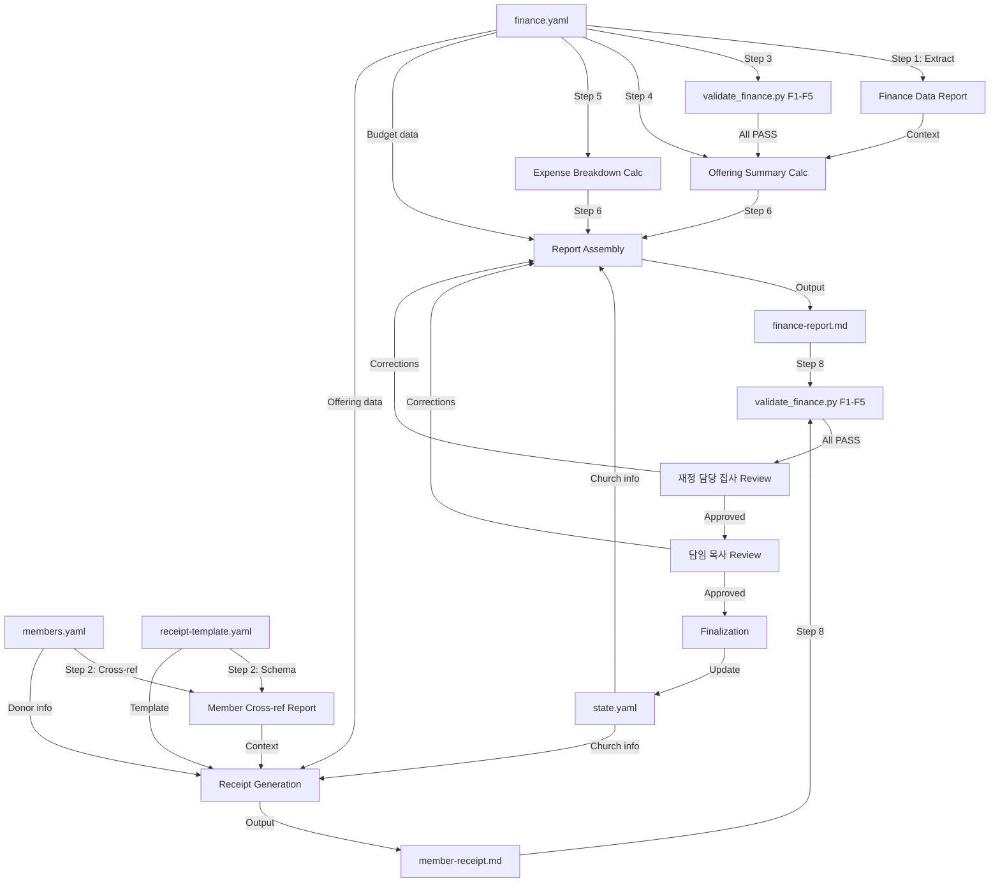

# Monthly Finance Report Workflow

Generates monthly financial reports for the church: an offering summary by category, expense breakdown, budget vs actual comparison, and annual donation receipts (기부금영수증) for individual members per Korean tax law (소득세법 시행령 §80조①5호).

## Overview

- **Input**: `data/finance.yaml`, `data/members.yaml`, `templates/receipt-template.yaml`, `state.yaml`
- **Output**: `output/finance-reports/{year}-{month}-finance-report.md`, `certificates/receipts/{year}/{member_id}-receipt-{year}.md`
- **Frequency**: Monthly (1st business day of each month — for the preceding month)
- **Autopilot**: disabled — all financial outputs require double human review (재정 담당 집사 + 담임 목사)
- **pACS**: enabled — self-confidence assessment on financial accuracy
- **Workflow ID**: `monthly-finance-report`
- **Trigger**: scheduled (1st business day of each month) or manual (`/generate-finance-report`)
- **Risk Level**: high (financial data — legal and fiduciary obligations)
- **Primary Agent**: `@finance-recorder`
- **Supporting Agents**: `@member-manager` (read-only for member data)
- **Currency**: KRW (Korean Won), integer amounts only — no decimals

---

## Inherited DNA

> This workflow inherits the complete genome of AgenticWorkflow.
> Purpose varies by domain; the genome is identical. See `soul.md` section 0.

**Constitutional Principles** (adapted to the finance reporting domain):

1. **Quality Absolutism** (Constitutional Principle 1) — Every financial figure published under the church name must be arithmetically provable and legally compliant. A single incorrect amount on a donation receipt can cause tax filing errors for members and legal liability for the church. Quality means: F1-F5 validation PASS, zero arithmetic discrepancies, correct Korean numeral conversion, and dual-signature human review on every output. Speed of report generation is irrelevant; accuracy is the sole metric.
2. **Single-File SOT** (Constitutional Principle 2) — `data/finance.yaml` is the single source of truth for all financial records. The `@finance-recorder` agent is the sole writer. No other agent writes to this file. `state.yaml` tracks workflow-level state (Orchestrator only). `data/members.yaml` is read-only for member information needed in receipt generation (donor name, address, resident_number).
3. **Code Change Protocol** (Constitutional Principle 3) — When modifying validation scripts (`validate_finance.py`), receipt templates, or calculation logic, the 3-step protocol (Intent, Ripple Effect Analysis, Change Plan) applies. Coding Anchor Points (CAP) guide all implementation:
   - **CAP-1 (Think Before Coding)** — Read `finance.yaml` schema and `validate_finance.py` F1-F5 rules before any modification. Understand the arithmetic chain: offerings → monthly_summary → budget comparison.
   - **CAP-2 (Simplicity First)** — Financial reporting is aggregation and formatting. No speculative abstractions. Sum offerings by category, sum expenses by category, compare to budget, format as Markdown.
   - **CAP-4 (Surgical Changes)** — When fixing a calculation or adjusting a format, change only the affected computation. Do not restructure the entire report or modify unrelated financial records.

**Inherited Patterns**:

| DNA Component | Inherited Form | Application in This Workflow |
|--------------|---------------|------------------------------|
| 3-Phase Structure | Research, Processing, Output | Data extraction + validation, calculation + generation, double-review + finalization |
| SOT Pattern | `finance.yaml` — single writer (`@finance-recorder`) | All financial records centralized; `state.yaml` Orchestrator-only |
| 4-Layer QA | L0 Anti-Skip, L1 Verification, L1.5 pACS, L2 Human Review | L0: file exists + min size. L1: arithmetic verification. L1.5: pACS self-rating. L2: double human review (재정 담당 집사 + 담임 목사) |
| P1 Hallucination Prevention | Deterministic validation (`validate_finance.py` F1-F5) | F1 ID uniqueness, F2 amount positivity, F3 offering sums, F4 budget arithmetic, F5 monthly summary accuracy |
| P2 Expert Delegation | `@finance-recorder` for all financial operations | Sole agent for finance.yaml writes and report generation |
| Safety Hooks | `block_destructive_commands.py` — dangerous command blocking | Prevents accidental deletion of financial records |
| Atomic Writes | `church_data_utils.py` flock + tempfile + rename | Financial data integrity during concurrent access |
| Context Preservation | Snapshot + Knowledge Archive + RLM restoration | Financial calculation state survives session boundaries |
| Coding Anchor Points (CAP) | CAP-1 through CAP-4 internalized | CAP-1: read F1-F5 before modifying calculations. CAP-2: aggregation only, no over-engineering. CAP-4: surgical fixes to individual computations |
| Decision Log | `autopilot-logs/` — N/A (Autopilot disabled) | All decisions require explicit human approval |
| Void-Only Deletion | `void: true` flag — never delete financial records | Korean church accounting requires permanent audit trail |

**Domain-Specific Gene Expression**:

The finance reporting workflow expresses these DNA components most strongly:

- **P1 Gene (dominant)** — `validate_finance.py` F1-F5 runs after every write to `finance.yaml`. F3 (offering sum consistency) and F5 (monthly summary accuracy) provide computational proof that no arithmetic error can propagate to reports. This is not advisory; it is structural enforcement.
- **SOT Gene (dominant)** — Financial data has the strictest sole-writer pattern. Only `@finance-recorder` writes to `finance.yaml`. The void-only deletion policy ensures an immutable audit trail. This mirrors Korean church accounting practices where all records must be preserved indefinitely.
- **Safety Gene (expressed)** — Financial data is HIGH sensitivity. Double human review (재정 담당 집사 + 담임 목사) is mandatory on ALL outputs. Autopilot is permanently disabled for this workflow. No auto-approval of financial documents.
- **Quality Gene (dominant)** — Donation receipts are legal documents (소득세법 시행령 §80조①5호). Korean numeral conversion must be exact. Privacy masking of resident numbers must be correct. Any error has direct legal and tax consequences for church members.

---

## Slash Command

### `/generate-finance-report`

```markdown
# .claude/commands/generate-finance-report.md
---
description: "Generate the monthly finance report and optionally donation receipts"
---

Execute the monthly-finance-report workflow for the specified month.

Steps:
1. Read `state.yaml` for church info and workflow state
2. Read and validate `data/finance.yaml` (run F1-F5 validation)
3. Filter offerings and expenses for the target month
4. Calculate offering summary by category (십일조, 감사헌금, 특별헌금, 기타)
5. Calculate expense breakdown by category (관리비, 인건비, 사역비, 선교비, 기타)
6. Generate budget vs actual comparison from budget section
7. Produce monthly report as Markdown
8. Run P1 validation: `python3 .claude/hooks/scripts/validate_finance.py --data-dir data/`
9. Present for double human review (재정 담당 집사 → 담임 목사)
10. On approval, update `state.yaml` workflow state

Optional (annual cycle):
11. Generate per-member donation receipts (기부금영수증) using receipt-template.yaml
12. Run receipt arithmetic validation
13. Present receipts for double human review

Target: $ARGUMENTS (defaults to previous month if not specified. Use "receipts" or "영수증" to include donation receipt generation.)
```

---

## Research Phase

### 1. Finance Data Extraction

- **Agent**: `@finance-recorder`
- **Verification**:
  - [ ] `data/finance.yaml` is readable and valid YAML
  - [ ] `schema_version` is present and matches expected version
  - [ ] `currency` field is "KRW"
  - [ ] `year` field matches the target report year
  - [ ] `last_updated` is a valid date within reasonable range
  - [ ] At least one non-void offering record exists for the target month
  - [ ] At least one non-void expense record exists for the target month (or explicit zero-expense confirmation)
  - [ ] `budget` section exists with `fiscal_year` matching the target year
  - [ ] `budget.categories` contains at least the standard categories: 관리비, 인건비
  - [ ] All offering records have `items[]` with `category` and `amount` fields
  - [ ] All expense records have `category`, `amount`, and `approved_by` fields
- **Task**: Read `data/finance.yaml` and extract all non-void offering and expense records for the target month. Identify the budget categories and their allocated amounts. Verify data completeness and flag any anomalies (e.g., voided records, missing approval signatures, unusually large amounts).
- **Output**: Finance data extraction report (internal -- passed to Step 2 as context)
- **Translation**: none
- **Review**: none

### 2. Member Data Cross-Reference (Receipt Mode Only)

- **Agent**: `@finance-recorder` (read-only access to `data/members.yaml`)
- **Verification**:
  - [ ] `data/members.yaml` is readable and valid YAML
  - [ ] All `member_id` references in `finance.yaml` `pledged_annual` resolve to existing members
  - [ ] Referenced members have `status: "active"`
  - [ ] Member records contain fields needed for receipts: `name`, `contact.address` (nullable)
  - [ ] `templates/receipt-template.yaml` is readable and contains all required sections: header, church_info, donor_info, donation_details, legal_footer
  - [ ] Receipt template `legal.basis` matches expected statute reference (소득세법 제34조)
- **Task**: Cross-reference `finance.yaml` `pledged_annual` member IDs against `data/members.yaml` to verify donor identity for receipt generation. Read `templates/receipt-template.yaml` to confirm template schema is intact. This step runs only when donation receipts are requested (annual cycle or explicit `receipts` argument).
- **Output**: Member cross-reference report (internal -- passed to Step 7 as context)
- **Translation**: none
- **Review**: none

### 3. (hook) P1 Source Data Validation

- **Pre-processing**: None -- validation reads data files directly
- **Hook**: `validate_finance.py`
- **Command**: `python3 .claude/hooks/scripts/validate_finance.py --data-dir data/`
- **Verification**:
  - [ ] F1 PASS: All offering IDs match `OFF-YYYY-NNN` format; all expense IDs match `EXP-YYYY-NNN` format; no duplicates
  - [ ] F2 PASS: All amounts in non-void records are positive integers
  - [ ] F3 PASS: Every offering's `total` equals `sum(items[].amount)` for non-void records
  - [ ] F4 PASS: `budget.total_budget` equals `sum(budget.categories.values())`
  - [ ] F5 PASS: All `monthly_summary` entries match computed totals from non-void records
  - [ ] Validation script exits with code 0 and `valid: true` in JSON output
- **Task**: Execute the P1 deterministic validation script to verify financial data integrity before any calculations begin. All five checks (F1-F5) must PASS. If any check fails, halt and diagnose before proceeding.
- **Output**: Validation result (JSON -- `valid: true/false` with per-check details)
- **Error Handling**: If any F-check fails, the pipeline halts. The `@finance-recorder` agent must diagnose the specific failing rule, fix the data issue in `finance.yaml`, and re-run validation (max 3 retries). After 3 failures, escalate to human (재정 담당 집사).
- **Translation**: none
- **Review**: none

---

## Processing Phase

### 4. Monthly Offering Summary Calculation

- **Agent**: `@finance-recorder`
- **Pre-processing**: Load validated `data/finance.yaml`. Filter offerings where `date` falls within the target month and `void == false`.
- **Verification**:
  - [ ] Only non-void offerings for the target month are included in aggregation
  - [ ] Offerings are grouped by `items[].category` with correct category names: 십일조 (Tithe), 감사헌금 (Thanksgiving), 특별헌금 (Special), 선교헌금 (Mission), 건축헌금 (Building Fund), 주일헌금 (Sunday Offering), 기타 (Other)
  - [ ] Category subtotals sum to the monthly total income (arithmetic cross-check)
  - [ ] Grand total matches `monthly_summary[target_month].total_income` in finance.yaml (F5 consistency)
  - [ ] All amounts are formatted as KRW integers with comma separators (e.g., ₩3,850,000)
  - [ ] Percentage share of each category relative to total income is computed correctly (sum of percentages = 100%)
  - [ ] [trace:step-4:validation-rules] -- arithmetic integrity verified against F3 and F5 rules
- **Task**: Aggregate all non-void offerings for the target month by category. For each category, compute: total amount, number of offerings, percentage of total income. Produce a summary table:

  | 헌금 구분 (Category) | 건수 (Count) | 금액 (Amount) | 비율 (%) |
  |---------------------|-------------|---------------|---------|
  | 십일조 (Tithe)       | N           | ₩X,XXX,XXX    | XX.X%   |
  | 감사헌금 (Thanksgiving)| N          | ₩X,XXX,XXX    | XX.X%   |
  | ...                 | ...         | ...           | ...     |
  | **합계 (Total)**     | **N**       | **₩X,XXX,XXX**| **100%**|

- **Output**: Offering summary table (internal -- embedded in Step 6 report)
- **Translation**: none
- **Review**: none

### 5. Monthly Expense Breakdown Calculation

- **Agent**: `@finance-recorder`
- **Pre-processing**: Filter expenses where `date` falls within the target month and `void == false`.
- **Verification**:
  - [ ] Only non-void expenses for the target month are included
  - [ ] Expenses are grouped by `category` with standard categories: 관리비, 인건비, 사역비, 선교비, 교육비, 기타
  - [ ] Category subtotals sum to the monthly total expense (arithmetic cross-check)
  - [ ] Grand total matches `monthly_summary[target_month].total_expense` in finance.yaml (F5 consistency)
  - [ ] Each expense has an `approved_by` field (audit trail)
  - [ ] All amounts are formatted as KRW integers with comma separators
  - [ ] Percentage share of each category relative to total expense is computed correctly
  - [ ] [trace:step-4:validation-rules] -- arithmetic integrity verified against F5 rules
- **Task**: Aggregate all non-void expenses for the target month by category. For each category, compute: total amount, number of transactions, percentage of total expense. Produce a summary table:

  | 지출 구분 (Category) | 건수 (Count) | 금액 (Amount) | 비율 (%) |
  |---------------------|-------------|---------------|---------|
  | 관리비 (Maintenance)  | N           | ₩X,XXX,XXX    | XX.X%   |
  | 인건비 (Personnel)    | N           | ₩X,XXX,XXX    | XX.X%   |
  | 사역비 (Ministry)     | N           | ₩X,XXX,XXX    | XX.X%   |
  | 선교비 (Mission)      | N           | ₩X,XXX,XXX    | XX.X%   |
  | ...                 | ...         | ...           | ...     |
  | **합계 (Total)**     | **N**       | **₩X,XXX,XXX**| **100%**|

- **Output**: Expense breakdown table (internal -- embedded in Step 6 report)
- **Translation**: none
- **Review**: none

### 6. Monthly Report Assembly

- **Agent**: `@finance-recorder`
- **Pre-processing**: Combine offering summary from Step 4, expense breakdown from Step 5, and budget data from `finance.yaml`.
- **Verification**:
  - [ ] Report file exists at `output/finance-reports/{year}-{month}-finance-report.md` and is non-empty (>= 500 bytes)
  - [ ] Report contains all four sections: 헌금 요약 (Offering Summary), 지출 내역 (Expense Breakdown), 예결산 대비 (Budget vs Actual), 월말 잔액 (Monthly Balance)
  - [ ] Budget vs Actual comparison includes: budget category, budgeted amount (annual ÷ 12 for monthly), actual amount, variance (actual - budgeted), variance percentage
  - [ ] Monthly balance calculation: total_income - total_expense = balance (verified against monthly_summary)
  - [ ] Year-to-date totals are included: cumulative income, cumulative expense, cumulative balance
  - [ ] Report header contains: church name (from state.yaml), report period, generation date
  - [ ] No placeholder text -- every field contains real computed data from finance.yaml
  - [ ] All arithmetic in the report is independently verifiable against F3/F5 validation
- **Task**: Generate the monthly finance report as a Markdown document containing:
  1. **Header**: Church name, denomination, report period (YYYY년 MM월), generation date
  2. **헌금 요약 (Offering Summary)**: Category breakdown table from Step 4
  3. **지출 내역 (Expense Breakdown)**: Category breakdown table from Step 5
  4. **예결산 대비 (Budget vs Actual)**: For each budget category, show annual budget, monthly budget (÷12), actual monthly spend, variance, and variance percentage. Flag categories where actual exceeds budget in red.
  5. **월말 잔액 (Monthly Balance)**: Total income - total expense = balance. Include prior month carry-forward if available.
  6. **누적 현황 (Year-to-Date)**: Cumulative income, expense, and balance from January through the target month.
  7. **비고 (Notes)**: Any voided records, unusual transactions, or discrepancies noted during processing.
- **Output**: `output/finance-reports/{year}-{month}-finance-report.md`
- **Translation**: none
- **Review**: none

### 7. Donation Receipt Generation (Annual Cycle Only)

- **Agent**: `@finance-recorder`
- **Pre-processing**: Load `templates/receipt-template.yaml` for section-slot schema. Load `data/members.yaml` for donor information. This step executes only during the annual cycle (typically January for the prior fiscal year) or when explicitly requested.
- **Verification**:
  - [ ] Receipt template loaded and all 5 sections present: header, church_info, donor_info, donation_details, legal_footer
  - [ ] For each active member with donations: per-member annual total computed from non-void offerings
  - [ ] `receipt_number` follows format `No. {year}-{seq:03d}` with sequential counter
  - [ ] `donation_period` displays correct fiscal year range (YYYY년 1월 1일 ~ YYYY년 12월 31일)
  - [ ] `donation_items` table aggregates offerings by category with correct sums
  - [ ] `total_amount_numeric` equals sum of all category amounts (arithmetic cross-check)
  - [ ] `total_amount_korean` correctly converts integer to Korean numeral notation (금 {value}원정)
  - [ ] `donor_id_number` privacy masking applied: `XXXXXX-X******` format
  - [ ] `seal_zone` contains no variable content (RESERVED area)
  - [ ] Legal text matches: "위 금액을 소득세법 제34조, 같은 법 시행령 제80조 제1항 제5호에 의하여 기부금으로 영수합니다."
  - [ ] Two copies generated per receipt: donor copy + church archive copy
  - [ ] Receipt file exists at `certificates/receipts/{year}/{member_id}-receipt-{year}.md`
  - [ ] [trace:step-9:template-engine] -- receipt-template.yaml section-slot schema faithfully populated
- **Task**: For each active member with recorded donations in `finance.yaml`:
  1. Filter all non-void offerings attributed to the member (via `pledged_annual` member_id linkage or direct offering attribution)
  2. Aggregate by offering category: 십일조, 감사헌금, 특별헌금, 선교헌금, 기타
  3. Compute total annual donation amount
  4. Convert total to Korean numeral notation (e.g., 12,340,000 → 금 일천이백삼십사만원정)
  5. Read member info from `members.yaml`: name, address, resident_number (privacy-masked)
  6. Read church info from `state.yaml`: church_name, representative (담임 목사)
  7. Populate `receipt-template.yaml` slots for each section
  8. Generate receipt Markdown file at `certificates/receipts/{year}/{member_id}-receipt-{year}.md`
  9. Generate both donor copy and church archive copy within the same file (separated by page break marker `---`)
- **Output**: `certificates/receipts/{year}/{member_id}-receipt-{year}.md` (one per member with donations)
- **Translation**: none
- **Review**: none

### 8. (hook) P1 Output Validation

- **Pre-processing**: None -- validation reads data files directly
- **Hook**: `validate_finance.py`
- **Command**: `python3 .claude/hooks/scripts/validate_finance.py --data-dir data/`
- **Verification**:
  - [ ] F1-F5 all PASS (re-validation after report generation to confirm no data corruption)
  - [ ] [trace:step-8:validate-finance] -- F1-F5 results confirm arithmetic integrity of all source data
  - [ ] Monthly report totals independently cross-checked against F5 monthly_summary
  - [ ] If receipts were generated: each receipt's total matches the sum of its category line items
  - [ ] Validation script exits with code 0 and `valid: true` in JSON output
- **Task**: Re-run the full P1 validation suite after report and receipt generation to confirm that:
  1. No data was inadvertently corrupted during processing
  2. All arithmetic in generated outputs is consistent with the validated source data
  3. Monthly summary in `finance.yaml` is accurate (F5)
  For receipts: additionally verify that sum(donation_items) == total_amount_numeric for each generated receipt file by reading and parsing each receipt.
- **Output**: Validation result (JSON -- `valid: true/false` with per-check details)
- **Error Handling**: If any F-check fails post-generation, halt immediately. This indicates a critical error -- the generated reports may contain incorrect figures. The `@finance-recorder` agent must diagnose, fix, and regenerate (max 3 retries). After 3 failures, escalate to human (재정 담당 집사).
- **Translation**: none
- **Review**: none

---

## Output Phase

### 9. (human) Double Review — 재정 담당 집사

- **Action**: The 재정 담당 집사 (Finance Deacon) reviews all generated financial outputs for accuracy and completeness. This is the first gate of the mandatory double-review process.
- **HitL Pattern**: Double Review Gate 1 of 2 — Finance Deacon reviews before Senior Pastor
- **Verification**:
  - [ ] Monthly report offering totals match the Finance Deacon's independent records (manual cross-check)
  - [ ] Monthly report expense totals match approved payment records
  - [ ] Budget vs actual comparison reflects the approved annual budget from the congregational meeting (공동의회)
  - [ ] If receipts generated: spot-check at least 3 receipts for arithmetic accuracy
  - [ ] If receipts generated: verify Korean numeral notation is correct on spot-checked receipts
  - [ ] If receipts generated: verify privacy masking on donor ID numbers is complete
  - [ ] No sensitive information exposed beyond what is legally required
  - [ ] Finance Deacon signs off with explicit approval or provides corrections
- **Autopilot Behavior**: DISABLED -- this step always requires explicit human approval. Financial documents cannot be auto-approved under any circumstance.
- **Translation**: none
- **Review**: none

### 10. (human) Double Review — 담임 목사

- **Action**: The 담임 목사 (Senior Pastor) reviews all generated financial outputs as the church's legal representative. This is the second and final gate of the double-review process.
- **HitL Pattern**: Double Review Gate 2 of 2 — Senior Pastor final approval
- **Verification**:
  - [ ] Finance Deacon's approval from Step 9 is recorded
  - [ ] Monthly report is consistent with the church's financial policy and pastoral priorities
  - [ ] If receipts generated: representative_name on receipts matches the Senior Pastor's actual name
  - [ ] If receipts generated: church registration number (고유번호증 번호) is correct
  - [ ] Senior Pastor signs off with explicit approval or provides corrections
  - [ ] If corrections are provided: loop back to Step 6 (report) or Step 7 (receipts), re-generate, re-validate, and re-submit for double review
- **Autopilot Behavior**: DISABLED -- this step always requires explicit human approval. The Senior Pastor's review is the legal authorization for all church financial documents.
- **Translation**: none
- **Review**: none

### 11. Finalization

- **Agent**: `@finance-recorder`
- **Verification**:
  - [ ] Both human approvals (Step 9 + Step 10) are recorded
  - [ ] `finance.yaml` `monthly_summary` is up to date for the target month (F5 consistent)
  - [ ] `state.yaml` workflow state is updated: `last_report_month`, `last_report_date`, `status: "completed"`
  - [ ] Report file path is recorded in `state.yaml` `church.workflow_states.finance.outputs`
  - [ ] If receipts generated: receipt file paths are recorded
  - [ ] No data files other than `finance.yaml` were modified by this workflow run
  - [ ] Audit trail complete: all computation steps are traceable from source records to report figures
- **Task**: After both human reviews approve the outputs:
  1. Confirm `finance.yaml` `monthly_summary` for the target month is accurate (run `validate_finance.py --data-dir data/` one final time)
  2. Update `state.yaml` finance workflow state to reflect completion
  3. Record output file paths in workflow state
  4. Report completion status to Orchestrator
- **Output**: Updated `state.yaml` (workflow state)
- **Translation**: none
- **Review**: none

---

## Cross-Step Traceability Index

This section documents all traceability markers used in the workflow and their resolution targets.

| Marker | Step | Resolves To |
|--------|------|-------------|
| `[trace:step-4:validation-rules]` | Steps 4, 5 | F3/F5 arithmetic integrity rules -- offering sums and monthly summary consistency |
| `[trace:step-8:validate-finance]` | Step 8 | F1-F5 validation results -- post-generation data integrity confirmation |
| `[trace:step-9:template-engine]` | Step 7 | receipt-template.yaml section-slot schema -- template population for donation receipts |

## Post-processing

After each workflow run, execute the following validation scripts:

```bash
# P1 Finance validation (F1-F5)
python3 .claude/hooks/scripts/validate_finance.py --data-dir data/

# Cross-step traceability validation (CT1-CT5)
python3 .claude/hooks/scripts/validate_traceability.py --step 11 --project-dir .
```

---

## Claude Code Configuration

### Sub-agents

```yaml
# .claude/agents/finance-recorder.md
---
model: sonnet
tools: [Read, Write, Edit, Bash, Glob, Grep]
write_permissions:
  - data/finance.yaml
  - output/finance-reports/
---
# Financial data management + report generation
# Sonnet is sufficient for deterministic aggregation and formatting
# All outputs require double human review (Autopilot disabled)
```

### SOT (State Management)

- **SOT File**: `state.yaml` (church-admin system-level SOT)
- **Write Permission**: Orchestrator only -- no sub-agent writes to `state.yaml` directly
- **Agent Access**: `@finance-recorder` writes only to `data/finance.yaml` and `output/finance-reports/`. Reads `data/members.yaml` and `templates/receipt-template.yaml` as read-only.
- **Autopilot Override**: Autopilot is permanently disabled for this workflow. The `state.yaml` `autopilot.enabled` field is ignored. All `(human)` steps require explicit approval.

**SOT Fields Used**:

```yaml
church:
  name: "..."                              # Report header + receipt church_name
  denomination: "..."                      # Report header
  representative_name: "..."               # Receipt representative_name slot
  registration_number: "..."               # Receipt church_registration_number slot
  workflow_states:
    finance:
      last_report_month: "2026-01"         # Last completed report month
      last_report_date: "2026-02-03"       # Date of last report generation
      next_due_month: "2026-02"            # Next report target
      status: "pending"                    # pending | in_progress | completed
      outputs:
        "2026-01": "output/finance-reports/2026-01-finance-report.md"
```

### Hooks

```json
{
  "hooks": {
    "PreToolUse": [
      {
        "matcher": "Write",
        "hooks": [
          {
            "type": "command",
            "command": "if test -f \"$CLAUDE_PROJECT_DIR/.claude/hooks/scripts/block_destructive_commands.py\"; then python3 \"$CLAUDE_PROJECT_DIR/.claude/hooks/scripts/block_destructive_commands.py\"; fi",
            "timeout": 10
          }
        ]
      }
    ]
  }
}
```

> **Note**: The monthly-finance-report workflow relies on the parent project's hook infrastructure (block_destructive_commands.py, context preservation hooks). No workflow-specific hooks are needed beyond `validate_finance.py` which is invoked explicitly in Steps 3 and 8.

### Slash Commands

```yaml
commands:
  /generate-finance-report:
    description: "Generate the monthly finance report and optionally donation receipts"
    file: ".claude/commands/generate-finance-report.md"
```

### Runtime Directories

```yaml
runtime_directories:
  output/finance-reports/:     # Generated monthly finance report Markdown files
  certificates/receipts/:     # Generated donation receipt files (annual)
  verification-logs/:         # step-N-verify.md (L1 verification results)
  pacs-logs/:                 # step-N-pacs.md (pACS self-confidence ratings)
```

### Error Handling

```yaml
error_handling:
  on_agent_failure:
    action: retry_with_feedback
    max_attempts: 3
    escalation: "재정 담당 집사 (Finance Deacon)"

  on_validation_failure:
    action: retry_with_feedback
    retry_with_feedback: true
    rollback_after: 3
    detail: "F1-F5 validation failure triggers re-read of finance.yaml and re-computation"

  on_arithmetic_mismatch:
    action: halt_immediately
    detail: "Any arithmetic discrepancy in financial outputs is a critical error. Halt, diagnose, and re-generate from validated source data."

  on_hook_failure:
    action: log_and_continue

  on_context_overflow:
    action: save_and_recover
```

### pACS Logs

```yaml
pacs_logging:
  log_directory: "pacs-logs/"
  log_format: "step-{N}-pacs.md"
  dimensions: [F, C, L]
  scoring: "min-score"
  triggers:
    GREEN: ">= 70 -> proceed to human review"
    YELLOW: "50-69 -> proceed with flag, document weak dimension"
    RED: "< 50 -> rework before human review"
  protocol: "AGENTS.md section 5.4"
  note: "pACS RED does not bypass human review — even GREEN requires double review (Autopilot disabled)"
```

---

## Data Flow Diagram



---

## Execution Checklist (Per-Run)

This checklist is executed by the Orchestrator each time the monthly-finance-report workflow runs.

### Pre-Run
- [ ] Verify `state.yaml` `church.workflow_states.finance.status` is `pending` or `completed` (not `in_progress`)
- [ ] Determine target month from `state.yaml` `church.workflow_states.finance.next_due_month`
- [ ] Confirm target month is in the past (cannot generate report for current or future months)

### Step 1 Completion
- [ ] Finance data extracted for target month
- [ ] Anomalies flagged (voided records, missing approvals)

### Step 2 Completion (Receipt Mode)
- [ ] Member cross-references valid
- [ ] Receipt template schema intact

### Step 3 Completion
- [ ] `validate_finance.py` exits with code 0, `valid: true`
- [ ] F1, F2, F3, F4, F5 all individually PASS

### Step 4 Completion
- [ ] Offering summary by category computed
- [ ] Category subtotals sum to monthly total (arithmetic verified)

### Step 5 Completion
- [ ] Expense breakdown by category computed
- [ ] Category subtotals sum to monthly total (arithmetic verified)

### Step 6 Completion
- [ ] Report file exists at `output/finance-reports/{year}-{month}-finance-report.md`
- [ ] Report is non-empty (>= 500 bytes)
- [ ] All four sections present: offering, expense, budget comparison, balance

### Step 7 Completion (Receipt Mode)
- [ ] Receipt files generated for all eligible members
- [ ] Each receipt contains donor copy + church archive copy
- [ ] Korean numeral notation correct
- [ ] Privacy masking applied

### Step 8 Completion
- [ ] `validate_finance.py` re-run exits with code 0, `valid: true`
- [ ] F1-F5 all PASS post-generation

### Step 9 Completion
- [ ] 재정 담당 집사 explicit approval recorded
- [ ] Any corrections applied and re-validated

### Step 10 Completion
- [ ] 담임 목사 explicit approval recorded
- [ ] Any corrections applied, re-validated, and re-reviewed by 재정 담당 집사

### Step 11 Completion
- [ ] `finance.yaml` `monthly_summary` up to date
- [ ] `state.yaml` workflow state updated
- [ ] Output file paths recorded

---

## Quality Standards

### Financial Accuracy

1. **Arithmetic Integrity** — Every sum in the report must be independently verifiable by re-aggregating the source records in `finance.yaml`. F3 (offering sums) and F5 (monthly summary) provide computational proof.
2. **Budget Consistency** — Annual budget figures must match the approved budget from the congregational meeting. F4 validates `total_budget == sum(categories)`.
3. **Void Exclusion** — All calculations exclude records with `void: true`. Voided records are preserved for audit trail but never counted in aggregations.
4. **Currency Integrity** — All amounts are KRW integers. No decimal amounts. No currency conversion. Formatted with comma separators for readability.

### Receipt Legal Compliance

1. **Statute Reference** — Every receipt must contain the exact legal text: "소득세법 제34조, 같은 법 시행령 제80조 제1항 제5호"
2. **Korean Numeral Notation** — Total amount must appear in both numeric (₩1,234,000) and Korean numeral (금 일백이십삼만사천원정) forms. The Korean numeral must be arithmetically identical to the numeric form.
3. **Privacy Masking** — Donor resident registration numbers must be masked as `XXXXXX-X******`. No unmasked PII in generated receipts.
4. **Seal Zone** — The 직인 위치 area must remain free of variable content (template constraint from receipt-template.yaml).
5. **Dual Copy** — Every receipt generates two copies: donor copy and church archive copy.

### Non-Functional Quality

1. **Double Review** — No financial document is finalized without explicit approval from both the Finance Deacon and the Senior Pastor. This is a non-negotiable fiduciary and legal requirement.
2. **Auditability** — Every figure in the report traces back to specific records in `finance.yaml` with IDs (OFF-YYYY-NNN, EXP-YYYY-NNN). The audit trail is immutable (void-only deletion).
3. **Reproducibility** — Running the workflow twice for the same month with unchanged source data produces identical outputs.
4. **Traceability** — Cross-step traceability markers link calculations back to validation rules and template schemas, enabling post-hoc verification of the computation chain.
