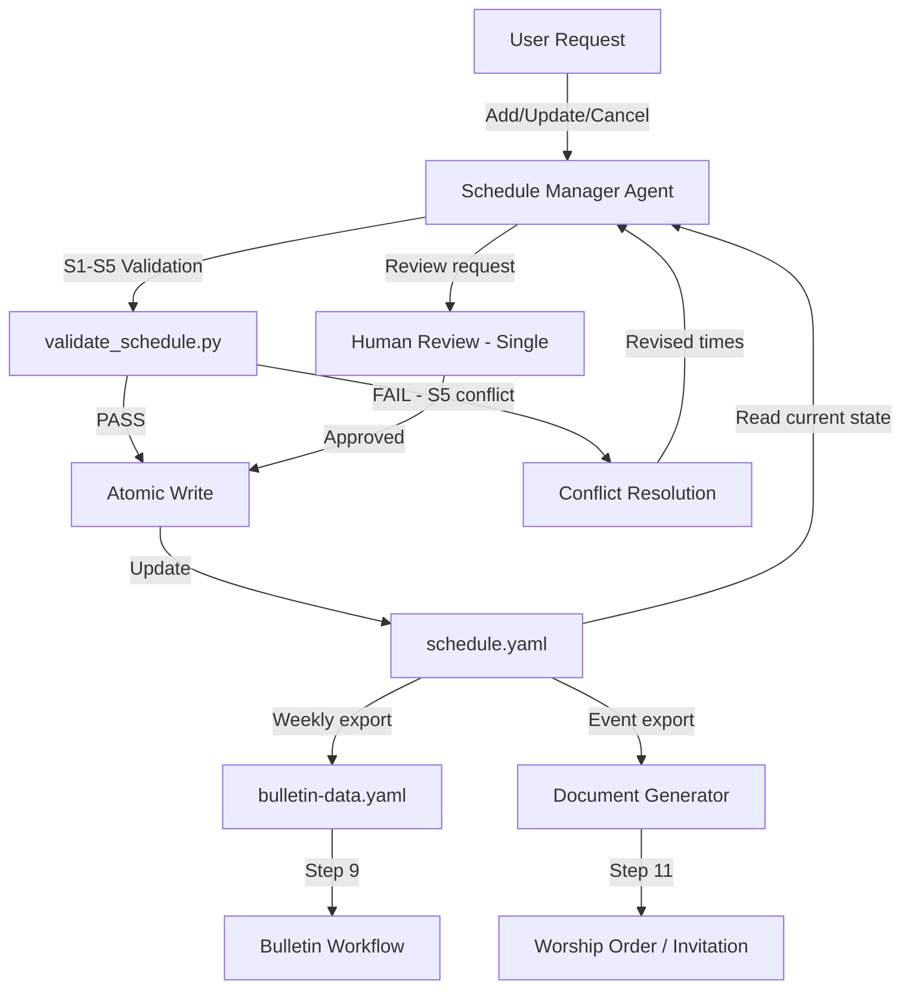

# 일정 관리 워크플로우

교회 예배, 특별 행사, 시설 예약을 관리하기 위한 자동화 파이프라인으로, 충돌 감지 및 워크플로우 간 통합을 제공한다.

- **Workflow ID**: `schedule-manager`
- **Trigger**: 이벤트 기반(비정기 일정 변경) 또는 예약 기반(주간 주보 준비)
- **Frequency**: 수시
- **Risk Level**: 중간
- **Autopilot**: 적격(단일 리뷰 HitL 게이트)
- **Primary Agent**: `@schedule-manager`
- **Output**: 업데이트된 `data/schedule.yaml`, 주보 및 문서 생성을 위한 일정 보고서

---

## 유전된 DNA (부모 게놈)

### 헌법적 원칙

1. **품질 절대주의** (헌법적 원칙 1) — 모든 일정 항목은 시간적 정합성을 갖추고, 시설 충돌이 없어야 하며, 유효한 상태값을 가져야 한다. 시설 예약이 겹치는 예배나 시간 범위가 불가능한(종료 시각이 시작 시각보다 앞선) 행사는 운영 조율에 지장을 준다. 품질이란: 모든 S1-S5 검증 규칙 통과, 시설 충돌 없음, 올바른 상태 전환을 의미한다.
2. **SOT 규율** (헌법적 원칙 2) — `schedule.yaml`이 모든 교회 일정의 단일 소스 오브 트루스이다. 별도 캘린더나 비공식 채널을 통한 업데이트는 허용되지 않는다. `@schedule-manager` 에이전트가 유일한 기록자이다.
3. **코드 변경 프로토콜** (헌법적 원칙 3) — 일정 수정 전 반드시 다음을 수행한다: (1) 의도 — 어떤 예배/행사/예약을 왜 변경하는지, (2) 파급 효과 — 주보 데이터, 문서 생성, 시설 가용성에 영향이 있는지, (3) 변경 계획 — S1-S5를 먼저 검증하고, 기록하고, 확인한다.

### 유전 패턴

| DNA 구성 요소 | 부모 형태 | 일정 관리 특화 발현 |
|--------------|-------------|-------------------------------|
| 3단계 구조 | Research, Planning, Implementation | 검증, 처리, 출력 (일정 → 검증 → 통합) |
| SOT 패턴 | 단일 파일 상태 관리 | `schedule.yaml` 단일 기록자 + 원자적 쓰기 |
| 4계층 QA | L0, L1, L1.5, L2 | L0: 파일 존재. L1: S1-S5 검증. L1.5: pACS. L2: 사람 검토 |
| P1 검증 | 결정론적 Python 스크립트 | `validate_schedule.py` — 매 쓰기 후 S1-S5 검증 |
| P2 전문성 기반 위임 | 전문 에이전트 | `@schedule-manager`가 일정 담당, `@bulletin-generator`가 주보 소비 |
| Safety Hook | 쓰기 권한 강제 | 에이전트 수준 write_permissions: `data/schedule.yaml`만 허용 |
| CAP-2 | 단순성 우선 | 직접 CRUD 운영 — 불필요한 추상화 계층 없음 |
| CAP-4 | 외과적 변경 | 변경 대상인 특정 예배/행사/예약만 수정 |

---

## Research 단계

### 1. 일정 검증

- **Agent**: `@schedule-manager`
- **Task**: 변경 전 현재 일정 상태를 검증한다. schedule.yaml을 로드하고, S1-S5 규칙을 검증하며, 기존 충돌이나 불일치를 식별한다.
- **Verification**:
  - [ ] `data/schedule.yaml` 로드 및 파싱 성공
  - [ ] 모든 기존 항목이 S1(ID 형식), S2(시간 형식), S3(반복 주기), S4(상태 열거값) 검증 통과
  - [ ] S5 시설 중복 검사 통과(기존 충돌 없음)
  - [ ] [trace:step-8:validate-schedule] 검증 규칙 참조됨
- **Output**: 일정 검증 보고서(내부)
- **Translation**: none

---

## Processing 단계

### 2. 예배/행사 관리

- **Agent**: `@schedule-manager`
- **Task**: 요청된 일정 작업을 실행한다(예배, 행사 또는 시설 예약의 추가/수정/취소).
- **Verification**:
  - [ ] 신규/수정 항목이 S1에 따른 유효한 ID 형식을 가짐 (`SVC-XXX-N`, `EVT-YYYY-NNN`, `FAC-YYYY-NNN`)
  - [ ] S2에 따른 유효한 시간 형식 (HH:MM)
  - [ ] S3에 따른 유효한 반복 주기/요일
  - [ ] S4에 따른 유효한 상태 열거값 (scheduled, confirmed, completed, cancelled)
  - [ ] 신규/수정 예약에 대한 S5 시설 중복 검사 통과 [trace:step-8:validate-schedule]
  - [ ] 원자적 쓰기 완료
- **Output**: 업데이트된 `data/schedule.yaml`
- **Post-processing**: `python3 .claude/hooks/scripts/validate_schedule.py --data-dir data/`
- **Translation**: none

#### 정기 예배 운영

| 운영 | 필수 필드 | 검증 |
|-----------|----------------|------------|
| 예배 추가 | id, name, recurrence, day_of_week, time, location | S1, S2, S3 |
| 예배 수정 | id + 변경 필드 | S1-S4 |
| 예배 취소 | id, reason | S4 (→ "cancelled") |

#### 특별 행사 운영

| 운영 | 필수 필드 | 검증 |
|-----------|----------------|------------|
| 행사 등록 | id, name, date, time, location, organizer | S1, S2, S5 |
| 행사 수정 | id + 변경 필드 | S1-S5 |
| 행사 취소 | id, reason | S4 (→ "cancelled") |

#### 시설 예약 운영

| 운영 | 필수 필드 | 검증 |
|-----------|----------------|------------|
| 시설 예약 | id, facility, date, start_time, end_time, purpose | S1, S2, S5 |
| 예약 해제 | id | 예약 목록에서 제거 |
| 가용성 확인 | facility, date, time_range | S5 중복 조회 |

### 3. (human) 일정 변경 검토

- **Agent**: 사람 검토자(단일 리뷰 — 중간 위험도)
- **Task**: 최종 확정 전에 제안된 일정 변경 사항을 검토한다.
- **Verification**:
  - [ ] 모든 수정 사항이 변경 전/후 비교와 함께 제시됨
  - [ ] 시설 충돌이 명시적으로 다루어짐(해당 시)
  - [ ] 다른 워크플로우에 미치는 영향이 기록됨(주보, 문서)
- **Output**: 승인 또는 거부된 일정 변경 사항
- **Translation**: none

---

## Output 단계

### 4. 워크플로우 간 통합

- **Agent**: `@schedule-manager`
- **Task**: 주보 및 문서 워크플로우에서 소비할 수 있도록 일정 데이터를 내보낸다.
- **Verification**:
  - [ ] 주간 예배 데이터가 bulletin-data.yaml 소비 형식으로 포맷됨 [trace:step-9:bulletin]
  - [ ] 행사 데이터가 문서 생성기용으로 포맷됨(예배 순서지, 초청장) [trace:step-9:template-engine]
  - [ ] 일정 변경이 다음 주보 생성 주기에 반영됨
  - [ ] validate_schedule.py S1-S5 최종 검사로 데이터 무결성 확인
- **Output**: 워크플로우 간 소비를 위한 일정 통합 데이터
- **Translation**: none

### 5. 상태 추적

- **Agent**: `@schedule-manager`
- **Task**: 날짜가 지남에 따라 행사 상태를 업데이트하고 완료를 추적한다.
- **Verification**:
  - [ ] 날짜가 지난 행사가 상태 검토 대상으로 자동 표시됨
  - [ ] 상태 전환이 유효한 열거값을 따름 (scheduled → confirmed → completed)
  - [ ] 취소된 행사가 취소 사유와 함께 보존됨(소프트 삭제)
- **Output**: 현재 상태가 반영된 업데이트된 `data/schedule.yaml`

---

## 후처리

각 워크플로우 실행 후:

```bash
# P1 Schedule validation (S1-S5)
python3 .claude/hooks/scripts/validate_schedule.py --data-dir data/

# Cross-step traceability validation (CT1-CT5)
python3 .claude/hooks/scripts/validate_traceability.py --step 11 --project-dir .
```

---

## 데이터 흐름 다이어그램



---

## Claude Code 설정

### 서브에이전트

```yaml
agents:
  schedule-manager:
    description: "Manages church schedule: services, events, facility bookings"
    model: sonnet
    tools: [Read, Write, Edit, Bash, Glob, Grep]
    write_permissions:
      - data/schedule.yaml
    permissionMode: default
    maxTurns: 15
```

### SOT

```yaml
sot_file: state.yaml
sot_write: orchestrator_only
```

### Hooks

```yaml
hooks:
  - event: PostToolUse
    matcher: "Write"
    command: "python3 .claude/hooks/scripts/validate_schedule.py --data-dir data/"
```

---

## 품질 기준

1. **시간적 정합성** — 모든 행사는 유효한 시작/종료 시각을 갖는다. 종료 시각은 시작 시각 이후여야 한다.
2. **시설 독점성** — 동일 시설, 동일 날짜에 두 예약이 겹칠 수 없다(S5).
3. **상태 유효성** — 모든 행사는 S4에 따른 유효한 상태 열거값을 사용한다.
4. **ID 고유성** — 예배, 행사, 예약 전체에 걸쳐 중복 ID가 없어야 한다(S1).
5. **통합 준비 상태** — 매 변경 후 일정 데이터가 주보 및 문서 소비를 위한 형식으로 준비된다.

## 추적성 인덱스

| 마커 | 단계 | 설명 |
|--------|------|-------------|
| [trace:step-8:validate-schedule] | Step 8 | 일정 데이터 무결성을 위한 S1-S5 검증 규칙 |
| [trace:step-9:bulletin] | Step 9 | 주간 예배 데이터를 소비하는 주보 워크플로우 |
| [trace:step-9:template-engine] | Step 9 | 예배 순서지 생성을 위한 템플릿 엔진 |
