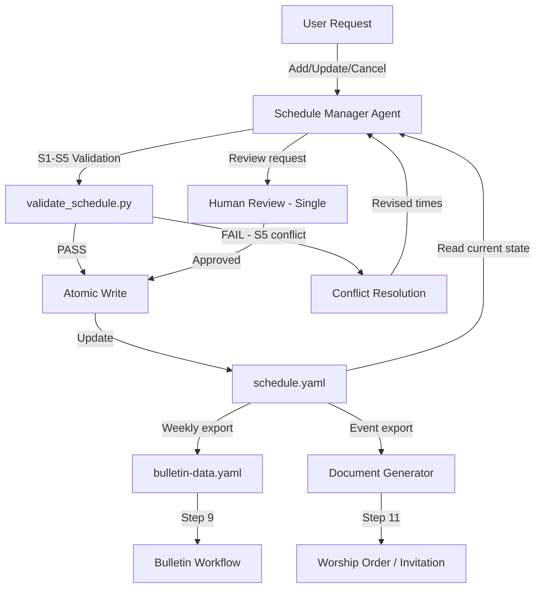

# Schedule Management Workflow

Automated pipeline for managing church worship services, special events, and facility bookings with conflict detection and cross-workflow integration.

- **Workflow ID**: `schedule-manager`
- **Trigger**: Event-driven (ad-hoc schedule changes) or scheduled (weekly bulletin preparation)
- **Frequency**: On-demand
- **Risk Level**: Medium
- **Autopilot**: Eligible (single-review HitL gate)
- **Primary Agent**: `@schedule-manager`
- **Output**: Updated `data/schedule.yaml`, schedule reports for bulletin and document generation

---

## Inherited DNA (Parent Genome)

### Constitutional Principles

1. **Quality Absolutism** (Constitutional Principle 1) — Every schedule entry must be temporally consistent, facility-conflict-free, and status-valid. A worship service with an overlapping facility booking or an event in an impossible time range (end before start) damages operational coordination. Quality means: all S1-S5 validation rules pass, no facility conflicts, correct status transitions.
2. **SOT Discipline** (Constitutional Principle 2) — `schedule.yaml` is the single source of truth for all church scheduling. No shadow calendars, no side-channel updates. The `@schedule-manager` agent is the sole writer.
3. **Code Change Protocol** (Constitutional Principle 3) — Before any schedule modification: (1) intent — which service/event/booking to change and why, (2) ripple effects — does this affect bulletin data, document generation, or facility availability, (3) change plan — validate S1-S5 first, then write, then verify.

### Inherited Patterns

| DNA Component | Parent Form | Schedule-Specific Expression |
|--------------|-------------|-------------------------------|
| 3-Phase Structure | Research, Planning, Implementation | Verification, Processing, Output (schedule → validate → integrate) |
| SOT Pattern | Single-file state management | `schedule.yaml` sole writer + atomic writes |
| 4-Layer QA | L0, L1, L1.5, L2 | L0: file exists. L1: S1-S5 validation. L1.5: pACS. L2: Human review |
| P1 Validation | Deterministic Python scripts | `validate_schedule.py` S1-S5 after every write |
| P2 Expert Delegation | Specialized agents | `@schedule-manager` for scheduling, `@bulletin-generator` for bulletin consumption |
| Safety Hooks | Write permission enforcement | Agent-level write_permissions: `data/schedule.yaml` only |
| CAP-2 | Simplicity First | Direct CRUD operations — no unnecessary abstraction layers |
| CAP-4 | Surgical Changes | Modify only the specific service/event/booking being changed |

---

## Research Phase

### 1. Schedule Verification

- **Agent**: `@schedule-manager`
- **Task**: Verify current schedule state before making changes. Load schedule.yaml, validate S1-S5 rules, identify any existing conflicts or inconsistencies.
- **Verification**:
  - [ ] `data/schedule.yaml` loaded and parsed successfully
  - [ ] All existing entries pass S1 (ID format), S2 (time format), S3 (recurrence), S4 (status enum) validation
  - [ ] S5 facility overlap check passed (no existing conflicts)
  - [ ] [trace:step-8:validate-schedule] validation rules referenced
- **Output**: Schedule verification report (internal)
- **Translation**: none

---

## Processing Phase

### 2. Service/Event Management

- **Agent**: `@schedule-manager`
- **Task**: Execute the requested schedule operation (add/update/cancel service, event, or facility booking).
- **Verification**:
  - [ ] New/modified entry has valid ID format per S1 (`SVC-XXX-N`, `EVT-YYYY-NNN`, `FAC-YYYY-NNN`)
  - [ ] Time format valid per S2 (HH:MM)
  - [ ] Recurrence/day-of-week valid per S3
  - [ ] Status is valid enum per S4 (planned, confirmed, completed, cancelled)
  - [ ] S5 facility overlap check passed for new/modified bookings [trace:step-8:validate-schedule]
  - [ ] Atomic write completed successfully
- **Output**: Updated `data/schedule.yaml`
- **Post-processing**: `python3 .claude/hooks/scripts/validate_schedule.py --data-dir data/`
- **Translation**: none

#### Regular Service Operations

| Operation | Required Fields | Validation |
|-----------|----------------|------------|
| Add service | id, name, recurrence, day_of_week, time, location | S1, S2, S3 |
| Update service | id + changed fields | S1-S4 |
| Cancel service | id, reason | S4 (→ "cancelled") |

#### Special Event Operations

| Operation | Required Fields | Validation |
|-----------|----------------|------------|
| Register event | id, name, date, time, location, organizer | S1, S2, S5 |
| Update event | id + changed fields | S1-S5 |
| Cancel event | id, reason | S4 (→ "cancelled") |

#### Facility Booking Operations

| Operation | Required Fields | Validation |
|-----------|----------------|------------|
| Book facility | id, facility, date, start_time, end_time, purpose | S1, S2, S5 |
| Release booking | id | Remove from bookings |
| Check availability | facility, date, time_range | S5 overlap query |

### 3. (human) Schedule Change Review

- **Agent**: Human reviewer (single-review — medium risk)
- **Task**: Review the proposed schedule changes before finalizing.
- **Verification**:
  - [ ] All modifications presented with before/after comparison
  - [ ] Facility conflicts explicitly addressed (if any)
  - [ ] Impact on other workflows noted (bulletin, documents)
- **Output**: Approved or rejected schedule changes
- **Translation**: none

---

## Output Phase

### 4. Cross-Workflow Integration

- **Agent**: `@schedule-manager`
- **Task**: Export schedule data for consumption by bulletin and document workflows.
- **Verification**:
  - [ ] Weekly service data formatted for bulletin-data.yaml consumption [trace:step-9:bulletin]
  - [ ] Event data formatted for document generator (worship orders, invitations) [trace:step-9:template-engine]
  - [ ] Schedule changes reflected in next bulletin generation cycle
  - [ ] validate_schedule.py S1-S5 final pass confirms data integrity
- **Output**: Schedule integration data ready for cross-workflow consumption
- **Translation**: none

### 5. Status Tracking

- **Agent**: `@schedule-manager`
- **Task**: Update event statuses as dates pass and track completion.
- **Verification**:
  - [ ] Events past their date automatically marked for status review
  - [ ] Status transitions follow valid enum (planned → confirmed → completed)
  - [ ] Cancelled events preserved with cancellation reason (soft-delete)
- **Output**: Updated `data/schedule.yaml` with current statuses

---

## Post-processing

After each workflow run:

```bash
# P1 Schedule validation (S1-S5)
python3 .claude/hooks/scripts/validate_schedule.py --data-dir data/

# Cross-step traceability validation (CT1-CT5)
python3 .claude/hooks/scripts/validate_traceability.py --step 11 --project-dir .
```

---

## Data Flow Diagram



---

## Claude Code Configuration

### Sub-agents

```yaml
agents:
  schedule-manager:
    description: "Manages church schedule: services, events, facility bookings"
    model: sonnet
    tools: [Read, Write, Edit, Bash, Glob, Grep]
    write_permissions:
      - data/schedule.yaml
    permissionMode: default
    maxTurns: 15
```

### SOT

```yaml
sot_file: state.yaml
sot_write: orchestrator_only
```

### Hooks

```yaml
hooks:
  - event: PostToolUse
    matcher: "Write"
    command: "python3 .claude/hooks/scripts/validate_schedule.py --data-dir data/"
```

---

## Quality Standards

1. **Temporal Consistency** — All events have valid start/end times. End time must be after start time.
2. **Facility Exclusivity** — No two bookings overlap for the same facility on the same date (S5).
3. **Status Validity** — All events use valid status enum values per S4.
4. **ID Uniqueness** — No duplicate IDs across services, events, and bookings per S1.
5. **Integration Readiness** — Schedule data formatted for bulletin and document consumption after every change.

## Traceability Index

| Marker | Step | Description |
|--------|------|-------------|
| [trace:step-8:validate-schedule] | Step 8 | S1-S5 validation rules for schedule data integrity |
| [trace:step-9:bulletin] | Step 9 | Bulletin workflow consuming weekly service data |
| [trace:step-9:template-engine] | Step 9 | Template engine for worship order generation |
