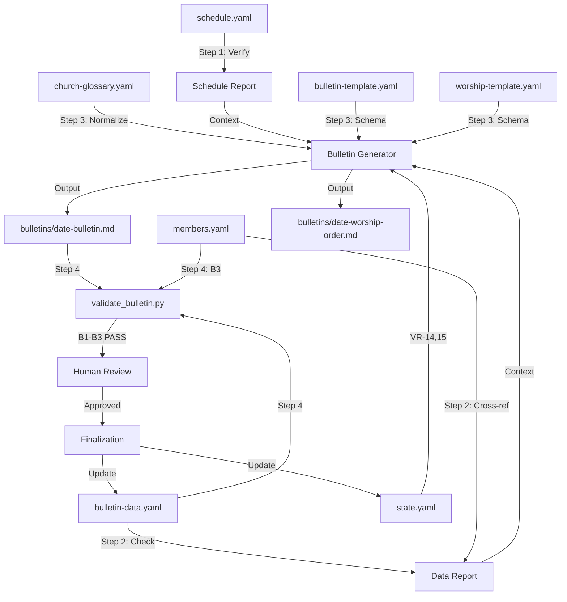

# 주간 주보 생성 워크플로우

주일 설교 데이터, 일정 검증, 교인 경축일, 공지사항을 취합하여 템플릿에 부합하는 Markdown 형식의 주보(Church Bulletin)와 예배 순서지(Worship Order Sheet)를 자동 생성하는 파이프라인이다.

## 개요

- **입력**: `data/bulletin-data.yaml`, `data/schedule.yaml`, `data/members.yaml`, `templates/bulletin-template.yaml`
- **출력**: `bulletins/{date}-bulletin.md`, `bulletins/{date}-worship-order.md`
- **주기**: 매주 (월요일 — 다가오는 주일용)
- **Autopilot**: 활성화 — 모든 단계가 저위험, 결정론적 데이터 조립 작업
- **pACS**: 활성화 — 생성된 주보 품질에 대한 자기 신뢰도 평가
- **워크플로우 ID**: `weekly-bulletin`
- **트리거**: 예약 실행 (매주 월요일)
- **위험 수준**: 낮음
- **주요 에이전트**: `@bulletin-generator`, `@schedule-manager`
- **지원 에이전트**: `@data-ingestor`, `@template-scanner`

---

## 유전된 DNA (부모 게놈)

> 이 워크플로우는 AgenticWorkflow의 전체 게놈을 상속한다.
> 목적은 도메인에 따라 다르지만, 게놈은 동일하다. `soul.md` 섹션 0 참조.

**헌법적 원칙** (주보 생성 도메인에 적용):

1. **품질 절대주의** (헌법적 원칙 1) — 교회 이름으로 발행되는 모든 주보는 정확하고, 완전하며, 올바른 형식을 갖추어야 한다. 축약하거나 임시 내용을 넣는 것은 허용되지 않는다. 날짜 오류, 설교 제목 누락, 유령 교인 참조가 있는 주보는 신뢰를 손상시킨다. 품질이란 16개 가변 영역 모두가 검증된 데이터로 채워지고, 깨진 참조가 없으며, 한국어 서식이 정확하고, 주일 날짜가 일치하는 것을 의미한다.
2. **단일 파일 SOT** (헌법적 원칙 2) — `state.yaml`이 중앙 상태 권한이다. `church.workflow_states.bulletin` 섹션이 생성 진행 상황을 추적한다. `bulletin-data.yaml`은 주보 콘텐츠의 지정된 데이터 SOT이다(단일 기록자: `@bulletin-generator`). 어떤 에이전트도 자신의 쓰기 권한 밖의 파일에 기록할 수 없다.
3. **코드 변경 프로토콜** (헌법적 원칙 3) — 검증 스크립트(`validate_bulletin.py`), 템플릿 정의, 파서 로직을 수정할 때 3단계 프로토콜(의도, 영향 범위 분석, 변경 설계)이 적용된다. 코딩 기준점(CAP)이 모든 구현을 안내한다:
   - **CAP-2 (단순성 우선)** — 주보 생성은 데이터 조립 작업이다. 추측성 추상화, 불필요한 헬퍼 계층은 금지한다. 템플릿 엔진은 YAML을 읽고, 슬롯을 채우고, Markdown을 출력한다.
   - **CAP-4 (외과적 변경)** — 주보 필드를 수정하거나 서식을 조정할 때, 해당 가변 영역만 변경한다. 관련 없는 섹션을 리팩토링하지 않는다.

**유전된 패턴**:

| DNA 구성 요소 | 유전 형태 | 이 워크플로우에서의 적용 |
|--------------|----------|----------------------|
| 3단계 구조 | Research, Processing, Output | 일정 검증, 데이터 완전성 검사, 주보 생성 |
| SOT 패턴 | `state.yaml` — 단일 기록자 (Orchestrator) | `church.workflow_states.bulletin`이 생성 상태를 추적 |
| 4계층 QA | L0 Anti-Skip, L1 Verification, L1.5 pACS, L2 Human Review | L0: 파일 존재 + 최소 크기. L1: VR 채움 검사. L1.5: pACS 자기 평가. L2: 사람 검토 단계 |
| P1 할루시네이션 방지 | 결정론적 검증 스크립트 (`validate_bulletin.py`) | B1 날짜/구조, B2 발행 순번, B3 교인 참조 무결성 |
| P2 전문성 기반 위임 | 각 작업별 전문 서브에이전트 | `@schedule-manager`는 일정, `@bulletin-generator`는 조립 담당 |
| Safety Hooks | `block_destructive_commands.py` — 위험 명령 차단 | 주보 아카이브나 데이터 파일의 우발적 `rm -rf` 방지 |
| 컨텍스트 보존 | 스냅샷 + Knowledge Archive + RLM 복원 | 주보 생성 상태가 세션 경계에서 보존됨 |
| 코딩 기준점 (CAP) | CAP-1부터 CAP-4까지 내면화 | CAP-2: 템플릿 채움을 위한 최소 코드. CAP-4: 개별 VR에 대한 외과적 편집만 |
| Decision Log | `autopilot-logs/` — 투명한 의사결정 추적 | 사람 검토 자동 승인이 근거와 함께 기록됨 |

**도메인 특화 유전자 발현**:

주보 워크플로우는 다음 DNA 구성 요소를 강하게 발현한다:
- **P1 (데이터 정확성)** — 교인 ID 교차 참조(B3 검증)로 허위 생일/기념일 항목이 없음을 보장한다. 날짜 검증(B1)으로 주일 정렬을 보장한다. 발행 순번 검증(B2)으로 중복이나 순서 오류를 방지한다.
- **P2 (전문성 기반 위임)** — 일정 검증은 `@schedule-manager`(일정 도메인 전문가)에게 위임된다. 데이터 조립은 `@bulletin-generator`(템플릿 채움 전문가)에게 위임된다. 이 둘은 호환 불가능하다.
- **SOT 유전자** — 주보 데이터는 엄격한 단일 기록자 패턴을 따른다. `bulletin-data.yaml`에는 `@bulletin-generator`만 기록한다. `state.yaml`에는 Orchestrator만 기록한다. 이를 통해 여러 에이전트가 동일한 데이터를 읽는 주간 파이프라인에서 데이터 경쟁을 방지한다.

---

## 슬래시 커맨드

### `/generate-bulletin`

```markdown
# .claude/commands/generate-bulletin.md
---
description: "Generate the weekly church bulletin for the upcoming Sunday"
---

Execute the weekly-bulletin workflow for the upcoming Sunday.

Steps:
1. Read `state.yaml` to get `church.workflow_states.bulletin.next_due_date`
2. Verify `data/schedule.yaml` for Sunday service information
3. Check `data/bulletin-data.yaml` for data completeness
4. Read `data/members.yaml` to filter birthday/anniversary members for the target week
5. Load `templates/bulletin-template.yaml` and populate all 16 variable regions
6. Generate `bulletins/{date}-bulletin.md` and `bulletins/{date}-worship-order.md`
7. Run P1 validation: `python3 .claude/hooks/scripts/validate_bulletin.py --data-dir data/`
8. Present bulletin for human review
9. On approval, update `state.yaml` and `bulletin-data.yaml` generation history

Target date: $ARGUMENTS (defaults to next Sunday if not specified)
```

---

## 가변 영역 맵 (16개 VR)

주보 템플릿은 데이터 소스에서 채워야 하는 16개의 가변 영역(Variable Region, VR)을 정의한다. 이 맵은 단계 3(주보 생성)의 권위 있는 참조 자료이다.

| VR ID | 이름 | 소스 경로 | 소스 파일 | 필수 | 형식 |
|-------|------|----------|----------|------|------|
| VR-BUL-01 | 발행 호수 | `bulletin.issue_number` | `bulletin-data.yaml` | 예 | `제 {value}호` |
| VR-BUL-02 | 날짜 | `bulletin.date` | `bulletin-data.yaml` | 예 | `{year}년 {month}월 {day}일 주일` |
| VR-BUL-03 | 설교 제목 | `bulletin.sermon.title` | `bulletin-data.yaml` | 예 | 일반 텍스트 |
| VR-BUL-04 | 성경 구절 | `bulletin.sermon.scripture` | `bulletin-data.yaml` | 예 | 일반 텍스트 |
| VR-BUL-05 | 설교자 | `bulletin.sermon.preacher` | `bulletin-data.yaml` | 예 | 일반 텍스트 |
| VR-BUL-06 | 설교 시리즈 정보 | `bulletin.sermon.series` + `bulletin.sermon.series_episode` | `bulletin-data.yaml` | 아니오 | `[ {series} -- 제 {episode}편 ]` |
| VR-BUL-07 | 예배 순서 표 | `bulletin.worship_order` | `bulletin-data.yaml` | 예 | Markdown 표 (4열) |
| VR-BUL-08 | 공지사항 목록 | `bulletin.announcements` | `bulletin-data.yaml` | 아니오 | 우선순위 표시가 있는 글머리 기호 목록 |
| VR-BUL-09 | 기도 요청 | `bulletin.prayer_requests` | `bulletin-data.yaml` | 아니오 | 범주별 글머리 기호 목록 |
| VR-BUL-10 | 생일 교인 | `bulletin.celebrations.birthday` | `bulletin-data.yaml` | 아니오 | `{name} ({date})` 목록 |
| VR-BUL-11 | 결혼기념일 교인 | `bulletin.celebrations.wedding_anniversary` | `bulletin-data.yaml` | 아니오 | `가정 {family_id} ({date})` 목록 |
| VR-BUL-12 | 주간 일정 | `regular_services` | `schedule.yaml` | 아니오 | 주간 예배 요약 목록 |
| VR-BUL-13 | 봉헌 담당 | `bulletin.offering_team` | `bulletin-data.yaml` | 아니오 | 쉼표로 구분된 이름 |
| VR-BUL-14 | 교회 연락처 | `church.name` + `church.denomination` | `state.yaml` | 예 | 헤더 블록 |
| VR-BUL-15 | 교단 헤더 | `church.denomination` | `state.yaml` | 예 | 교단 접두어 |
| VR-BUL-16 | 다음 주 미리보기 | `bulletin.next_week` | `bulletin-data.yaml` | 아니오 | 설교 제목 + 성경 구절 + 행사 |

---

## Research 단계

### 1. 일정 검증

- **에이전트**: `@schedule-manager`
- **검증 기준**:
  - [ ] `data/schedule.yaml`이 읽기 가능하고 유효한 YAML인지 확인
  - [ ] `regular_services`에 최소 하나의 주일예배(`day_of_week: "sunday"`)가 존재하는지 확인
  - [ ] 대상 주보 날짜가 주일(요일 검사)에 해당하는지 확인
  - [ ] 대상 날짜의 절기 또는 특별 행사가 식별되었는지 확인 (`special_events`에서 날짜 겹침 검사)
  - [ ] 모든 주일예배의 예배 시간과 장소가 비어 있지 않은 문자열인지 확인
- **작업**: `data/schedule.yaml`을 읽고 대상 주보 날짜에 주일예배가 올바르게 설정되어 있는지 검증한다. 날짜와 겹치는 특별 행사를 기반으로 절기(연중시기, 대림절, 사순절, 부활절 등)를 식별한다. 예배 수, 시간, 일정 이상 여부를 보고한다.
- **출력**: 일정 검증 보고서 (내부용 — 단계 2에 컨텍스트로 전달) [trace:step-1:domain-analysis]
- **번역**: 없음
- **리뷰**: 없음

### 2. 데이터 완전성 검사

- **에이전트**: `@bulletin-generator`
- **검증 기준**:
  - [ ] `data/bulletin-data.yaml`이 읽기 가능하고 유효한 YAML인지 확인
  - [ ] 5개 필수 필드가 모두 존재하고 비어 있지 않은지 확인: `issue_number`, `date`, `sermon.title`, `sermon.scripture`, `sermon.preacher`
  - [ ] `bulletin.date`가 단계 1의 대상 주일 날짜와 일치하는지 확인
  - [ ] `bulletin.worship_order`에 최소 3개 항목(최소 가동 예배)이 포함되어 있는지 확인
  - [ ] `data/members.yaml`이 생일/기념일 교인 필터링을 위해 읽기 가능한지 확인
  - [ ] 생일 교인(`celebrations.birthday`)의 `member_id` 형식이 `M\d+`에 부합하는지 확인
  - [ ] 결혼기념일 항목(`celebrations.wedding_anniversary`)의 `family_id` 형식이 `F\d+`에 부합하는지 확인
  - [ ] 모든 `member_id` 참조가 `data/members.yaml`에 존재하는지 확인 (교차 참조 무결성) [trace:step-1:domain-analysis]
  - [ ] 모든 `family_id` 참조가 `data/members.yaml` 가정 기록에 존재하는지 확인 (교차 참조 무결성)
- **작업**: `data/bulletin-data.yaml`을 읽고 대상 주일에 대한 모든 필수 필드가 채워져 있는지 검증한다. `celebrations.birthday[].member_id`를 `data/members.yaml`의 교인 ID와, `celebrations.wedding_anniversary[].family_id`를 가정 ID와 교차 참조한다. 누락되거나 유효하지 않은 참조를 표시한다. `data/church-glossary.yaml`을 읽어 설교 제목과 공지사항 텍스트의 한국어 용어 일관성을 검증한다.
- **출력**: 데이터 완전성 보고서 (내부용 — 단계 3에 컨텍스트로 전달) [trace:step-2:template-analysis]
- **번역**: 없음
- **리뷰**: 없음

---

## Processing 단계

### 3. 주보 생성

- **에이전트**: `@bulletin-generator`
- **전처리**: `templates/bulletin-template.yaml`을 로드하여 섹션-슬롯 스키마를 확보한다. `data/church-glossary.yaml`을 로드하여 한국어 용어를 정규화한다.
- **검증 기준**:
  - [ ] `templates/bulletin-template.yaml`이 읽기 가능하고 모든 예상 섹션(header, sermon, worship_order, announcements, prayer_requests, celebrations, offering_team, next_week)을 포함하는지 확인
  - [ ] 16개 가변 영역(VR-BUL-01부터 VR-BUL-16까지) 모두가 채워졌거나, 선택 필드의 경우 명시적으로 null로 표시되었는지 확인 [trace:step-2:template-analysis]
  - [ ] 필수 VR(01, 02, 03, 04, 05, 07, 14, 15)이 비어 있지 않은지 확인
  - [ ] VR-BUL-02 날짜가 `{year}년 {month}월 {day}일 주일` 형식인지 확인
  - [ ] VR-BUL-01 발행 호수가 `제 {value}호` 형식인지 확인
  - [ ] VR-BUL-07 예배 순서 표가 4열로 구성되어 있는지 확인: 순서, 항목, 내용, 담당
  - [ ] VR-BUL-08 `priority: "high"`인 공지사항에 `[중요]` 접두어가 붙었는지 확인
  - [ ] 생성된 주보 파일이 `bulletins/{date}-bulletin.md`에 존재하고 비어 있지 않은지 확인
  - [ ] 생성된 예배 순서지 파일이 `bulletins/{date}-worship-order.md`에 존재하고 비어 있지 않은지 확인
  - [ ] 주보 Markdown이 유효한 구조(제목, 표, 목록이 올바르게 파싱됨)로 렌더링되는지 확인
  - [ ] 출력의 한국어 용어가 `data/church-glossary.yaml` 항목과 일치하는지 확인 (예: 집사가 지사가 아닌지, 권사가 관사가 아닌지)
- **작업**: `templates/bulletin-template.yaml`에서 주보 템플릿 스키마를 로드한다. 템플릿의 각 섹션에 대해 `bulletin-data.yaml`(VR-BUL-12는 `schedule.yaml`, VR-BUL-14/15는 `state.yaml`)에서 해당 데이터를 읽는다. 위의 VR 맵에 있는 형식 사양에 따라 16개 가변 영역을 모두 채운다. 두 개의 출력 파일을 생성한다:
  1. `bulletins/{date}-bulletin.md` — 16개 VR이 모두 포함된 전체 주보
  2. `bulletins/{date}-worship-order.md` — 예배 순서지 (부분 집합: 헤더, 설교 정보, 예배 순서 표, 봉헌 담당, 간략 공지사항) — `templates/worship-template.yaml` 사용
- **출력**: `bulletins/{date}-bulletin.md`, `bulletins/{date}-worship-order.md`
- **번역**: 없음
- **리뷰**: 없음

### 4. (hook) P1 검증

- **전처리**: 없음 — 검증은 데이터 파일을 직접 읽음
- **Hook**: `validate_bulletin.py`
- **명령**: `python3 .claude/hooks/scripts/validate_bulletin.py --data-dir data/ --members-file data/members.yaml`
- **검증 기준**:
  - [ ] B1 PASS: 주보 날짜가 유효한 YYYY-MM-DD이며 주일인지 확인; 필수 섹션(issue_number, sermon, worship_order)이 존재하는지 확인; sermon에 title, scripture, preacher가 있는지 확인 [trace:step-4:validation-rules]
  - [ ] B2 PASS: 발행 호수가 양의 정수인지 확인; `generation_history`의 발행 호수가 중복 없이 단조 증가하는지 확인 [trace:step-4:validation-rules]
  - [ ] B3 PASS: `celebrations.birthday`의 모든 `member_id` 참조가 `members.yaml`에 존재하는지 확인; `celebrations.wedding_anniversary`의 모든 `family_id` 참조가 `members.yaml`에 존재하는지 확인 [trace:step-4:validation-rules]
  - [ ] 검증 스크립트가 종료 코드 0과 JSON 출력의 `valid: true`로 종료되는지 확인
- **작업**: 주보 데이터 무결성을 검증하는 P1 결정론적 검증 스크립트를 실행한다. 스크립트는 세 가지 규칙을 검사한다:
  - **B1** — 날짜 및 구조 일관성 (주일 날짜, 필수 섹션)
  - **B2** — 발행 호수 순번 (양의 정수, 단조 이력)
  - **B3** — 교인 참조 무결성 (생일/기념일 ID가 members.yaml에 존재)
- **출력**: 검증 결과 (JSON — 검사별 세부사항과 함께 `valid: true/false`)
- **오류 처리**: B 검사 중 하나라도 실패하면 파이프라인이 중단된다. `@bulletin-generator` 에이전트가 데이터 문제를 수정하고 검증을 재실행해야 한다(최대 3회 재시도). 3회 실패 후 사람에게 에스컬레이션한다.
- **번역**: 없음
- **리뷰**: 없음

---

## Output 단계

### 5. (human) 사람 검토

- **조치**: 생성된 주보와 예배 순서지의 정확성, 어조, 완전성을 검토한다. 다음 사항을 확인한다:
  - 설교 정보가 담임목사의 의도한 메시지와 일치하는지
  - 공지사항이 최신이고 올바르게 우선순위가 매겨졌는지
  - 생일 및 기념일 교인이 올바르게 목록에 올라 있는지
  - 민감한 정보가 실수로 노출되지 않았는지
  - 한국어 서식이 자연스럽고 교인 대상으로 적절한지
- **명령**: `/generate-bulletin`
- **검증 기준**:
  - [ ] 사람이 `bulletins/{date}-bulletin.md`를 검토했는지 확인
  - [ ] 사람이 `bulletins/{date}-worship-order.md`를 검토했는지 확인
  - [ ] 사람이 확인했거나 수정 사항을 제공했는지 확인
  - [ ] 수정 사항이 제공된 경우 적용되고 재검증되었는지 확인
- **Autopilot 동작**: Autopilot 모드에서 이 단계는 다음 근거로 자동 승인된다: "16개 VR 모두 채워짐, P1 검증 통과(B1-B3), pACS GREEN. 결정론적 검증을 통해 품질 극대화 달성." 결정은 `autopilot-logs/step-5-decision.md`에 기록된다.
- **번역**: 없음
- **리뷰**: 없음

### 6. 최종 처리

- **에이전트**: `@bulletin-generator`
- **검증 기준**:
  - [ ] `bulletin-data.yaml`의 `generation_history`가 새 항목으로 갱신되었는지 확인: `issue`, `generated_at` (ISO 8601 타임스탬프), `generated_by: "bulletin-generator"`, `output_path` [trace:step-2:template-analysis]
  - [ ] `state.yaml`의 `church.workflow_states.bulletin`이 갱신되었는지 확인: `last_generated_issue`, `last_generated_date`, `next_due_date` (7일 후), `status: "completed"`
  - [ ] `state.yaml`의 `church.current_bulletin_issue`가 1 증가되었는지 확인 (다음 주보용)
  - [ ] `generation_history`의 발행 호수가 주보의 `issue_number`와 일치하는지 확인
  - [ ] `next_due_date`가 현재 주보 날짜로부터 정확히 7일 후의 유효한 날짜인지 확인
  - [ ] 이 단계에서 `bulletin-data.yaml` 이외의 데이터 파일이 수정되지 않았는지 확인
- **작업**: `bulletin-data.yaml`의 생성 이력을 완료된 생성 기록으로 갱신한다. `state.yaml`의 주보 워크플로우 상태를 완료로 반영한다. 다음 주보 주기를 위해 발행 카운터를 증가시킨다.
- **출력**: 갱신된 `bulletin-data.yaml` (generation_history), 갱신된 `state.yaml` (워크플로우 상태)
- **번역**: 없음
- **리뷰**: 없음

---

## Claude Code 설정

### 서브에이전트

```yaml
# .claude/agents/bulletin-generator.md
---
model: sonnet
tools: [Read, Write, Edit, Bash, Glob, Grep]
write_permissions:
  - data/bulletin-data.yaml
  - bulletins/
---
# Pattern execution task — highly templated data assembly + formatting
# Sonnet is sufficient for deterministic template population
```

```yaml
# .claude/agents/schedule-manager.md (referenced, not defined in this workflow)
---
model: sonnet
tools: [Read, Grep, Glob]
write_permissions:
  - data/schedule.yaml
---
# Schedule verification and liturgical season identification
```

### SOT (상태 관리)

- **SOT 파일**: `state.yaml` (church-admin 시스템 수준 SOT)
- **쓰기 권한**: Orchestrator만 — 어떤 서브에이전트도 `state.yaml`에 직접 기록하지 않음
- **에이전트 접근**: 모든 서브에이전트는 읽기 전용. `@bulletin-generator`는 `bulletin-data.yaml`과 `bulletins/`에만 기록
- **품질 우선**: 기본 패턴 적용. 단일 데이터 생성 에이전트가 있는 순차적(비병렬) 워크플로우이므로 SOT 병목이 없음

**사용되는 SOT 필드**:

```yaml
church:
  name: "..."                              # VR-BUL-14
  denomination: "..."                      # VR-BUL-15
  current_bulletin_issue: 1247             # Issue counter
  workflow_states:
    bulletin:
      last_generated_issue: 1246           # Previous issue
      last_generated_date: "2026-02-22"    # Previous date
      next_due_date: "2026-03-01"          # Target date
      status: "pending"                    # pending | in_progress | completed
```

### Hooks

```json
{
  "hooks": {
    "PreToolUse": [
      {
        "matcher": "Write",
        "hooks": [
          {
            "type": "command",
            "command": "if test -f \"$CLAUDE_PROJECT_DIR/.claude/hooks/scripts/block_destructive_commands.py\"; then python3 \"$CLAUDE_PROJECT_DIR/.claude/hooks/scripts/block_destructive_commands.py\"; fi",
            "timeout": 10
          }
        ]
      }
    ]
  }
}
```

> **참고**: weekly-bulletin 워크플로우는 상위 프로젝트의 Hook 인프라(block_destructive_commands.py, 컨텍스트 보존 Hook)에 의존한다. 단계 4에서 명시적으로 호출되는 `validate_bulletin.py` 외에 워크플로우 전용 Hook은 필요하지 않다.

### 슬래시 커맨드

```yaml
commands:
  /generate-bulletin:
    description: "Generate the weekly church bulletin for the upcoming Sunday"
    file: ".claude/commands/generate-bulletin.md"
```

### 런타임 디렉터리

```yaml
runtime_directories:
  bulletins/:                # Generated bulletin and worship order files
  verification-logs/:        # step-N-verify.md (L1 verification results)
  pacs-logs/:                # step-N-pacs.md (pACS self-confidence ratings)
  autopilot-logs/:           # step-N-decision.md (auto-approval decision logs)
```

### 오류 처리

```yaml
error_handling:
  on_agent_failure:
    action: retry_with_feedback
    max_attempts: 3
    escalation: human

  on_validation_failure:
    action: retry_with_feedback
    retry_with_feedback: true
    rollback_after: 3
    detail: "B1/B2/B3 validation failure triggers re-read of source data and re-generation"

  on_hook_failure:
    action: log_and_continue

  on_context_overflow:
    action: save_and_recover
```

### Autopilot 로그

```yaml
autopilot_logging:
  log_directory: "autopilot-logs/"
  log_format: "step-{N}-decision.md"
  required_fields:
    - step_number
    - checkpoint_type
    - decision
    - rationale
    - timestamp
  template: "references/autopilot-decision-template.md"
```

### pACS 로그

```yaml
pacs_logging:
  log_directory: "pacs-logs/"
  log_format: "step-{N}-pacs.md"
  dimensions: [F, C, L]
  scoring: "min-score"
  triggers:
    GREEN: ">= 70 -> auto-proceed"
    YELLOW: "50-69 -> proceed with flag"
    RED: "< 50 -> rework or escalate"
  protocol: "AGENTS.md section 5.4"
```

---

## 교차 단계 추적성 인덱스

이 섹션은 워크플로우에서 사용되는 모든 추적 마커와 그 해석 대상을 문서화한다.

| 마커 | 단계 | 해석 대상 |
|------|------|----------|
| `[trace:step-1:domain-analysis]` | 단계 1 | 일정 검증 보고서 — 예배 시간, 절기, 특별 행사 |
| `[trace:step-2:template-analysis]` | 단계 2 | 데이터 완전성 보고서 — 필드 존재 여부, 교차 참조 무결성 |
| `[trace:step-4:validation-rules]` | 단계 4 | B1-B3 검증 규칙 — 날짜 일관성, 발행 순번, 교인 참조 |

---

## 데이터 흐름 다이어그램



---

## 실행 체크리스트 (실행 시마다)

이 체크리스트는 weekly-bulletin 워크플로우가 실행될 때마다 Orchestrator가 수행한다.

### 실행 전
- [ ] `state.yaml`의 `church.workflow_states.bulletin.status`가 `pending` 또는 `completed`인지 확인 (`in_progress`가 아닌지)
- [ ] `data/bulletin-data.yaml`의 `last_updated`가 현재 주 이내인지 확인
- [ ] `state.yaml`의 `church.workflow_states.bulletin.next_due_date`에서 대상 주일 날짜를 결정

### 단계 1 완료
- [ ] 일정 검증에서 주일예배 존재가 확인됨
- [ ] 절기가 식별됨
- [ ] SOT `current_step`이 1로 설정됨

### 단계 2 완료
- [ ] 모든 필수 주보 필드가 존재함
- [ ] 교인 교차 참조가 유효함
- [ ] 데이터 완전성 보고서가 생성됨

### 단계 3 완료
- [ ] 주보 파일이 `bulletins/{date}-bulletin.md`에 존재함
- [ ] 예배 순서지 파일이 `bulletins/{date}-worship-order.md`에 존재함
- [ ] 두 파일 모두 비어 있지 않음 (L0 검사: >= 100 바이트)
- [ ] 16개 VR 모두 검사됨 (5개 필수 VR이 비어 있지 않고, 11개 선택 VR이 채워졌거나 명시적으로 null)

### 단계 4 완료
- [ ] `validate_bulletin.py`가 종료 코드 0으로 종료됨
- [ ] JSON 출력에 `valid: true`가 표시됨
- [ ] B1, B2, B3이 모두 개별적으로 PASS함

### 단계 5 완료
- [ ] 사람 검토가 완료됨 (또는 Autopilot 자동 승인됨)
- [ ] 수정 사항이 있었다면 적용됨
- [ ] Decision Log가 생성됨 (Autopilot 모드)

### 단계 6 완료
- [ ] `bulletin-data.yaml`의 `generation_history`가 갱신됨
- [ ] `state.yaml`의 `church.workflow_states.bulletin`이 갱신됨
- [ ] `state.yaml`의 `church.current_bulletin_issue`가 증가됨
- [ ] 워크플로우 상태가 `completed`로 설정됨

---

## 후처리

각 워크플로우 실행 후 다음 검증 스크립트를 실행한다:

```bash
# P1 Bulletin validation (B1-B3)
python3 .claude/hooks/scripts/validate_bulletin.py --data-dir data/

# Cross-step traceability validation (CT1-CT5)
python3 .claude/hooks/scripts/validate_traceability.py --step 9 --project-dir .
```

---

## 품질 기준

### 주보 콘텐츠 품질

1. **날짜 정확성** — 주보 날짜는 반드시 주일이어야 한다. B1 검증으로 확인한다.
2. **발행 호수 단조성** — 각 발행 호수는 이전 호수보다 엄격하게 커야 한다. B2 검증으로 확인한다.
3. **참조 무결성** — 경축일에 있는 모든 member_id와 family_id는 members.yaml의 기존 기록으로 해석되어야 한다. B3 검증으로 확인한다.
4. **VR 완전성** — 5개 필수 VR(01, 02, 03, 04, 05)이 비어 있지 않아야 한다. VR-07(예배 순서)은 3개 이상의 항목을 포함해야 한다.
5. **한국어 서식** — 날짜는 `년/월/일` 형식을 사용한다. 발행 호수는 `제 N호` 형식을 사용한다. 직분명은 용어 사전에 따라 정규화된 용어를 사용한다(지사가 아닌 집사).
6. **공지사항 우선순위** — 높은 우선순위의 공지사항은 `[중요]` 접두어를 붙인다.
7. **예배 순서 구조** — 표는 정확히 4열(순서, 항목, 내용, 담당)로 구성한다. 항목은 1부터 시작하여 순차적으로 번호가 매겨진다.
8. **템플릿 적합성** — 출력 구조가 `bulletin-template.yaml`의 섹션 순서와 일치해야 한다.

### 비기능 품질

1. **멱등성** — 동일한 주일에 대해 워크플로우를 두 번 실행하면 동일한 출력이 생성된다(입력 데이터가 변경되지 않은 경우).
2. **추적성** — 생성된 모든 필드는 YAML 데이터 파일의 특정 소스 경로로 추적된다.
3. **감사 가능성** — `bulletin-data.yaml`의 `generation_history`가 생성된 모든 주보의 완전한 감사 추적을 제공한다.
