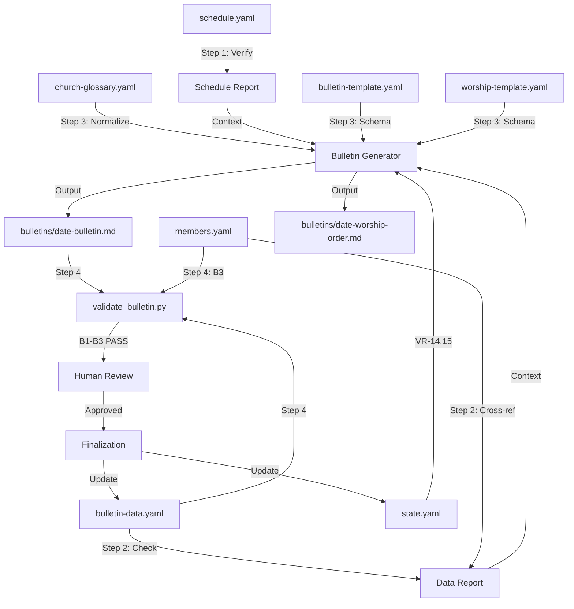

# Weekly Bulletin Generation Workflow

Automated pipeline for generating the weekly church bulletin (주보) and worship order sheet by assembling sermon data, schedule verification, member celebrations, and announcements into template-conformant Markdown output.

## Overview

- **Input**: `data/bulletin-data.yaml`, `data/schedule.yaml`, `data/members.yaml`, `templates/bulletin-template.yaml`
- **Output**: `bulletins/{date}-bulletin.md`, `bulletins/{date}-worship-order.md`
- **Frequency**: Weekly (Monday — for the upcoming Sunday)
- **Autopilot**: enabled — all steps are low-risk, deterministic data assembly
- **pACS**: enabled — self-confidence assessment on generated bulletin quality
- **Workflow ID**: `weekly-bulletin`
- **Trigger**: scheduled (every Monday)
- **Risk Level**: low
- **Primary Agents**: `@bulletin-generator`, `@schedule-manager`
- **Supporting Agents**: `@data-ingestor`, `@template-scanner`

---

## Inherited DNA (Parent Genome)

> This workflow inherits the complete genome of AgenticWorkflow.
> Purpose varies by domain; the genome is identical. See `soul.md` section 0.

**Constitutional Principles** (adapted to bulletin generation domain):

1. **Quality Absolutism** (Constitutional Principle 1) — Every bulletin issued under the church name must be accurate, complete, and correctly formatted. No abbreviated or placeholder content is acceptable. A bulletin with a wrong date, missing sermon title, or orphaned member reference damages trust. Quality means: all 16 variable regions populated with verified data, zero broken references, correct Korean formatting, and Sunday-date alignment.
2. **Single-File SOT** (Constitutional Principle 2) — `state.yaml` is the central state authority. The `church.workflow_states.bulletin` section tracks generation progress. `bulletin-data.yaml` is the designated data SOT for bulletin content (sole writer: `@bulletin-generator`). No agent may write to files outside its write permissions.
3. **Code Change Protocol** (Constitutional Principle 3) — When modifying validation scripts (`validate_bulletin.py`), template definitions, or parser logic, the 3-step protocol (Intent, Ripple Effect Analysis, Change Plan) applies. Coding Anchor Points (CAP) guide all implementation:
   - **CAP-2 (Simplicity First)** — Bulletin generation is a data assembly task. No speculative abstractions, no unnecessary helper layers. The template engine reads YAML, populates slots, outputs Markdown.
   - **CAP-4 (Surgical Changes)** — When fixing a bulletin field or adjusting formatting, change only the affected variable region. Do not refactor unrelated sections.

**Inherited Patterns**:

| DNA Component | Inherited Form | Application in This Workflow |
|--------------|---------------|------------------------------|
| 3-Phase Structure | Research, Processing, Output | Schedule verification, data completeness check, bulletin generation |
| SOT Pattern | `state.yaml` — single writer (Orchestrator) | `church.workflow_states.bulletin` tracks generation state |
| 4-Layer QA | L0 Anti-Skip, L1 Verification, L1.5 pACS, L2 Human Review | L0: file exists + min size. L1: VR population checks. L1.5: pACS self-rating. L2: Human review step |
| P1 Hallucination Prevention | Deterministic validation scripts (`validate_bulletin.py`) | B1 date/structure, B2 issue sequence, B3 member reference integrity |
| P2 Expert Delegation | Specialized sub-agents for each task | `@schedule-manager` for schedule, `@bulletin-generator` for assembly |
| Safety Hooks | `block_destructive_commands.py` — dangerous command blocking | Prevents accidental `rm -rf` of bulletin archives or data files |
| Context Preservation | Snapshot + Knowledge Archive + RLM restoration | Bulletin generation state survives session boundaries |
| Coding Anchor Points (CAP) | CAP-1 through CAP-4 internalized | CAP-2: minimal code for template population. CAP-4: surgical edits to individual VRs only |
| Decision Log | `autopilot-logs/` — transparent decision tracking | Human review auto-approval logged with rationale |

**Domain-Specific Gene Expression**:

The bulletin workflow strongly expresses these DNA components:
- **P1 (Data Accuracy)** — Member ID cross-referencing (B3 validation) ensures no phantom birthday/anniversary entries. Date validation (B1) guarantees Sunday alignment. Issue sequence validation (B2) prevents duplicate or out-of-order issue numbers.
- **P2 (Expert Delegation)** — Schedule verification is delegated to `@schedule-manager` (schedule domain expert). Data assembly is delegated to `@bulletin-generator` (template population specialist). These are not interchangeable.
- **SOT Gene** — Bulletin data has a strict sole-writer pattern. Only `@bulletin-generator` writes to `bulletin-data.yaml`. Only the Orchestrator writes to `state.yaml`. This prevents data races in a weekly pipeline where multiple agents read the same data.

---

## Slash Command

### `/generate-bulletin`

```markdown
# .claude/commands/generate-bulletin.md
---
description: "Generate the weekly church bulletin for the upcoming Sunday"
---

Execute the weekly-bulletin workflow for the upcoming Sunday.

Steps:
1. Read `state.yaml` to get `church.workflow_states.bulletin.next_due_date`
2. Verify `data/schedule.yaml` for Sunday service information
3. Check `data/bulletin-data.yaml` for data completeness
4. Read `data/members.yaml` to filter birthday/anniversary members for the target week
5. Load `templates/bulletin-template.yaml` and populate all 16 variable regions
6. Generate `bulletins/{date}-bulletin.md` and `bulletins/{date}-worship-order.md`
7. Run P1 validation: `python3 .claude/hooks/scripts/validate_bulletin.py --data-dir data/`
8. Present bulletin for human review
9. On approval, update `state.yaml` and `bulletin-data.yaml` generation history

Target date: $ARGUMENTS (defaults to next Sunday if not specified)
```

---

## Variable Region Map (16 VRs)

The bulletin template defines 16 variable regions (VRs) that must be populated from data sources. This map is the authoritative reference for Step 3 (Bulletin Generation).

| VR ID | Name | Source Path | Source File | Required | Format |
|-------|------|------------|-------------|----------|--------|
| VR-BUL-01 | Issue Number | `bulletin.issue_number` | `bulletin-data.yaml` | Yes | `제 {value}호` |
| VR-BUL-02 | Date | `bulletin.date` | `bulletin-data.yaml` | Yes | `{year}년 {month}월 {day}일 주일` |
| VR-BUL-03 | Sermon Title | `bulletin.sermon.title` | `bulletin-data.yaml` | Yes | Plain text |
| VR-BUL-04 | Scripture Reference | `bulletin.sermon.scripture` | `bulletin-data.yaml` | Yes | Plain text |
| VR-BUL-05 | Preacher | `bulletin.sermon.preacher` | `bulletin-data.yaml` | Yes | Plain text |
| VR-BUL-06 | Sermon Series Info | `bulletin.sermon.series` + `bulletin.sermon.series_episode` | `bulletin-data.yaml` | No | `[ {series} -- 제 {episode}편 ]` |
| VR-BUL-07 | Worship Order Table | `bulletin.worship_order` | `bulletin-data.yaml` | Yes | Markdown table (4 columns) |
| VR-BUL-08 | Announcements List | `bulletin.announcements` | `bulletin-data.yaml` | No | Bulleted list with priority markers |
| VR-BUL-09 | Prayer Requests | `bulletin.prayer_requests` | `bulletin-data.yaml` | No | Bulleted list by category |
| VR-BUL-10 | Birthday Members | `bulletin.celebrations.birthday` | `bulletin-data.yaml` | No | `{name} ({date})` list |
| VR-BUL-11 | Anniversary Members | `bulletin.celebrations.wedding_anniversary` | `bulletin-data.yaml` | No | `가정 {family_id} ({date})` list |
| VR-BUL-12 | Weekly Schedule | `regular_services` | `schedule.yaml` | No | Summary list of weekly services |
| VR-BUL-13 | Offering Team | `bulletin.offering_team` | `bulletin-data.yaml` | No | Comma-separated names |
| VR-BUL-14 | Church Contact Info | `church.name` + `church.denomination` | `state.yaml` | Yes | Header block |
| VR-BUL-15 | Denomination Header | `church.denomination` | `state.yaml` | Yes | Denomination prefix |
| VR-BUL-16 | Next Week Preview | `bulletin.next_week` | `bulletin-data.yaml` | No | Sermon title + scripture + events |

---

## Research Phase

### 1. Schedule Verification

- **Agent**: `@schedule-manager`
- **Verification**:
  - [ ] `data/schedule.yaml` is readable and valid YAML
  - [ ] At least one Sunday service (`day_of_week: "sunday"`) exists in `regular_services`
  - [ ] The target bulletin date falls on a Sunday (day-of-week check)
  - [ ] Liturgical season or special events for the target date are identified (check `special_events` for date overlap)
  - [ ] Service times and locations are non-empty strings for all Sunday services
- **Task**: Read `data/schedule.yaml` and verify that Sunday services are properly configured for the target bulletin date. Identify the liturgical season (Ordinary Time, Advent, Lent, Easter, etc.) based on the date and any overlapping special events. Report service count, times, and any schedule anomalies.
- **Output**: Schedule verification report (internal — passed to Step 2 as context) [trace:step-1:domain-analysis]
- **Translation**: none
- **Review**: none

### 2. Data Completeness Check

- **Agent**: `@bulletin-generator`
- **Verification**:
  - [ ] `data/bulletin-data.yaml` is readable and valid YAML
  - [ ] All 5 required fields are present and non-empty: `issue_number`, `date`, `sermon.title`, `sermon.scripture`, `sermon.preacher`
  - [ ] `bulletin.date` matches the target Sunday date from Step 1
  - [ ] `bulletin.worship_order` contains at least 3 items (minimum viable service)
  - [ ] `data/members.yaml` is readable for birthday/anniversary member filtering
  - [ ] Birthday members (`celebrations.birthday`) have valid `member_id` format matching `M\d+`
  - [ ] Anniversary entries (`celebrations.wedding_anniversary`) have valid `family_id` format matching `F\d+`
  - [ ] All `member_id` references exist in `data/members.yaml` (cross-reference integrity) [trace:step-1:domain-analysis]
  - [ ] All `family_id` references exist in `data/members.yaml` family records (cross-reference integrity)
- **Task**: Read `data/bulletin-data.yaml` and verify all required fields are populated for the target Sunday. Cross-reference `celebrations.birthday[].member_id` against `data/members.yaml` member IDs and `celebrations.wedding_anniversary[].family_id` against family IDs. Flag any missing or invalid references. Read `data/church-glossary.yaml` to verify Korean term consistency in sermon titles and announcement text.
- **Output**: Data completeness report (internal — passed to Step 3 as context) [trace:step-2:template-analysis]
- **Translation**: none
- **Review**: none

---

## Processing Phase

### 3. Bulletin Generation

- **Agent**: `@bulletin-generator`
- **Pre-processing**: Load `templates/bulletin-template.yaml` to obtain the section-slot schema. Load `data/church-glossary.yaml` for Korean term normalization.
- **Verification**:
  - [ ] `templates/bulletin-template.yaml` is readable and contains all expected sections (header, sermon, worship_order, announcements, prayer_requests, celebrations, offering_team, next_week)
  - [ ] All 16 variable regions (VR-BUL-01 through VR-BUL-16) are populated or explicitly marked as null for optional fields [trace:step-2:template-analysis]
  - [ ] Required VRs (01, 02, 03, 04, 05, 07, 14, 15) are non-empty
  - [ ] VR-BUL-02 date is formatted as `{year}년 {month}월 {day}일 주일`
  - [ ] VR-BUL-01 issue number is formatted as `제 {value}호`
  - [ ] VR-BUL-07 worship order table has 4 columns: 순서, 항목, 내용, 담당
  - [ ] VR-BUL-08 announcements with `priority: "high"` are prefixed with `[중요]`
  - [ ] Generated bulletin file exists at `bulletins/{date}-bulletin.md` and is non-empty
  - [ ] Generated worship order file exists at `bulletins/{date}-worship-order.md` and is non-empty
  - [ ] Bulletin Markdown renders valid structure (headings, tables, lists parse correctly)
  - [ ] Korean terms in output match `data/church-glossary.yaml` entries (e.g., 집사 not 지사, 권사 not 관사)
- **Task**: Load the bulletin template schema from `templates/bulletin-template.yaml`. For each section in the template, read the corresponding data from `bulletin-data.yaml` (and `schedule.yaml` for VR-BUL-12, `state.yaml` for VR-BUL-14/15). Populate all 16 variable regions following the format specifications in the VR map above. Generate two output files:
  1. `bulletins/{date}-bulletin.md` — Full bulletin with all 16 VRs
  2. `bulletins/{date}-worship-order.md` — Worship order sheet (subset: header, sermon info, worship order table, offering team, brief announcements) using `templates/worship-template.yaml`
- **Output**: `bulletins/{date}-bulletin.md`, `bulletins/{date}-worship-order.md`
- **Translation**: none
- **Review**: none

### 4. (hook) P1 Validation

- **Pre-processing**: None — validation reads data files directly
- **Hook**: `validate_bulletin.py`
- **Command**: `python3 .claude/hooks/scripts/validate_bulletin.py --data-dir data/ --members-file data/members.yaml`
- **Verification**:
  - [ ] B1 PASS: Bulletin date is valid YYYY-MM-DD and is a Sunday; required sections (issue_number, sermon, worship_order) are present; sermon has title, scripture, and preacher [trace:step-4:validation-rules]
  - [ ] B2 PASS: Issue number is a positive integer; `generation_history` issue numbers are monotonically increasing with no duplicates [trace:step-4:validation-rules]
  - [ ] B3 PASS: All `member_id` references in `celebrations.birthday` exist in `members.yaml`; all `family_id` references in `celebrations.wedding_anniversary` exist in `members.yaml` [trace:step-4:validation-rules]
  - [ ] Validation script exits with code 0 and `valid: true` in JSON output
- **Task**: Execute the P1 deterministic validation script to verify bulletin data integrity. The script checks three rules:
  - **B1** — Date and structure consistency (Sunday date, required sections)
  - **B2** — Issue number sequence (positive integer, monotonic history)
  - **B3** — Member reference integrity (birthday/anniversary IDs exist in members.yaml)
- **Output**: Validation result (JSON — `valid: true/false` with per-check details)
- **Error Handling**: If any B-check fails, the pipeline halts. The `@bulletin-generator` agent must fix the data issue and re-run validation (max 3 retries). After 3 failures, escalate to human.
- **Translation**: none
- **Review**: none

---

## Output Phase

### 5. (human) Human Review

- **Action**: Review the generated bulletin and worship order sheet for accuracy, tone, and completeness. Verify that:
  - Sermon information matches the pastor's intended message
  - Announcements are current and correctly prioritized
  - Birthday and anniversary members are correctly listed
  - No sensitive information is inadvertently exposed
  - Korean formatting is natural and appropriate for the congregation
- **Command**: `/generate-bulletin`
- **Verification**:
  - [ ] Human has reviewed `bulletins/{date}-bulletin.md`
  - [ ] Human has reviewed `bulletins/{date}-worship-order.md`
  - [ ] Human has confirmed or provided corrections
  - [ ] If corrections were provided, they have been applied and re-validated
- **Autopilot Behavior**: In autopilot mode, this step is auto-approved with the rationale: "All 16 VRs populated, P1 validation passed (B1-B3), pACS GREEN. Quality maximization achieved through deterministic validation." Decision logged to `autopilot-logs/step-5-decision.md`.
- **Translation**: none
- **Review**: none

### 6. Finalization

- **Agent**: `@bulletin-generator`
- **Verification**:
  - [ ] `bulletin-data.yaml` `generation_history` is updated with the new entry: `issue`, `generated_at` (ISO 8601 timestamp), `generated_by: "bulletin-generator"`, `output_path` [trace:step-2:template-analysis]
  - [ ] `state.yaml` `church.workflow_states.bulletin` is updated: `last_generated_issue`, `last_generated_date`, `next_due_date` (7 days later), `status: "completed"`
  - [ ] `state.yaml` `church.current_bulletin_issue` is incremented by 1 (for the next bulletin)
  - [ ] Issue number in `generation_history` matches the bulletin's `issue_number`
  - [ ] `next_due_date` is a valid date exactly 7 days after the current bulletin date
  - [ ] No data files other than `bulletin-data.yaml` were modified by this step
- **Task**: Update `bulletin-data.yaml` generation history with the completed generation record. Update `state.yaml` bulletin workflow state to reflect completion. Increment the issue counter for the next bulletin cycle.
- **Output**: Updated `bulletin-data.yaml` (generation_history), updated `state.yaml` (workflow state)
- **Translation**: none
- **Review**: none

---

## Claude Code Configuration

### Sub-agents

```yaml
# .claude/agents/bulletin-generator.md
---
model: sonnet
tools: [Read, Write, Edit, Bash, Glob, Grep]
write_permissions:
  - data/bulletin-data.yaml
  - bulletins/
---
# Pattern execution task — highly templated data assembly + formatting
# Sonnet is sufficient for deterministic template population
```

```yaml
# .claude/agents/schedule-manager.md (referenced, not defined in this workflow)
---
model: sonnet
tools: [Read, Grep, Glob]
write_permissions:
  - data/schedule.yaml
---
# Schedule verification and liturgical season identification
```

### SOT (State Management)

- **SOT File**: `state.yaml` (church-admin system-level SOT)
- **Write Permission**: Orchestrator only — no sub-agent writes to `state.yaml` directly
- **Agent Access**: Read-only for all sub-agents. `@bulletin-generator` writes only to `bulletin-data.yaml` and `bulletins/`
- **Quality Override**: Default pattern applies. No SOT bottleneck because this is a sequential (non-parallel) workflow with a single data-producing agent.

**SOT Fields Used**:

```yaml
church:
  name: "..."                              # VR-BUL-14
  denomination: "..."                      # VR-BUL-15
  current_bulletin_issue: 1247             # Issue counter
  workflow_states:
    bulletin:
      last_generated_issue: 1246           # Previous issue
      last_generated_date: "2026-02-22"    # Previous date
      next_due_date: "2026-03-01"          # Target date
      status: "pending"                    # pending | in_progress | completed
```

### Hooks

```json
{
  "hooks": {
    "PreToolUse": [
      {
        "matcher": "Write",
        "hooks": [
          {
            "type": "command",
            "command": "if test -f \"$CLAUDE_PROJECT_DIR/.claude/hooks/scripts/block_destructive_commands.py\"; then python3 \"$CLAUDE_PROJECT_DIR/.claude/hooks/scripts/block_destructive_commands.py\"; fi",
            "timeout": 10
          }
        ]
      }
    ]
  }
}
```

> **Note**: The weekly-bulletin workflow relies on the parent project's hook infrastructure (block_destructive_commands.py, context preservation hooks). No workflow-specific hooks are needed beyond `validate_bulletin.py` which is invoked explicitly in Step 4.

### Slash Commands

```yaml
commands:
  /generate-bulletin:
    description: "Generate the weekly church bulletin for the upcoming Sunday"
    file: ".claude/commands/generate-bulletin.md"
```

### Runtime Directories

```yaml
runtime_directories:
  bulletins/:                # Generated bulletin and worship order files
  verification-logs/:        # step-N-verify.md (L1 verification results)
  pacs-logs/:                # step-N-pacs.md (pACS self-confidence ratings)
  autopilot-logs/:           # step-N-decision.md (auto-approval decision logs)
```

### Error Handling

```yaml
error_handling:
  on_agent_failure:
    action: retry_with_feedback
    max_attempts: 3
    escalation: human

  on_validation_failure:
    action: retry_with_feedback
    retry_with_feedback: true
    rollback_after: 3
    detail: "B1/B2/B3 validation failure triggers re-read of source data and re-generation"

  on_hook_failure:
    action: log_and_continue

  on_context_overflow:
    action: save_and_recover
```

### Autopilot Logs

```yaml
autopilot_logging:
  log_directory: "autopilot-logs/"
  log_format: "step-{N}-decision.md"
  required_fields:
    - step_number
    - checkpoint_type
    - decision
    - rationale
    - timestamp
  template: "references/autopilot-decision-template.md"
```

### pACS Logs

```yaml
pacs_logging:
  log_directory: "pacs-logs/"
  log_format: "step-{N}-pacs.md"
  dimensions: [F, C, L]
  scoring: "min-score"
  triggers:
    GREEN: ">= 70 -> auto-proceed"
    YELLOW: "50-69 -> proceed with flag"
    RED: "< 50 -> rework or escalate"
  protocol: "AGENTS.md section 5.4"
```

---

## Cross-Step Traceability Index

This section documents all traceability markers used in the workflow and their resolution targets.

| Marker | Step | Resolves To |
|--------|------|-------------|
| `[trace:step-1:domain-analysis]` | Step 1 | Schedule verification report — service times, liturgical season, special events |
| `[trace:step-2:template-analysis]` | Step 2 | Data completeness report — field presence, cross-reference integrity |
| `[trace:step-4:validation-rules]` | Step 4 | B1-B3 validation rules — date consistency, issue sequence, member references |

---

## Data Flow Diagram



---

## Execution Checklist (Per-Run)

This checklist is executed by the Orchestrator each time the weekly-bulletin workflow runs.

### Pre-Run
- [ ] Verify `state.yaml` `church.workflow_states.bulletin.status` is `pending` or `completed` (not `in_progress`)
- [ ] Verify `data/bulletin-data.yaml` `last_updated` is within the current week
- [ ] Determine target Sunday date from `state.yaml` `church.workflow_states.bulletin.next_due_date`

### Step 1 Completion
- [ ] Schedule verification confirms Sunday services exist
- [ ] Liturgical season identified
- [ ] SOT `current_step` set to 1

### Step 2 Completion
- [ ] All required bulletin fields are present
- [ ] Member cross-references are valid
- [ ] Data completeness report generated

### Step 3 Completion
- [ ] Bulletin file exists at `bulletins/{date}-bulletin.md`
- [ ] Worship order file exists at `bulletins/{date}-worship-order.md`
- [ ] Both files are non-empty (L0 check: >= 100 bytes)
- [ ] All 16 VRs checked (5 required VRs non-empty, 11 optional VRs populated or explicitly null)

### Step 4 Completion
- [ ] `validate_bulletin.py` exits with code 0
- [ ] JSON output shows `valid: true`
- [ ] B1, B2, B3 all individually PASS

### Step 5 Completion
- [ ] Human review completed (or autopilot auto-approved)
- [ ] Corrections applied if any
- [ ] Decision log generated (autopilot mode)

### Step 6 Completion
- [ ] `bulletin-data.yaml` `generation_history` updated
- [ ] `state.yaml` `church.workflow_states.bulletin` updated
- [ ] `state.yaml` `church.current_bulletin_issue` incremented
- [ ] Workflow status set to `completed`

---

## Post-processing

After each workflow run, execute the following validation scripts:

```bash
# P1 Bulletin validation (B1-B3)
python3 .claude/hooks/scripts/validate_bulletin.py --data-dir data/

# Cross-step traceability validation (CT1-CT5)
python3 .claude/hooks/scripts/validate_traceability.py --step 9 --project-dir .
```

---

## Quality Standards

### Bulletin Content Quality

1. **Date Accuracy** — Bulletin date must be a Sunday. Verified by B1 validation.
2. **Issue Monotonicity** — Each issue number must be strictly greater than the previous. Verified by B2 validation.
3. **Reference Integrity** — Every member_id and family_id in celebrations must resolve to an existing record in members.yaml. Verified by B3 validation.
4. **VR Completeness** — All 5 required VRs (01, 02, 03, 04, 05) must be non-empty. VR-07 (worship order) must have >= 3 items.
5. **Korean Formatting** — Dates use `년/월/일` format. Issue numbers use `제 N호` format. Roles use glossary-normalized terms (집사 not 지사).
6. **Announcement Priority** — High-priority announcements are prefixed with `[중요]`.
7. **Worship Order Structure** — Table has exactly 4 columns (순서, 항목, 내용, 담당). Items are sequentially numbered starting from 1.
8. **Template Conformance** — Output structure matches `bulletin-template.yaml` section order.

### Non-Functional Quality

1. **Idempotency** — Running the workflow twice for the same Sunday produces identical output (given unchanged input data).
2. **Traceability** — Every generated field traces back to a specific source path in a YAML data file.
3. **Auditability** — `generation_history` in `bulletin-data.yaml` provides a complete audit trail of all generated bulletins.
